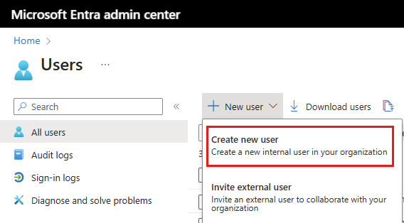
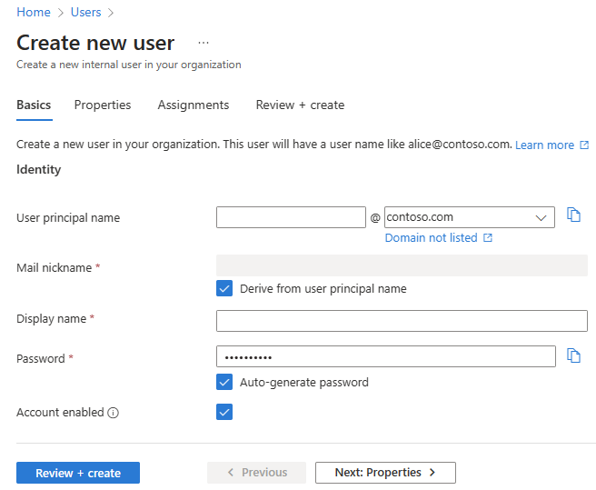
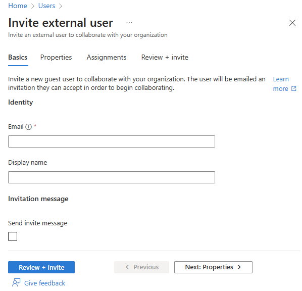

# How to create, invite, and delete users (preview)

This article explains how to create a new user, invite an external guest, and delete a user in your Azure Active Directory (Azure AD) tenant. The **User Administrator** or **Global Administrator** role is required.

The updated experience for creating new users covered in this article is available as an Azure AD preview feature. This feature is enabled by default, but you can opt out by going to **Azure AD** > **Preview features** and disabling the **Create user experience** feature. For more information about previews, see [Supplemental Terms of Use for Microsoft Azure Previews](https://azure.microsoft.com/support/legal/preview-supplemental-terms/).

Instructions for the legacy create user process can be found in the **[Add or delete users](add-users-azure-active-directory.md)** article.

[!INCLUDE [GDPR-related guidance](../../../includes/gdpr-hybrid-note.md)]

## Before you begin

Before you create or invite a new user, take some time to review the types of users, their authentication methods, and their access within the Azure AD tenant. For example, do you need to create an internal guest, an internal user, or an external guest? Does your new user need guest or member privileges?

- **Internal member**: These users are most likely full-time employees in your organization.
- **Internal guest**: These users have an account in your tenant, but have guest-level privileges. It's possible they were created within your tenant prior to the availability of B2B collaboration.
- **External member**: These users authenticate using an external account, but has member access to your tenant. These types of users are common in [multi-tenant organizations](../multi-tenant-organizations/overview.md#what-is-a-multi-tenant-organization).
- **External guest**: These users are true guests of your tenant who authenticate using an external method and who have guest-level privileges. 

Want to explore the differences between internal and external guests and members a bit further? Check out the [B2B collaboration properties](../external-identities/user-properties.md) article.

Reviewing the default user permissions may also help you determine the type of user you need to create. See the [Set default user permissions](users-default-permissions.md) article for more information.

## Create a new user

1. Sign in to the [Azure portal](https://portal.azure.com/) in the **User Administrator** role.

1. Navigate to **Azure Active Directory** > **Users**.

1. Select **Create new user** from the menu.

    

### Basics

- **User principal name**: Enter a unique username and select a domain from the menu after the @ symbol. Select **Domain not listed** if you need to create a new domain. For more information, see [Add your custom domain name](add-custom-domain.md)

- **Mail nickname**: If you need to enter an email nickname that is different from the user principal name you entered, uncheck the **Derive from user principal name** option, then enter the mail nickname.

- **Display name**: Enter the user's name, such as Chris Green or Chris A. Green

- **Password**: Provide a password for the user to use during their initial sign-in. Uncheck the **Auto-generate password** option to enter a different password.

- **Account enabled**: This option is checked by default. Uncheck to prevent the new user from being able to sign-in. You can change this setting after the user is created. This setting was called **Block sign in** in the legacy create user process.

Either select the **Review + create** button to create the new user or **Next: Properties** to complete the next section.

### Properties

There are six categories of user properties you may be able to edit. These properties can be added or updated after the user is created. To manage these details, go to **Azure AD** > **Users** and select a user to update.

- **Identity:** Enter the user's first and last name. Set the User type as either Member or Guest. 

- **Job information:** Add any job-related information, such as the user's job title, department, or manager.

- **Contact information:** Add any relevant contact information for the user.

- **Parental controls:** For organizations like K-12 school districts, the user's age group may need to be provided. *Minors* are 12 and under, *Not adult* are 13-18 years old, and *Adults* are 18 and over. The combination of age group and consent provided by parent options determine the Legal age group classification. The Legal age group classification may limit the user's access and authority.

- **Settings:** Specify the user's global location.

Either select the **Review + create** button to create the new user or **Next: Assignments** to complete the next section.

### Assignments

You can assign the user to an administrative unit, group, or Azure AD role when the account is created. You can assign the user to up to 20 groups or roles. You can only assign the user to one administrative unit.

**To assign a group to the new user**:

1. Select **+ Add group**.
1. From the menu that appears, choose up to 20 groups from the list and select the **Select** button.
1. Select the **Review + create** button.

    

### Review and create

The final tab captures several key details from the user creation process. Review the details and select the **Create** button if everything looks good.

## Invite an external user

The overall process for inviting an external guest user is similar, except for a few details on the **Basics** tab. 

1. Sign in to the [Azure portal](https://portal.azure.com/) in the **User Administrator** role.

1. Navigate to **Azure Active Directory** > **Users**.

1. Select **Invite external user** from the menu. 

    

### Basics for external users

In this section, you're inviting the guest to your tenant using *their email address*. If you need to create a guest user with a domain account, use the [create new user process](#create-a-new-user) but change the **User type** to **Guest**. 

- **Email**: Enter the email address for the guest user you're inviting.

- **Display name**: Provide the display name.

-  **Invitation message**: Select the **Send invite message** checkbox to customize a brief message to the guest. Provide a Cc recipient, if necessary.

### Guest user invitations

When you invite an external guest user by sending an email invitation, you can check the status of the invitation from the user's details.

1. Go to **Azure AD** > **Users** and select the invited guest user.
1. In the **My Feed** section, locate the **B2B collaboration** tile. 
    - If the invitation state is **PendingAcceptance**, select the **Resend invitation** link to send another email.
    - You can also select the **Properties** for the user and view the **Invitation state**.

## Next steps

* [Learn about B2B collaboration users](../external-identities/add-users-administrator.md)
* [Review the default user permissions](users-default-permissions.md)
* [Add a custom domain](add-custom-domain.md)