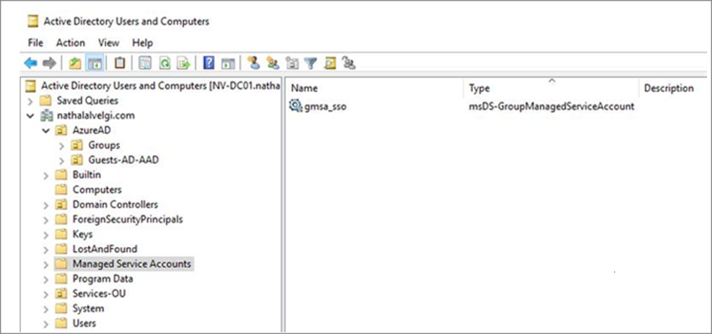

# Secure group managed service accounts

Group managed service accounts (gMSAs) are managed domain accounts that you use to help secure services. gMSAs can run on a single server or on a server farm, such as systems behind a network load balancing or Internet Information Services (IIS) server. After you configure your services to use a gMSA principal, password management for that account is handled by the Windows operating system.

## Benefits of using gMSAs

gMSAs offer a single identity solution with greater security. At the same time, to help reduce administrative overhead, they:

* **Set strong passwords**: gMSAs use 240-byte, randomly generated complex passwords. The complexity and length of gMSA passwords minimizes the likelihood of a service getting compromised by brute force or dictionary attacks.

* **Cycle passwords regularly**: gMSAs shift password management to the Windows operating system, which changes the password every 30 days. Service and domain administrators no longer need to schedule password changes or manage service outages to help keep service accounts secure. 

* **Support deployment to server farms**: The ability to deploy gMSAs to multiple servers allows for the support of load balanced solutions where multiple hosts run the same service. 

* **Support simplified service principal name (SPN) management**: You can set up an SPN by using PowerShell when you create an account. In addition, services that support automatic SPN registrations might do so against the gMSA, provided that the gMSA permissions are correctly set. 

## When to use gMSAs

Use gMSAs as the preferred account type for on-premises services unless a service, such as Failover Clustering, doesn't support it.

> [!IMPORTANT]
> You must test your service with gMSAs before you deploy it into production. To do so, set up a test environment to ensure that the application can use the gMSA, and then access the resources it needs to access. For more information, see [Support for group managed service accounts](/system-center/scom/support-group-managed-service-accounts).


If a service doesn't support the use of gMSAs, your next best option is to use a standalone managed service account (sMSA). An sMSA provides the same functionality as a gMSA, but it's intended for deployment on a single server only.

If you can't use a gMSA or sMSA that's supported by your service, you must configure the service to run as a standard user account. Service and domain administrators are required to observe strong password management processes to help keep the account secure.

## Assess the security posture of gMSAs

gMSA accounts are inherently more secure than standard user accounts, which require ongoing password management. However, it's important to consider a gMSA's scope of access as you look at its overall security posture.

Potential security issues and mitigations for using gMSAs are shown in the following table:

| Security issue| Mitigation |
| - | - |
| gMSA is a member of privileged groups. | <li>Review your group memberships. To do so, you create a PowerShell script to enumerate all group memberships. You can then filter a resultant CSV file by the names of your gMSA files.<li>Remove the gMSA from privileged groups.<li>Grant the gMSA only the rights and permissions it requires to run its service (consult with your service vendor). 
| gMSA has read/write access to sensitive resources. | <li>Audit access to sensitive resources.<li>Archive audit logs to a SIEM, such as Azure Log Analytics or Microsoft Sentinel, for analysis.<li>Remove unnecessary resource permissions if you detect an undesirable level of access. |
| | |


## Find gMSAs

Your organization might already have created gMSAs. To retrieve these accounts, run the following PowerShell cmdlets:

```powershell
Get-ADServiceAccount 
Install-ADServiceAccount 
New-ADServiceAccount 
Remove-ADServiceAccount 
Set-ADServiceAccount 
Test-ADServiceAccount 
Uninstall-ADServiceAccount
```


To work effectively, gMSAs must be in the Managed Service Accounts AD container.

  


To find service MSAs that might not be in the list, run the following commands:

```powershell

Get-ADServiceAccount -Filter *

# This PowerShell cmdlet will return all managed service accounts (both gMSAs and sMSAs). An administrator can differentiate between the two by examining the ObjectClass attribute on returned accounts.

# For gMSA accounts, ObjectClass = msDS-GroupManagedServiceAccount

# For sMSA accounts, ObjectClass = msDS-ManagedServiceAccount

# To filter results to only gMSAs:

Get-ADServiceAccount –Filter * | where-object {$_.ObjectClass -eq "msDS-GroupManagedServiceAccount"}
```

## Manage gMSAs

To manage gMSA accounts, you can use the following Active Directory PowerShell cmdlets:

`Get-ADServiceAccount`

`Install-ADServiceAccount`

`New-ADServiceAccount`

`Remove-ADServiceAccount`

`Set-ADServiceAccount`

`Test-ADServiceAccount`

`Uninstall-ADServiceAccount`

> [!NOTE]
> Beginning with Windows Server 2012, the *-ADServiceAccount cmdlets work with gMSAs by default. For more information about using the preceding cmdlets, see [Get started with group managed service accounts](/windows-server/security/group-managed-service-accounts/getting-started-with-group-managed-service-accounts).

## Move to a gMSA
gMSA accounts are the most secure type of service account for on-premises needs. If you can move to one, you should. Additionally, consider moving your services to Azure and your service accounts to Azure Active Directory. To move to a gMSA account, do the following:

1. Ensure that the [Key Distribution Service (KDS) root key](/windows-server/security/group-managed-service-accounts/create-the-key-distribution-services-kds-root-key) is deployed in the forest. This is a one-time operation.

1. [Create a new gMSA](/windows-server/security/group-managed-service-accounts/getting-started-with-group-managed-service-accounts).

1. Install the new gMSA on each host that runs the service.
   > [!NOTE] 
   > For more information about creating and installing a gMSA on a host, prior to configuring your service to use the gMSA, see [Get started with group managed service accounts](/previous-versions/windows/it-pro/windows-server-2012-R2-and-2012/jj128431(v=ws.11)).

1. Change your service identity to gMSA, and specify a blank password.

1. Validate that your service is working under the new gMSA identity.

1. Delete the old service account identity.

 

## Next steps

To learn more about securing service accounts, see the following articles:

* [Introduction to on-premises service accounts](service-accounts-on-premises.md)  
* [Secure standalone managed service accounts](service-accounts-standalone-managed.md)  
* [Secure computer accounts](service-accounts-computer.md)  
* [Secure user accounts](service-accounts-user-on-premises.md)  
* [Govern on-premises service accounts](service-accounts-govern-on-premises.md)
