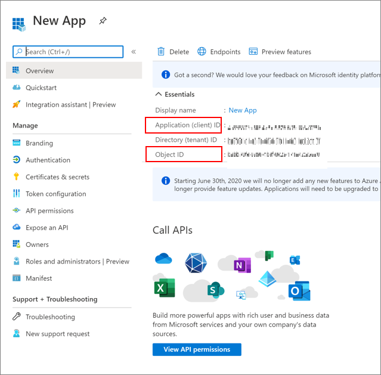

# Securing service principals in Azure Active Directory 

An Azure Active Directory (Azure AD) service principals are the local representation of an application object in a tenant or directory. It's the identity of the application instance. Service principals define who accesses the application, and resources the application accesses. A service principal is created in each tenant where the application is used, and references the globally unique application object. The tenant secures the service principal sign-in and access to resources. 

Learn more: [Application and service principal objects in Azure AD](../develop/app-objects-and-service-principals.md)

### Tenant-service principal relationships

A single-tenant application has one service principal in its home tenant. A multi-tenant web application or API requires a service principal in each tenant. A service principal is created when a user from that tenant consents to use of the application or API. This consent creates a one-to-many relationship between the multi-tenant application and its associated service principals.

A multi-tenant application is homed in a tenant and has instances in other tenants. Most software-as-a-service (SaaS) applications accommodate multi-tenancy. Use service principals to ensure the needed security posture for the application, and its users, in single- and multi-tenant scenarios.

## ApplicationID and ObjectID

An application instance has two properties: the ApplicationID (or ClientID) and the ObjectID.

> [!NOTE] 
> The terms **application** and **service principal** are used interchangeably, when referring to an application in authentication tasks. However, they are two representations of applications in Azure AD.
 
The ApplicationID represents the global application and is the same for application instances, across tenants. The ObjectID is a unique value for an application object. As with users, groups, and other resources, the ObjectID helps to identify an application instance in Azure AD.

To learn more, see [Application and service principal relationship](../develop/app-objects-and-service-principals.md)

You can create an application and its service principal object (ObjectID) in a tenant using:

* Azure PowerShell
* Azure command-line interfce (CLI)
* Microsoft Graph
* The Azure portal
* Other tools

## Service principal authentication

When using service principals—client certificates and client secrets, there are two mechanisms for authentication. 

Because certificates are more secure, it's recommended you use them, when possible. Unlike client secrets, client certificates can't be embedded in code, accidentally. When possible, use Azure Key Vault for certificate and secrets management to encrypt assets with keys protected by hardware security modules:

* Authentication keys
* Storage account keys
* Data encryption keys
* .pfx files
* Passwords 

For more information on Azure Key Vault and how to use it for certificate and secret management, see:

* [About Azure Key Vault](../../key-vault/general/overview.md)
* [Assign a Key Vault access policy](../../key-vault/general/assign-access-policy.md) 

 ### Challenges and mitigations
 
When using service principals, use the following table to match challenges and mitigations.

| Challenge| Mitigation|
| - | - |
| Access reviews for service principals assigned to privileged roles| This functionality is in preview |
| Service principal access reviews| Manual check of resource access control list using the Azure portal |
| Over-permissioned service principals| When you create automation service accounts, or or service principals, grant permissions for the task. Evaluate service principals to reduce privileges. |
|Identify modifications to service principal credentials or authentication methods |See the Sensitive Operations Report workbook. See also, the Tech Community blog post [Azure AD workbook to help you assess Solorigate risk](https://techcommunity.microsoft.com/t5/azure-active-directory-identity/azure-ad-workbook-to-help-you-assess-solorigate-risk/ba-p/2010718).|

## Find accounts using service principals

To find accounts run the following commands using service principals with Azure CLI or PowerShell.

* Azure CLI - `az ad sp list`
* PowerShell - `Get-AzureADServicePrincipal -All:$true` 

For more information see [Get-AzureADServicePrincipal](/powershell/module/azuread/get-azureadserviceprincipal).

## Assess service principal security

To assess the security, evaluate privileges and credential storage. Use the following table to help mitigate challenges:

|Challenge | Mitigation|
| - | - |
| Detect the user who consented to a multi-tenant app, and detect illicit consent grants to a multi-tenant app | Run the following PowerShell to find multi-tenant apps. `Get-AzureADServicePrincipal -All:$true ? {$_.Tags -eq WindowsAzureActiveDirectoryIntegratedApp"}` Disable user consent.  Allow user consent from verified publishers, for selected permissions. (recommended)   Configure them in the user context. Use their tokens to trigger the service principal.|
|Use of a hard-coded shared secret in a script using a service principal|Use a certificate|
|Tracking who uses the certificate or the secret| Monitor the service principal sign-ins using the Azure AD sign-in logs|
|Can't manage service principal sign-in with Conditional Access| Monitor the sign-ins using the Azure AD sign-in logs
| Contributor is the default Azure role-based access control (Azure RBAC) role|Evaluate needs and apply the least possible permissions|

Learn more: [What is Conditional Access?](../conditional-access/overview.md)

## Move from a user account to a service principal​  

If you're using an Azure user account as a service principal, evaluate if you can move to a [Managed Identity](../../app-service/overview-managed-identity.md?tabs=dotnet) or a service principal. If you can't use a managed identity, provision a service principal with enough permissions and scope to run the required tasks. You can create a service principal by [registering an application](../develop/howto-create-service-principal-portal.md), or with [PowerShell](../develop/howto-authenticate-service-principal-powershell.md).

When using Microsoft Graph, check the API documentation. See, [Create an Azure service principal](/powershell/azure/create-azure-service-principal-azureps). Ensure the permission type for application is supported.

## Next steps

Learn more about service principals:

[Create a service principal](../develop/howto-create-service-principal-portal.md)

[Monitor service principal sign-ins](../reports-monitoring/concept-sign-ins.md)

Learn more about securing service accounts:

[Introduction to Azure service accounts](service-accounts-introduction-azure.md)

[Securing managed identities](service-accounts-managed-identities.md)

[Governing Azure service accounts](service-accounts-governing-azure.md)

[Introduction to on-premises service accounts](service-accounts-on-premises.md)

Conditional Access:

Use Conditional Access to block service principals from untrusted locations. See, [Create a location-based Conditional Access policy](../conditional-access/workload-identity.md#create-a-location-based-conditional-access-policy).
