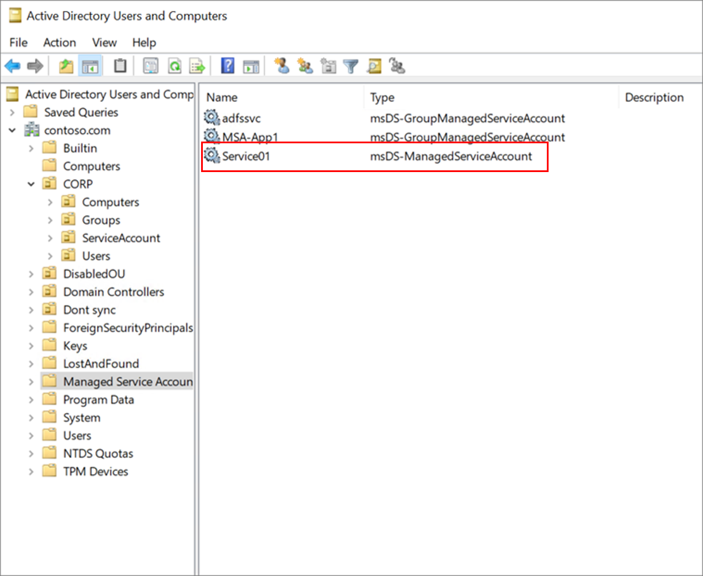

# Securing standalone managed service accounts

Standalone Managed Service Accounts (sMSAs) are managed domain accounts used to secure one or more services running on a server. They cannot be reused across multiple servers. sMSAs provide automatic password management, simplified service principal name (SPN) management, and the ability to delegate management to other administrators. 

In Active Directory, sMSAs are tied to a specific server that runs a service. You can find these accounts listed in the Active Directory Users and Computers snap-in of the Microsoft Management Console.

Managed Service Accounts were introduced with Windows Server 2008R2 Active Directory Schema and require a minimum OS level of Windows Server 2008R2​. 

##  Benefits of using sMSAs

sMSAs offer greater security than user accounts used as service accounts, while reducing administrative overhead by:

* Setting strong passwords. sMSAs use 240 byte randomly generated complex passwords. The complexity and length of sMSA passwords minimizes the likelihood of a service getting compromised by brute force or dictionary attacks.

* Cycling passwords regularly. Windows automatically changes the sMSA password every 30 days. Service and domain administrators don’t need to schedule password changes or manage the associated downtime.

* Simplifying SPN management. Service principal names are automatically updated if the Domain Functional Level (DFL) is Windows Server 2008 R2. ​For instance, the service principal name is automatically updated in the following scenarios:

   * The host computer account is renamed. ​

   * The DNS name of the host computer is changed.

   * When adding or removing an additional sam-accountname or dns-hostname parameters using [PowerShell](https://docs.microsoft.com/powershell/module/addsadministration/set-adserviceaccount?view=win10-ps)

## When to use sMSAs

sMSAs can simplify management and security tasks. Use sMSAs when you've one or more services deployed to a single server, and you cannot use a gMSA. 

> [!NOTE] 
> While you can use sMSAs for more than one service, we recommend that each service have its own identity for auditing purposes. 

If the creator of the software can’t tell you if it can use an MSA, you must test your application. To do so, create a test environment and ensure it can access all required resources. See [create and install an sMSA](https://docs.microsoft.com/archive/blogs/askds/managed-service-accounts-understanding-implementing-best-practices-and-troubleshooting) for step-by-step directions.

### Assess security posture of sMSAs

sMSAs are inherently more secure than standard user accounts, which require ongoing password management. However, it's important to consider sMSAs’ scope of access as part of their overall security posture.

The following table shows how to mitigate potential security issues posed by sMSAs.

| Security Issues| Mitigations |
| - | - |
| sMSA is a member of privileged groups|Remove the sMSA from elevated privileged groups (such as Domain Admins).   Use the least privileged model and grant the sMSA only the rights and permissions it requires to run its service(s).   If you're unsure of the required permissions, consult the service creator. |
| sMSA has read/write access to sensitive resources.|Audit access to sensitive resources. Archive audit logs to a SIEM (Azure Log Analytics or Azure Sentinel) for analysis.   Remediate resource permissions if an undesirable level of access is detected. |
| By default, sMSA password rollover frequency is 30 days| Group policy can be used to tune the duration depending on enterprise security requirements.   *You can set the password expiration duration using the following path.  Computer Configuration\Policies\Windows Settings\Security Settings\Security Options\​Domain member: Maximum machine account password age |

### Challenges with sMSAs

The challenges associated with sMSAs are as follows:

| Challenges| Mitigations |
| - | - |
| They can be used on a single server.| Use gMSAs if you need to use the account across servers. |
| They cannot be used across domains.| Use gMSAs if you need to use the account across domains. |
| Not all applications support sMSAs.| Use gMSAs if possible. If not use a standard user account or a computer account as recommended by the application creator. |

## Find sMSAs

On any domain controller, run DSA.msc and expand the Managed Service Accounts container to view all sMSAs. 

The following PowerShell command returns all sMSAs and gMSAs in the Active Directory domain. 

`Get-ADServiceAccount -Filter *`

The following command returns only sMSAs in the Active Directory domain.

`Get-ADServiceAccount -Filter * | where { $_.objectClass -eq "msDS-ManagedServiceAccount" }`

## Manage sMSAs

You can use the following Active Directory PowerShell cmdlets for managing sMSAs:

`Get-ADServiceAccount`

` Install-ADServiceAccount`

` New-ADServiceAccount`

` Remove-ADServiceAccount`

`Set-ADServiceAccount`

`Test-ADServiceAccount`

`Ininstall-ADServiceAccount`

## Move to sMSAs

If an application service supports sMSA but not gMSAs, and is currently using a user account or computer account for the security context, [create and install an sMSA](https://docs.microsoft.com/archive/blogs/askds/managed-service-accounts-understanding-implementing-best-practices-and-troubleshooting) on the server. 

Ideally, move resources to Azure, and use Azure Managed Identities or service principals.

 

## Next steps
See the following articles on securing service accounts

* [Introduction to on-premises service accounts](service-accounts-on-premises.md)

* [Secure group managed service accounts](service-accounts-group-managed.md)

* [Secure standalone managed service accounts](service-accounts-standalone-managed.md)

* [Secure computer accounts](service-accounts-computer.md)

* [Secure user accounts](service-accounts-user-on-premises.md)

* [Govern on-premises service accounts](service-accounts-govern-on-premises.md)

 
