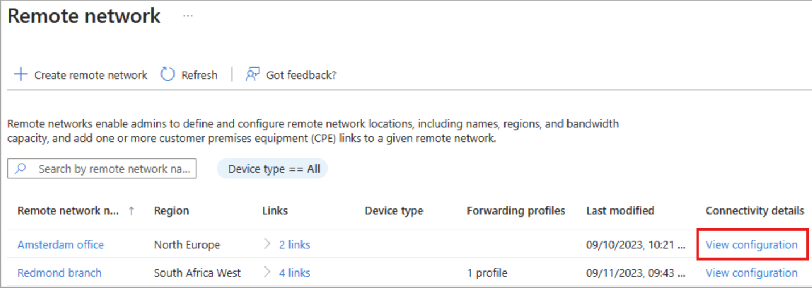

# Configure customer premises equipment for Global Secure Access (preview)

IPSec tunnel is a bidirectional communication. One side of the communication is established when [adding a device link to a remote network](how-to-manage-remote-network-device-links.md) in Global Secure Access (preview). During that process, you enter your public IP address and BGP addresses in the Microsoft Entra admin center to tell us about your network configurations.

This article provides the steps to set up the other side of the communication channel.

## Prerequisites

To configure your customer premises equipment (CPE), you must have:

- A **Global Secure Access Administrator** role in Microsoft Entra ID.
- Sent an email to Global Secure Access onboarding according to the onboarding process in the **Remote network** area of Global Secure Access.
- Received the connectivity information from Global Secure Access onboarding.
- The preview requires a Microsoft Entra ID P1 license. If needed, you can [purchase licenses or get trial licenses](https://aka.ms/azureadlicense).

To onboard to Global Secure Access remote network connectivity, you must have completed the [onboarding process](how-to-create-remote-networks.md#onboard-your-tenant-for-remote-networks). In order to configure your CPE, you need the connectivity information provided by the Global Secure Access onboarding team.

## How to configure your customer premises equipment

You can set up the CPE using the Microsoft Entra admin center or using the Microsoft Graph API.

## [Microsoft Entra admin center](#tab/microsoft-entra-admin-center)

1. Sign in to the [Microsoft Entra admin center](https://entra.microsoft.com) as a **Global Secure Access Administrator**.
1. Browse to **Global Secure Access** > **Devices** > **Remote network**.
1. Select **View configuration** for the remote network you need to configure.

    

1. Locate and save Microsoft's public IP address from the panel that opens.
1. In the preferred interface for *your CPE*, enter the IP address you saved in the previous step. This step completes the IPSec tunnel configuration.

> [!IMPORTANT]
>The crypto profile you specified for the device link should match with what you specify on your CPE. If you chose the "default" IKE policy when configuring the device link, use the configurations described in the [Remote network configurations](reference-remote-network-configurations.md) article.

## [Microsoft Graph API](#tab/microsoft-graph-api)

Follow these instructions to download the connectivity information for your remote network. 

1. Sign in to [Graph Explorer](https://aka.ms/ge).
1. Select **GET** as the HTTP method from the dropdown.
1. Set the API version to **beta**.
1. Run the following query to use get the connectivity information, replacing `{GUID}` with the ID of the remote network you want to configure:

    ```http
    https://graph.microsoft.com/beta/networkaccess/branches/{GUID}/downloadConnectivity
    ```
---

[!INCLUDE [Public preview important note](./includes/public-preview-important-note.md)]

## Next steps

- [How to manage remote networks](how-to-manage-remote-networks.md)
- [How to manage remote network device links](how-to-manage-remote-network-device-links.md)
