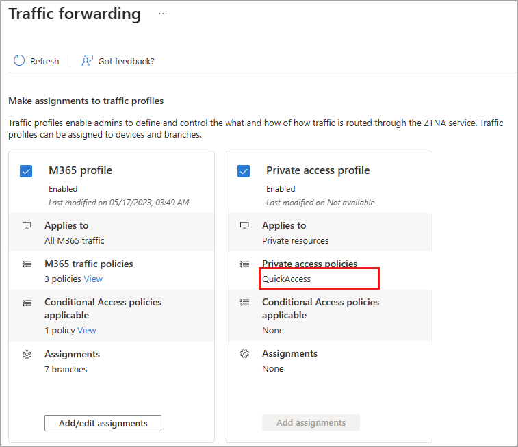

# How to enable the Private access profile

The **Private access profile** looks at traffic going to your organization's private, internal applications and sites. Your [Quick access groups](how-to-define-quick-access-ranges.md) define the apps and sites that make up your Private access profile.

Quick access groups are similar to the M365 traffic policies, except the IP addresses and FQDNs in the M365 profile are predefined. Quick access groups allow you to create your own collection of fully qualified domain names (FQDN), IP addresses, and IP address ranges. Just like with the M365 profile, you can also apply a Conditional Access policy or assign the profile to specific branch locations.

### Private access policies

To apply a Private access policy, a Quick access range must be created. The Quick access range includes any IP addresses, IP ranges, and fully qualified domain names (FQDN) for the private applications and destinations you want to include in the policy. For more information, see [Define Quick access ranges](how-to-define-quick-access-ranges.md).

**To view applied Quick access ranges**: 

1. Select the **View** link for **Private access policies**.

    

1. Select a link from the list to view the Quick access policy details. 

### Private access Conditional Access policies

Conditional Access policies can be applied to your traffic profiles to provide more options for managing access to applications, sites, and services. For example, you can create a policy that requires using compliant devices when accessing M365 services or requires multifactor authentication for all Microsoft 365 traffic.

Conditional Access policies are created and applied to the profile in the Conditional Access area of Microsoft Entra ID. For more information, see the [Conditional Access overview](../active-directory/conditional-access/overview.md).

**To view applied Conditional Access policies**:

1. Select the **View** link for **Conditional Access policies applicable**.

    

1. Select a link from the list to view the policy details. 

    

**To create a Conditional Access policy for the M365 profiles**:

1. Create a new Conditional Access policy. For more information, see [Building a Conditional Access policy](../active-directory/conditional-access/concept-conditional-access-policies.md).
1. Under **Target Resources** select **No target resources selected**.
1. Select **Network Access (Preview)** from the menu.
1. From the new menu that appears, select one or more traffic profiles to apply the policy to. 

    

### Private access branch assignments

Traffic profiles can be assigned to branches, so that the network traffic is forwarded to Microsoft Entra Private Access without having to install the client on end user devices. As long as the device is behind the customer premises equipment (CPE), the client isn't required.  You must create a branch before you can add it to the profile. For more information, see [How to create a branch](how-to-manage-branch-locations.md).

## Next steps

- [Define Quick access ranges](how-to-define-quick-access-ranges.md)