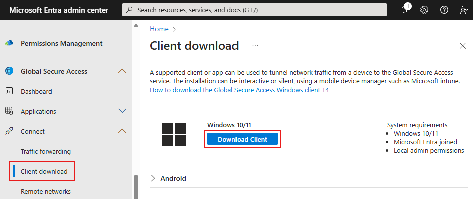
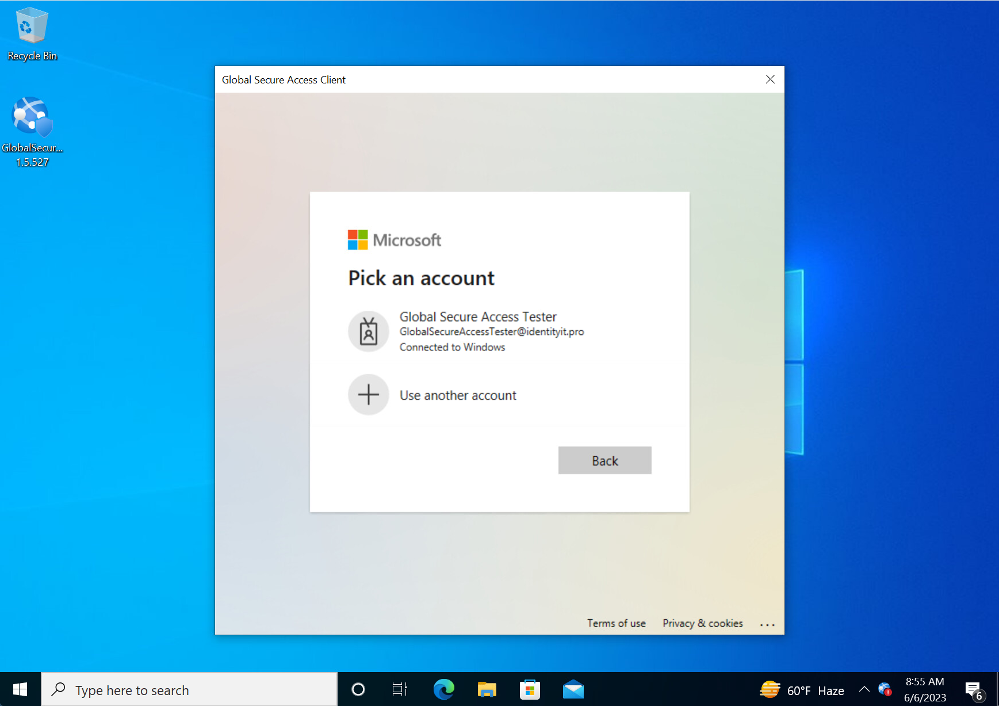

# Global Secure Access client for Windows (preview)

Learn how to install the Global Secure Access client for Windows.

## Prerequisites

- The Global Secure Access client is supported on 64-bit versions of Windows 11 or Windows 10.
   - Azure Virtual Desktop single-session is supported.
   - Azure Virtual Desktop multi-session isn't supported.
   - Windows 365 is supported.
- Devices must be either Microsoft Entra joined or Microsoft Entra hybrid joined. 
   - Microsoft Entra registered devices aren't supported.
- Local administrator credentials are required for installation.
- The preview requires a Microsoft Entra ID P1 license. If needed, you can [purchase licenses or get trial licenses](https://aka.ms/azureadlicense).

### Known limitations

- Multiple user sessions on the same device, like those from a Remote Desktop Server (RDP), aren't supported.
- Networks that use a captive portal, like some guest wireless network solutions, might cause the client connection to fail. As a workaround you can [pause the Global Secure Access client](#troubleshooting).
- Virtual machines where both the host and guest Operating Systems have the Global Secure Access client installed aren't supported. Individual virtual machines with the client installed are supported.
- The service *bypasses* the traffic if the Global Secure Access client isn't able to connect to the service (for example due to an authorization or Conditional Access failure). Traffic is sent direct-and-local instead of being blocked. In this scenario, you can create a Conditional Access policy for the [compliant network check](how-to-compliant-network.md), to block traffic if the client isn't able to connect to the service.
- The Global Secure Access client on ARM64 architecture isn't yet supported. However, ARM64 is on the roadmap.


There are several other limitations based on the traffic forwarding profile in use:

| Traffic forwarding profile | Limitation |
| --- | --- |
| [Microsoft 365](how-to-manage-microsoft-365-profile.md) | Tunneling [IPv6 traffic isn't currently supported](#disable-ipv6-and-secure-dns). |
| [Microsoft 365](how-to-manage-microsoft-365-profile.md) and [Private access](how-to-manage-private-access-profile.md) | To tunnel network traffic based on rules of FQDNs (in the forwarding profile), [Domain Name System (DNS) over HTTPS (Secure DNS) needs to be disabled](#disable-ipv6-and-secure-dns). |
| [Microsoft 365](how-to-manage-microsoft-365-profile.md) | The Global Secure Access client currently only supports Transmission Control Protocol (TCP) traffic. Exchange Online uses the QUIC protocol for some traffic over User Datagram Protocol (UDP) port 443 force this traffic to use HTTPS (443 TCP) by [blocking the QUIC traffic with a local firewall rule](#block-quic-when-tunneling-exchange-online-traffic). Non-HTTP protocols, such as POP3, IMAP, SMTP, aren't acquired from the client and are sent direct-and-local. |
| [Microsoft 365](how-to-manage-microsoft-365-profile.md) and [Private access](how-to-manage-private-access-profile.md) | If the end-user device is configured to use a proxy server, locations that you wish to tunnel using the Global Secure Access client must be excluded from that configuration. For examples, see [Proxy configuration example](#proxy-configuration-example). |
| [Private access](how-to-manage-private-access-profile.md) | Single label domains, like `https://contosohome` for private apps aren't supported. Instead use a fully qualified domain name (FQDN), like `https://contosohome.contoso.com`. Administrators can also choose to append DNS suffixes via Windows. |

## Download the client

The most current version of the Global Secure Access client can be downloaded from the Microsoft Entra admin center.

1. Sign in to the [Microsoft Entra admin center](https://entra.microsoft.com) as a [Global Secure Access Administrator](/azure/active-directory/roles/permissions-reference#global-secure-access-administrator).
1. Browse to **Global Secure Access (Preview)** > **Connect** > **Client download**.
1. Select **Download Client**.

    
    
## Install the client

Organizations can install the client interactively, silently with the `/quiet` switch, or use mobile device management platforms like [Microsoft Intune to deploy it](/mem/intune/apps/apps-win32-app-management) to their devices.

1. Copy the Global Secure Access client setup file to your client machine.
1. Run the *GlobalSecureAccessClient.exe* setup file. Accept the software license terms.
1. The client is installed and users are prompted to sign in with their Microsoft Entra credentials.

    

1. Users sign in and the connection icon turns green. Double-clicking on the connection icon opens a notification with client information showing a connected state.

    :::image type="content" source="media/how-to-install-windows-client/client-install-connected.png" alt-text="Screenshot showing the client is connected.":::


## Troubleshooting

To troubleshoot the Global Secure Access client, right-click the client icon in the taskbar.

:::image type="content" source="media/how-to-install-windows-client/client-install-menu-options.png" alt-text="Screenshot showing the context menu of the Global Secure Access client.":::

- **Login as different user**
   - Forces sign-in screen to change user or reauthenticate the existing user.
- **Pause**
   - This option can be used to temporarily disable traffic tunneling. As this client is part of your organization's security posture we recommend leaving it running always.
   - This option stops the Windows services related to client. When these services are stopped, traffic is no longer tunneled from the client machine to the cloud service. Network traffic behaves as if the client isn't installed while the client is paused. If the client machine is restarted, the services automatically restart with it.
- **Resume**
   - This option starts the underlying services related to the Global Secure Access client. This option would be used to resume after temporarily pausing the client for troubleshooting. Traffic resumes tunneling from the client to the cloud service.
- **Restart**
   - This option stops and starts the Windows services related to client.
- **Collect logs**
   - Collect logs for support and further troubleshooting. These logs are collected and stored in `C:\Program Files\Global Secure Access Client\Logs` by default.
      - These logs include information about the client machine, the related event logs for the services, and registry values including the traffic forwarding profiles applied.
- **Client Checker**
   - Runs a script to test client components ensuring the client is configured and working as expected. 
- **Connection Diagnostics** provides a live display of client status and connections tunneled by the client to the Global Secure Access service
   - **Summary** tab shows general information about the client configuration including: policy version in use, last policy update date and time, and the ID of the tenant the client is configured to work with.
      - Hostname acquisition state changes to green when new traffic acquired by FQDN is tunneled successfully based on a match of the destination FQDN in a traffic forwarding profile.
   - **Flows** show a live list of connections initiated by the end-user device and tunneled by the client to the Global Secure Access edge. Each connection is new row.
      - **Timestamp** is the time when the connection was first established.
      - **Fully Qualified Domain Name (FQDN)** of the destination of the connection. If the decision to tunnel the connection was made based on an IP rule in the forwarding policy not by an FQDN rule, the FQDN column shows N/A.
      - **Source** port of the end-user device for this connection. 
      - **Destination IP** is the destination of the connection.
      - **Protocol** only TCP is supported currently.
      - **Process** name that initiated the connection. 
      - **Flow** active provides a status of whether the connection is still open.
      - **Sent data** provides the number of bytes sent by the end-user device over the connection. 
      - **Received data** provides the number of bytes received by the end-user device over the connection. 
      - **Correlation ID** is provided to each connection tunneled by the client. This ID allows tracing of the connection in the client logs. The client logs consist of event viewer, event trace (ETL), and the [Global Secure Access traffic logs](how-to-view-traffic-logs.md).
      - **Flow ID** is the internal ID of the connection used by the client shown in the ETL file.
      - **Channel name** identifies the traffic forwarding profile to which the connection is tunneled. This decision is taken according to the rules in the forwarding profile. 
   - **HostNameAcquisition** provides a list of hostnames that the client acquired based on the FQDN rules in the forwarding profile. Each hostname is shown in a new row. Future acquisition of the same hostname creates another row if DNS resolves the hostname (FQDN) to a different IP address.
      - **Timestamp** is the time when the connection was first established.
      - **FQDN** that is resolved.
      - **Generated IP address** is an IP address generated by the client for internal purposes. This IP is shown in flows tab for connections that are established to the relative FQDN.
      - **Original IP address** is the first IPv4 address in the DNS response when querying the FQDN. If the DNS server that the end-user device points to doesn’t return an IPv4 address for the query, the original IP address shows `0.0.0.0`.
   - **Services** shows the status of the Windows services related to the Global Secure Access client. Services that are started have a green status icon, services that are stopped show a red status icon. All three Windows services must be started for the client to function.
   - **Channels** list the traffic forwarding profiles assigned to the client and the state of the connection to the Global Secure Access edge.

### Event logs

Event logs related to the Global Secure Access client can be found in the Event Viewer under `Applications and Services/Microsoft/Windows/Global Secure Access Client/Operational`. These events provide useful detail regarding the state, policies, and connections made by the client.

### Disable IPv6 and secure DNS

If you need assistance disabling IPv6 or secure DNS on Windows devices you're trying the preview with, the following script provides assistance.

```powershell
function CreateIfNotExists
{
    param($Path)
    if (-NOT (Test-Path $Path))
    {
        New-Item -Path $Path -Force | Out-Null
    }
}

$disableBuiltInDNS = 0x00

# Prefer IPv4 over IPv6 with 0x20, disable  IPv6 with 0xff, revert to default with 0x00. 
# This change takes effect after reboot. 
$setIpv6Value = 0x20
Set-ItemProperty -Path "HKLM:\SYSTEM\CurrentControlSet\Services\Tcpip6\Parameters" -Name "DisabledComponents" -Type DWord -Value $setIpv6Value

# This section disables browser based secure DNS lookup.
# For the Microsoft Edge browser.
CreateIfNotExists "HKLM:\SOFTWARE\Policies\Microsoft"
CreateIfNotExists "HKLM:\SOFTWARE\Policies\Microsoft\Edge"

Set-ItemProperty -Path "HKLM:\SOFTWARE\Policies\Microsoft\Edge" -Name "DnsOverHttpsMode" -Value "off"

Set-ItemProperty -Path "HKLM:\SOFTWARE\Policies\Microsoft\Edge" -Name "BuiltInDnsClientEnabled" -Type DWord -Value $disableBuiltInDNS

# For the Google Chrome browser.

CreateIfNotExists "HKLM:\SOFTWARE\Policies\Google"
CreateIfNotExists "HKLM:\SOFTWARE\Policies\Google\Chrome"

Set-ItemProperty -Path "HKLM:\SOFTWARE\Policies\Google\Chrome" -Name "DnsOverHttpsMode" -Value "off"

Set-ItemProperty -Path "HKLM:\SOFTWARE\Policies\Google\Chrome" -Name "BuiltInDnsClientEnabled" -Type DWord -Value $disableBuiltInDNS
```

### Proxy configuration example

Example proxy PAC file containing exclusions:

```
function FindProxyForURL(url, host) {  // basic function; do not change
   if (isPlainHostName(host) ||
      dnsDomainIs(host, ".contoso.com") || //tunneled
      dnsDomainIs(host, ".fabrikam.com"))  // tunneled
      return "DIRECT";                     // If true, sets "DIRECT" connection
      else                                 // for all other destinations  
      return "PROXY 10.1.0.10:8080";  // transfer the traffic to the proxy. 
}
```

Organizations must then create a system variable named `grpc_proxy` with a value like `http://10.1.0.10:8080` that matches your proxy server's configuration on end-user machines to allow the Global Secure Access client services to use the proxy by configuring the following.

### Block QUIC when tunneling Exchange Online traffic 

Since UDP traffic isn't supported in the current preview, organizations that plan to tunnel their Exchange Online traffic should disable the QUIC protocol (443 UDP). Administrators can disable this protocol triggering clients to fall back to HTTPS (443 TCP) with the following Windows Firewall rule:

```powershell
New-NetFirewallRule -DisplayName "Block QUIC for Exchange Online" -Direction Outbound -Action Block -Protocol UDP -RemoteAddress 13.107.6.152/31,13.107.18.10/31,13.107.128.0/22,23.103.160.0/20,40.96.0.0/13,40.104.0.0/15,52.96.0.0/14,131.253.33.215/32,132.245.0.0/16,150.171.32.0/22,204.79.197.215/32,6.6.0.0/16 -RemotePort 443 
```

This list of IPv4 addresses is based on the [Office 365 URLs and IP address ranges](/microsoft-365/enterprise/urls-and-ip-address-ranges#exchange-online) and the IPv4 block used by the Global Secure Access client.

[!INCLUDE [Public preview important note](./includes/public-preview-important-note.md)]

## Next steps

The next step for getting started with Microsoft Entra Internet Access is to [enable universal tenant restrictions](how-to-universal-tenant-restrictions.md).
