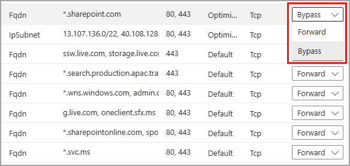

# How to enable and manage the Microsoft 365 traffic forwarding profile

With the Microsoft 365 profile enabled, Microsoft Entra Internet Access acquires the traffic going to all Microsoft 365 services. The **Microsoft 365** profile manages the following policy groups:

- Exchange Online
- SharePoint Online and OneDrive for Business
- Microsoft 365 Common and Office Online (only Microsoft Entra ID and Microsoft Graph)

## Prerequisites

To enable the Microsoft 365 traffic forwarding profile for your tenant, you must have:

- A **Global Secure Access Administrator** role in Microsoft Entra ID
- The preview requires a Microsoft Entra ID P1 license. If needed, you can [purchase licenses or get trial licenses](https://aka.ms/azureadlicense).
- To use the Microsoft 365 traffic forwarding profile, a Microsoft 365 E3 license is recommended.

### Known limitations

- Teams is currently not supported as part of the Microsoft 365 Common endpoints. Only Microsoft Entra ID and Microsoft Graph are supported.
- For details on limitations for the Microsoft 365 traffic profile, see [Windows Client known limitations](how-to-install-windows-client.md#known-limitations)

## Enable the Microsoft 365 traffic profile

1. Sign in to the [Microsoft Entra admin center](https://entra.microsoft.com).
1. Browse to **Global Secure Access (preview)** > **Connect** > **Traffic forwarding**.
1. Select the checkbox for **Microsoft 365 access profile**.

## Microsoft 365 traffic policies

To manage the details included in the Microsoft 365 traffic forwarding policy, select the **View** link for **Microsoft 365 traffic policies**.

:::image type="content" source="media/how-to-manage-microsoft-365-profile/microsoft-365-traffic-policies.png" alt-text="Screenshot of the Private access profile, with the view applications link highlighted." lightbox="media/how-to-manage-microsoft-365-profile/microsoft-365-traffic-policies-expanded.png":::

The policy groups are listed, with a checkbox to indicate if the policy group is enabled. Expand a policy group to view all of the IPs and FQDNs included in the group.

The policy groups include the following details:

- **Destination type**: FQDN or IP subnet
- **Destination**: The details of the FQDN or IP subnet
- **Ports**: TCP or UDP ports that are combined with the IP addresses to form the network endpoint
- **Protocol**: TCP (Transmission Control Protocol) or UDP (User Datagram Protocol)
- **Action**: Forward or Bypass

You can choose to bypass certain traffic. Users can still access the site; however, the service doesn't process the traffic. You can bypass traffic to a specific FQDN or IP address, an entire policy group within the profile, or the entire Microsoft 365 profile itself. If you only need to forward some of the Microsoft 365 resources within a policy group, enable the group then change the **Action** in the details accordingly.

The following example shows setting the `*.sharepoint.com` FQDN to **Bypass** so the traffic isn't forwarded to the service.

If the Global Secure Access client isn't able to connect to the service (for example due to an authorization or Conditional Access failure), the service *bypasses* the traffic. Traffic is sent direct-and-local instead of being blocked. In this scenario, you can create a Conditional Access policy for the [compliant network check](how-to-compliant-network.md), to block traffic if the client isn't able to connect to the service.

## Linked Conditional Access policies

[Conditional Access policies](../identity/conditional-access/overview.md) are created and applied to the traffic forwarding profile in the Conditional Access area of Microsoft Entra ID. For example, you can create a policy that requires using compliant devices when accessing Microsoft 365 services.

If you see "None" in the **Linked Conditional Access policies** section, there isn't a Conditional Access policy linked to the traffic forwarding profile. To create a Conditional Access policy, see [Universal Conditional Access through Global Secure Access](how-to-target-resource-microsoft-365-profile.md).

### Edit an existing Conditional Access policy

If the traffic forwarding profile has a linked Conditional Access policy, you can view and edit that policy.

1. Select the **View** link for **Linked Conditional Access policies**.

    

1. Select a policy from the list. The details of the policy open in Conditional Access.

    

## Microsoft 365 remote network assignments

Traffic profiles can be assigned to remote networks, so that the network traffic is forwarded to Global Secure Access without having to install the client on end user devices. As long as the device is behind the customer premises equipment (CPE), the client isn't required.  You must create a remote network before you can add it to the profile. For more information, see [How to create remote networks](how-to-create-remote-networks.md).

**To assign a remote network to the Microsoft 365 profile**:

1. Sign in to the [Microsoft Entra admin center](https://entra.microsoft.com/).
1. Browse to **Global Secure Access (preview)** > **Traffic forwarding**.
1. Select the **Add assignments** button for the profile.
    - If you're editing the remote network assignments, select the **Add/edit assignments** button.
1. Select a remote network from the list and select **Add**.

## User and group assignments
You can scope the Microsoft 365 profile to specific users and groups. To learn more about user and group assignment, see [How to assign and manage users and groups with traffic forwarding profiles](how-to-manage-users-groups-assignment.md).

[!INCLUDE [Public preview important note](./includes/public-preview-important-note.md)]

## Next steps

The next step for getting started with Microsoft Entra Internet Access is to [install and configure the Global Secure Access Client on end-user devices](how-to-install-windows-client.md)

For more information about traffic forwarding, see the following article:

- [Learn about traffic forwarding profiles](concept-traffic-forwarding.md)
