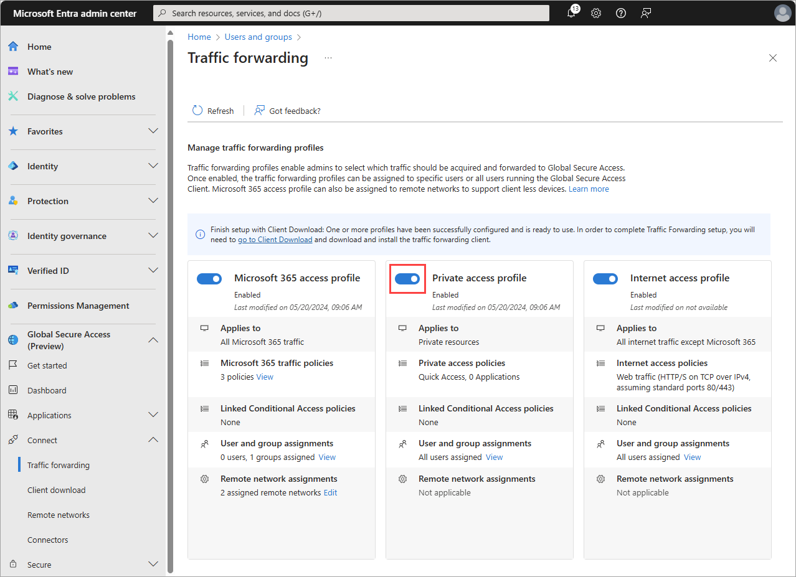
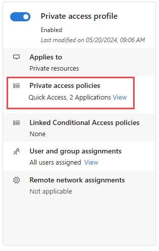

# How to manage the Private access traffic forwarding profile

The private access traffic forwarding profile routes traffic to your private network through the Global Secure Access Client. Enabling this traffic forwarding profile allows remote workers to connect to internal resources without a VPN.

## Prerequisites

To enable the Microsoft 365 traffic forwarding profile for your tenant, you must have:

- A **Global Secure Access Administrator** role in Microsoft Entra ID

### Known limitations

- At this time, private access traffic can only be acquired with the Global Secure Access Client. Remote networks can't be assigned to the Private access traffic forwarding profile.
- Tunneling traffic to Private Access destinations by IP address is supported only for IP ranges outside of the end-user device local subnet. 
- To tunnel network traffic based on rules of FQDNs (in the forwarding profile), DNS over HTTPS (Secure DNS) needs to be disabled. 

## Enable the Private access traffic forwarding profile

1. Sign in to the **[Microsoft Entra admin center](https://entra.microsoft.com)**.
1. Go to **Global Secure Access** > **Connect** > **Traffic forwarding**.
1. Select the checkbox for **Private access profile**.

## Private access traffic policies

To enable the Private access traffic forwarding profile, we recommend you first configure Quick Access. Quick Access includes the IP addresses, IP ranges, and fully qualified domain names (FQDNs) for the private resources you want to include in the policy. For more information, see [Configure Quick Access](how-to-configure-quick-access.md).

You can also configure per-app access to your private resources. This process is similar to configuring Quick Access, but per-app access provides the option to enable or disable the per-app access without impacting the FQDNs and IP addresses included in Quick Access.

To manage the details included in the Private access traffic forwarding policy:

1. Sign in to the [Microsoft Entra admin center](https://entra.microsoft.com) as a [Global Secure Access Administrator](../active-directory/roles/permissions-reference.md).
1. Go to **Global Secure Access** > **Connect** > **Traffic forwarding**.
1. Select the **View** link for **Private access policies**. 

Details of the Quick Access and any enterprise apps configured for Private access are displayed. Select the link for the application to view the details from the Enterprise applications area of Microsoft Entra ID.

## Linked Conditional Access policies

Conditional Access policies can be applied to your Quick Access and Global Secure Access applications. Applying Conditional Access policies provides more options for managing access to applications, sites, and services.

Conditional Access policies are created and applied to the Quick Access application in the **Protection** area of Microsoft Entra ID. For more information, see [Building a Conditional Access policy](../active-directory/conditional-access/concept-conditional-access-policies.md).

The following example creates a Conditional Access policy requiring multifactor authentication for your quick access applications.

1. Sign in to the **[Microsoft Entra admin center](https://entra.microsoft.com)** as a Conditional Access Administrator or Security Administrator.
1. Browse to **Microsoft Entra ID** > **Protection** > **Conditional Access**.
1. Select **Create new policy**.
1. Give your policy a name. We recommend that organizations create a meaningful standard for the names of their policies.
1. Under **Assignments**, select **Users or workload identities**.
   1. Under **Include**, select **All users**.
   1. Under **Exclude**, select **Users and groups** and choose your organization's emergency access or break-glass accounts. 
1. Under **Target resources** > **Include**, and select **Select apps**.
   1. Choose your configured quick access application.
1. Under **Access controls** > **Grant**
   1. Select **Grant access**, **Require multifactor authentication**, and select **Select**.
1. Confirm your settings and set **Enable policy** to **Report-only**.
1. Select **Create** to create to enable your policy.

After administrators confirm the policy settings using [report-only mode](../active-directory/conditional-access/howto-conditional-access-insights-reporting.md), an administrator can move the **Enable policy** toggle from **Report-only** to **On**.

[!INCLUDE [Public preview important note](./includes/public-preview-important-note.md)]

## Next steps

- [Configure Quick Access](how-to-configure-quick-access.md)
- [Learn about traffic forwarding](concept-traffic-forwarding.md)