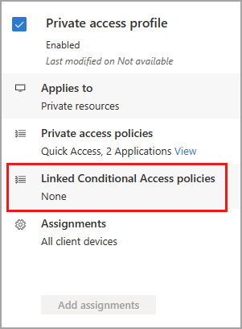

# How to manage the Private access traffic forwarding profile

The Private Access traffic forwarding profile routes traffic to your private network through the Global Secure Access Client. Enabling this traffic forwarding profile allows remote workers to connect to internal resources without a VPN. With the features of Microsoft Entra Private Access, you can control which private resources to tunnel through the service and apply Conditional Access policies to secure access to those services. Once your configurations are in place, you can view and manage all of those configurations from one place.

## Prerequisites

To enable the Microsoft 365 traffic forwarding profile for your tenant, you must have:

- A **Global Secure Access Administrator** role in Microsoft Entra ID

### Known limitations

- At this time, Private access traffic can only be acquired with the Global Secure Access Client. Remote networks can't be assigned to the Private access traffic forwarding profile.
- Tunneling traffic to Private Access destinations by IP address is supported only for IP ranges outside of the end-user device local subnet. 
- You must disable DNS over HTTPS (Secure DNS) to tunnel network traffic based on the rules of the fully qualified domain names (FQDNs) in the traffic forwarding profile. 

## Enable the Private access traffic forwarding profile

1. Sign in to the **[Microsoft Entra admin center](https://entra.microsoft.com)**.
1. Go to **Global Secure Access** > **Connect** > **Traffic forwarding**.
1. Select the checkbox for **Private Access profile**.

## Private Access policies

To enable the Private Access traffic forwarding profile, we recommend you first configure Quick Access. Quick Access includes the IP addresses, IP ranges, and fully qualified domain names (FQDNs) for the private resources you want to include in the policy. For more information, see [Configure Quick Access](how-to-configure-quick-access.md).

You can also configure per-app access to your private resources by creating a Private Access app. Similar to Quick Access, you create a new Enterprise app which can then be assigned to the Private Access traffic forwarding profile. Quick Access contains the main group of private resources you always want to route through the service. Private Access apps can be enabled and disabled as needed without impacting the FQDNs and IP addresses included in Quick Access.

To manage the details included in the Private access traffic forwarding policy, select the **View** link for **Private access policies**. 

:::image type="content" source="media/how-to-manage-private-access-profile/private-access-profile-link.png" alt-text="Screenshot of the Private access profile, with the view applications link highlighted." lightbox="media/how-to-manage-private-access-profile/private-access-profile-expanded.png":::

Details of your Quick Access and enterprise apps for Private Access are displayed. Select the link for the application to view the details from the Enterprise applications area of Microsoft Entra ID.

## Linked Conditional Access policies

[Conditional Access policies](../active-directory/conditional-access/overview.md) are created and applied to the traffic forwarding profile in the Conditional Access area of Microsoft Entra ID. For example, you can create a policy that requires multifactor authentication to access private resources.

If you see "None" in the **Linked Conditional Access policies** section, there isn't a Conditional Access policy linked to the traffic forwarding profile. To create a Conditional Access policy, see [Universal Conditional Access through Global Secure Access.](how-to-target-resource-microsoft-365-profile.md).

### Edit an existing Conditional Access policy

1. Select the **View** link for **Linked Conditional Access policies**.
1. Select a policy from the list. The details of the policy open in Conditional Accesss. 

[!INCLUDE [Public preview important note](./includes/public-preview-important-note.md)]

## Next steps

- [Configure Quick Access](how-to-configure-quick-access.md)
- [Learn about traffic forwarding](concept-traffic-forwarding.md)