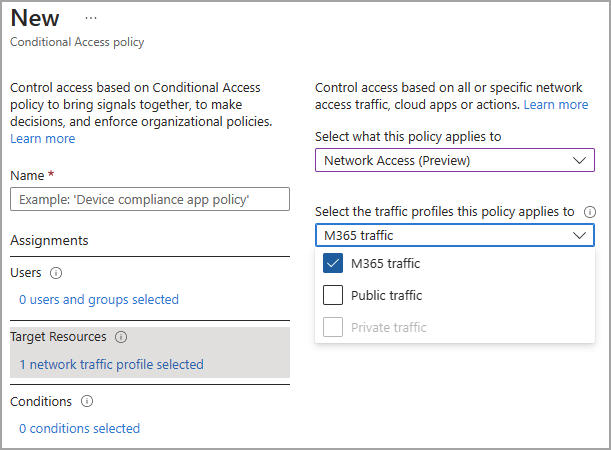

# How to enable the Private access profile

The private access traffic forwarding profile routes traffic to your private network through the Global Secure Access client. Enabling this traffic forwarding profile allows remote workers to connect to internal resources without a VPN.

[!INCLUDE [Public preview important note](./includes/public-preview-important-note.md)]

## Prerequisites

To enable the Microsoft 365 traffic forwarding profile for your tenant, you must have:

- A **Global Secure Access Administrator** role in Microsoft Entra ID

The **Private access profile** looks at traffic going to your organization's private, internal applications and sites. Your [Quick Access configurations](how-to-configure-quick-access.md) define the apps and sites that make up your Private access traffic forwarding profile.

Quick Access ranges are similar to the Microsoft 365 traffic policies, except the IP addresses and FQDNs in the Microsoft 365 profile are predefined. Quick Access groups allow you to create your own collection of fully qualified domain names (FQDN), IP addresses, and IP address ranges. 

## Private access traffic forwarding profile

To enable the Private access traffic forwarding profile, you must first configure Quick Access. Quick Access includes the IP addresses, IP ranges, and fully qualified domain names (FQDN) for the private applications and destinations you want to include in the policy. For more information, see [Configure Quick Access](how-to-configure-quick-access.md).

Because remote networks can't be assigned to the Private access traffic forwarding profile, you must install the Global Secure Access client on your end-user devices. For more information, see [How to install the Windows client](how-to-install-windows-client.md).

### Private access Conditional Access policies

<!--- need to confirm this section with PM and John --->
Conditional Access policies can be applied to your traffic profiles at the application level. Applying Conditional Access policies provides more options for managing access to applications, sites, and services.

Conditional Access policies are created and applied to the profile in the Conditional Access area of Microsoft Entra ID. For more information, see the [Conditional Access overview](../active-directory/conditional-access/overview.md).

1. Create a new Conditional Access policy. For more information, see [Building a Conditional Access policy](../active-directory/conditional-access/concept-conditional-access-policies.md).
1. Under **Target Resources** select **No target resources selected**.
1. Select **Network Access (Preview)** from the menu.
1. From the new menu that appears, select the Private access traffic option.

    

## Next steps

- [Configure Quick Access](how-to-configure-quick-access.md)
- [Learn about traffic forwarding](concept-traffic-forwarding.md)