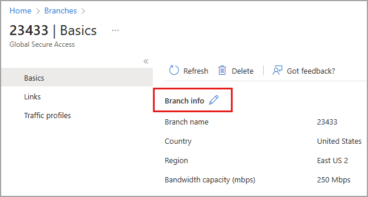
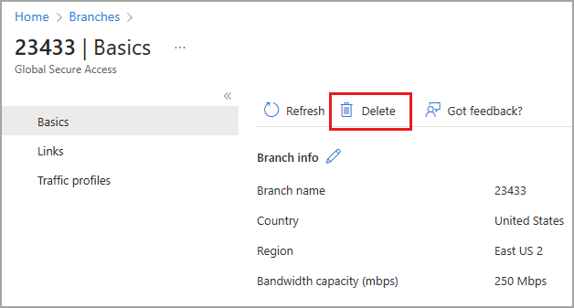

# Manage remote networks

Remote networks are remote locations or networks that require internet connectivity. Setting up remote networks connects your users in that location to Global Secure Access. Once a branch is configured, you can assign it to a traffic forwarding profile to manage your corporate network traffic.

This article explains how to create a branch office location for Global Secure Access.

## Prerequisites
<!--- confirm and make consistent with all articles --->
- **Microsoft Entra Internet Access Premium license** for your Microsoft Entra Identity tenant
- **Global Secure Access Administrator** role in Microsoft Entra ID
- The **Microsoft Graph** module must be installed to use PowerShell
- Administrator consent is required when using Microsoft Graph Explorer for the Microsoft Graph API

## Create a branch location
Global Secure Access provides branch connectivity so you can connect a branch office to Global Secure Access. Once a branch is connected, you can set up network security policies. These policies are applied on all outbound traffic. 

There are multiple ways to connect a branch location to Global Secure Access. In a nutshell, you're creating an Internet Protocol Security (IPSec) tunnel between a core router at your branch location and the nearest Microsoft VPN service. The network traffic is routed with the core router at the branch location so installation of a client isn't required on individual devices.

Branch office locations are configured on three tabs. To work through each tab, either select the tab from the top of the page, or select the **Next** button at the bottom of the page.

### Basics
The first step is to provide the basic details of your branch office, including the name, location, and bandwidth capacity. Completing this tab is required to create a new branch office.
<!--- need correct role here --->
1. Sign in to the **[Microsoft Entra admin center](https://entra.microsoft.com)** as a Global Secure Access Administrator. 
1. Browse to **Devices** > **Branches**.
1. Select the **Create branch office** button and provide the following details:
    - **Name**
    - **Country**
    - **Region**
    - **Bandwidth capacity** must be 250, 500, 750, or 1000 mbps.

### Connectivity
<!---Can't test this section because I need valid sample IP addresses, BGP addresses, and ASNs --->
The connectivity tab is where you add the device links for the branch office location. You need to provide the device type, IP address, border gateway protocol (BGP) address, and autonomous system number (ASN) for each device link. You can add device links after creating the branch office location. For more information on device links, see [How to manage branch location device links](how-to-manage-branch-location-device-links.md).

1. Select the **Add a link** button. The **Add a link pane** opens with three tabs to complete.

**General**

1. Enter the following details: 
    - **Link name**: Name of your CPE.
    - **Device type**: Choose one of the options from the dropdown list.
    - **IP address**: Public IP address of your device.
    - **Link BGP address**: The border gateway protocol address of the CPE.
    - **Link ASN**: Provide the autonomous system number of the CPE. For more information on the requirements for this detail, see the [Link ASN](#link-asn) section of this article.
1. Select the **Next** button.

**Details**

<!--- why is IKEv1 greyed out in my sample --->
1. Select either **IKEv2** or **IKEv1**. 
1. The IPSec/IKE policy is set to **Default** but you can change to **Custom**. If you select **Custom** you need to set the following details:
    - Encryption
    - IKEv2 integrity
    - DH group
    - IPSec encryption
    - IPSec integrity
    - PFS group
    - SA lifetime
1. Select the **Next** button.

**Security**

1. Enter a pre-shared key to be used on your CPE.
1. Select the **Add link** button. 

### Traffic profiles

You can assign the branch office to a traffic forwarding profile when you create the branch. You can also assign the branch at a later time. For more information, see [Traffic forwarding profiles](concept-traffic-forwarding.md).

1. Select the appropriate traffic forwarding profile.
1. Select the **Review + Create** button.

## Update branch locations

All details of your branch locations can be updated at any time.

1. Sign in to the Microsoft Entra admin center at [https://entra.microsoft.com](https://entra.microsoft.com).
1. Go to **Global Secure Access (preview)** > **Devices** > **Branches**.
1. Select the branch you need to update.

### Basics

On the Basics page you can update the branch name, country, region, and bandwidth. Select the pencil icon to edit the details.

## Delete a branch

1. Sign in to the Microsoft Entra admin center at [https://entra.microsoft.com](https://entra.microsoft.com).
1. Go to **Global Secure Access (preview)** > **Devices** > **Branches**.
1. Select the branch you need to delete.
1. Select the **Delete** button. 
1. Select **Delete** from the confirmation message.

## Link ASN

The link ASN is the autonomous system number of the CPE. The ASN is a unique number that identifies a network on the internet. The ASN is used to exchange routing information between the CPE and the Microsoft network. The ASN must be a 32-bit integer between 1 and 4294967295. The ASN must be unique for each device link.

The following ASNs are reserved by Azure and cannot be used for your on-premises VPN devices when connecting to Azure VPN gateways:
- 8075
- 8076
- 12076 (public)
- 65517
- 65518
- 65519
- 65520 (private)

<!--- need to understand what this means - pulled it from the tooltip --->

While setting up IPsec connectivity from virtual network gateways to Azure virtual WAN VPN, the ASN for Local Network Gateway is required to be 65515.

## Next steps

- [List branch locations](how-to-list-branch-locations.md)

