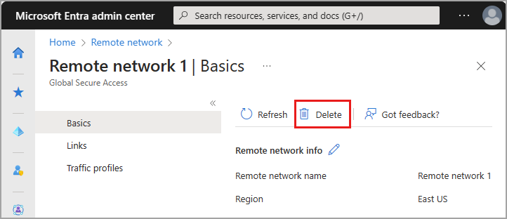

# Manage remote networks

Remote networks connect your users in remote locations to Global Secure Access (preview). Adding, updating, and removing remote networks from your environment are likely common tasks for many organizations. 

This article explains how to manage your existing remote networks for Global Secure Access.

## Prerequisites

- A **Global Secure Access Administrator** role in Microsoft Entra ID
- The preview requires a Microsoft Entra ID P1 license. If needed, you can [purchase licenses or get trial licenses](https://aka.ms/azureadlicense).
- To use the Microsoft 365 traffic forwarding profile, a Microsoft 365 E3 license is recommended.

### Known limitations

- At this time, remote networks can only be assigned to the Microsoft 365 traffic forwarding profile.

## Update remote networks

You can update remote networks in the Microsoft Entra admin center or using the Microsoft Graph API.

### [Microsoft Entra admin center](#tab/microsoft-entra-admin-center)

To update the details of your remote networks:

1. Sign in to the [Microsoft Entra admin center](https://entra.microsoft.com) as a [Global Secure Access Administrator](/azure/active-directory/roles/permissions-reference#global-secure-access-administrator).
1. Browse to **Global Secure Access (preview)** > **Devices** > **Remote networks**.
1. Select the remote network you need to update.

    

There are three sections with details you can edit:

#### Basics

From this page you can delete the selected remote network. The only detail you can edit after a remote network is created is the name. Select the pencil icon to edit the name of the remote network.


#### Links

From this page you can add a new device link or delete an existing device link. You can't edit the details of a device link after it was created. Select the trash can icon to delete a remote network device link.


#### Traffic profiles

From this page you can enable or disable the available traffic forwarding profile. To view or manage the details of the traffic forwarding profiles, browse to **Connect** > **Traffic forwarding**.

### [Microsoft Graph API](#tab/microsoft-graph-api)

To edit the details of a remote network:

1. Sign in to [Graph Explorer](https://aka.ms/ge).
1. Select **PATCH** as the HTTP method from the dropdown.
1. Select the API version to **BETA**.
1. Enter the query:

```http
    PATCH https://graph.microsoft.com/beta/networkaccess/connectivity/branches/8d2b05c5-1e2e-4f1d-ba5a-1a678382ef16
    {
        "@odata.context": "#$delta",
        "name": "ContosoRemoteNetwork2"
    }
``` 

1. Select **Run query** to update the remote network.

---

## Delete a remote network

You can delete remote networks in the Microsoft Entra admin center or using the Microsoft Graph API.

### [Microsoft Entra admin center](#tab/microsoft-entra-admin-center)

1. Sign in to the Microsoft Entra admin center at [https://entra.microsoft.com](https://entra.microsoft.com).
1. Browse to **Global Secure Access (preview)** > **Devices** > **Remote networks**.
1. Select the remote network you need to delete.
1. Select the **Delete** button.
1. Select **Delete** from the confirmation message.



### [Microsoft Graph API](#tab/microsoft-graph-api)

1. Sign in to [Graph Explorer](https://aka.ms/ge).
1. Select **PATCH** as the HTTP method from the dropdown.
1. Select the API version to **beta**.
1. Enter the query:

 ```http
    DELETE https://graph.microsoft.com/beta/networkaccess/connectivity/branches/97e2a6ea-c6c4-4bbe-83ca-add9b18b1c6b 
```

1. Select **Run query** to delete the remote network.

---

[!INCLUDE [Public preview important note](./includes/public-preview-important-note.md)]

## Next steps

- [List remote networks](how-to-list-remote-networks.md)
- [Manage remote network device links](how-to-manage-remote-network-device-links.md)
