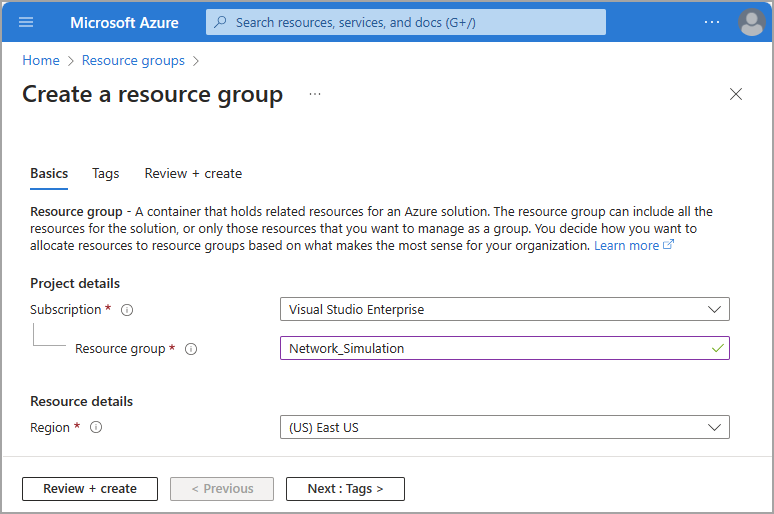
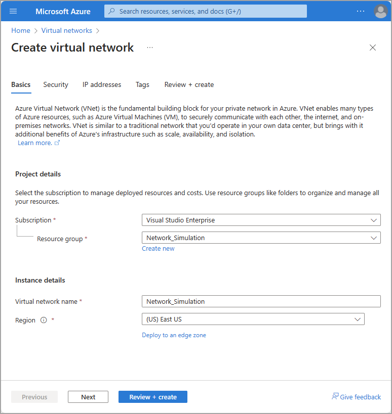
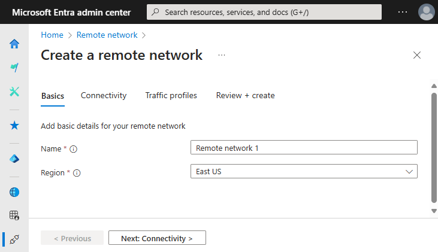
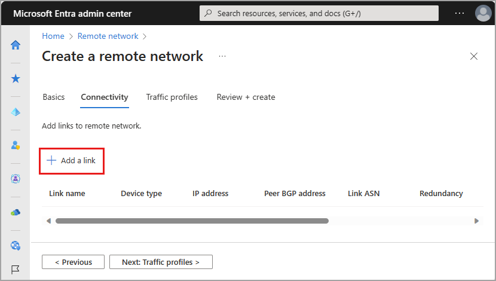
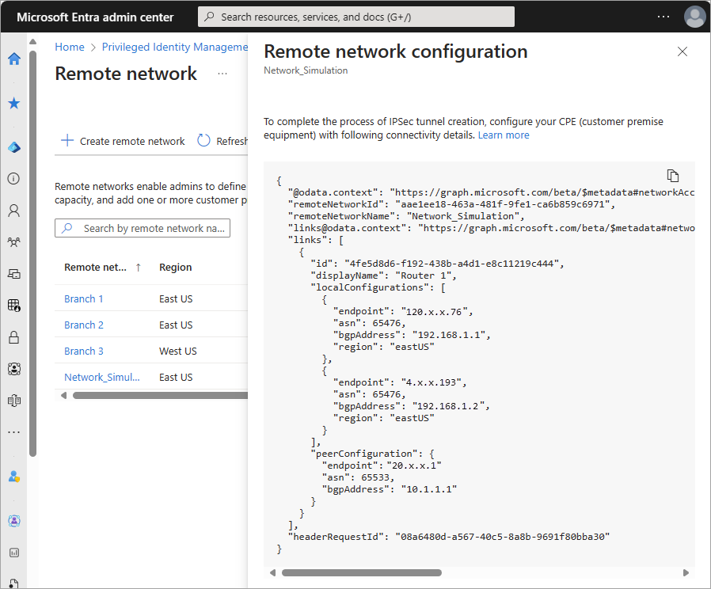

# Create a remote network using Azure virtual networks

Organizations might want to extend the capabilities of Microsoft Entra Internet Access to entire networks not just individual devices they can [install the Global Secure Access Client](how-to-install-windows-client.md) on. This article shows how to extend these capabilities to an Azure virtual network hosted in the cloud. Similar principles might be applied to a customer's on-premises network equipment.

:::image type="content" source="media/how-to-simulate-remote-network/simulate-remote-network.png" alt-text="Diagram showing a virtual network in Azure connected to Microsoft Entra Internet Access simulating a customer's network." lightbox="media/how-to-simulate-remote-network/simulate-remote-network.png":::

Building this functionality out in Azure provides organizations the ability to understand how Microsoft Entra Internet Access works in a more broad implementation. The resources we create in Azure correspond to on-premises concepts in the following ways:

| Azure resource | Traditional on-premises component |
| --- | --- |
| **[Virtual network](#create-a-virtual-network)** | Your on-premises IP address space |
| **[Virtual network gateway](#create-a-virtual-network-gateway)** | Your on-premises router, sometimes referred to as customer premises equipment (CPE) |
| **[Local network gateway](#create-local-network-gateway)** | The Microsoft gateway that your router (Azure virtual network gateway) creates an IPsec tunnel to |
| **[Connection](#create-site-to-site-s2s-vpn-connection)** | IPsec VPN tunnel created between the virtual network gateway and local network gateway |
| **[Virtual machine](#virtual-machine)** | Client devices on your on-premises network |

In this document, we use the following default values. Feel free to configure these settings according to your own requirements.

- **Subscription:** Visual Studio Enterprise
- **Resource group name:** Network_Simulation
- **Region:** East US

## Prerequisites

To complete the steps in this process, you must have the following prerequisites in place:

- An Azure subscription and permission to create resources in the [Azure portal](https://portal.azure.com).
- A basic understanding of [site-to-site VPN connections](/azure/vpn-gateway/tutorial-site-to-site-portal).
- A Microsoft Entra tenant with the [Global Secure Access Administrator](/azure/active-directory/roles/permissions-reference#global-secure-access-administrator) role assigned.

## High level steps

The steps to simulate remote network connectivity with Azure virtual networks are completed in the Azure portal and the Microsoft Entra admin center. It might be helpful to have multiple tabs open you can switch between them easily.

Before creating your virtual resources, you need a resource group and virtual network to use throughout the following sections. If you don't have a test resource group or virtual network you can use, start with the *Configure prerequisite infrastructure* steps. Otherwise, you can skip to the *Configure the virtual network* steps.

### Configure the prerequisite infrastructure

1. [Create a resource group](#create-a-resource-group) (Azure portal)
1. [Create a virtual network](#create-a-virtual-network) (Azure portal)

### Configure the virtual network

1. [Create a virtual network gateway](#create-a-virtual-network-gateway) (Azure portal)
1. [Create a remote network with device links](#create-a-remote-network) (Microsoft Entra admin center)
1. [Create local network gateway](#create-local-network-gateway) (Azure portal)
1. [Create site-to-site (S2S) VPN connection](#create-site-to-site-s2s-vpn-connection) (Azure portal)
1. [Verify connectivity](#verify-connectivity) (Both)

## Create a resource group

Create a resource group to contain all of the necessary resources.

1. Sign in to the [Azure portal](https://portal.azure.com) with permission to create resources.
1. Browse to **Resource groups**.
1. Select **Create**.
1. Select your **Subscription**, **Region**, and provide a name for your **Resource group**.
1. Select **Review + create**.
1. Confirm your details, then select **Create**.

> [!TIP]
> If you're using this article for testing Microsoft Entra Internet Access, clean up all related Azure resources by deleting the new resource group after you're done.

## Create a virtual network

Create a virtual network inside your new resource group.

1. From the Azure portal, browse to **Virtual Networks**.
1. Select **Create**.
1. Select the **Resource group** you just created.
1. Provide your network with a **Virtual network Name**.
1. Leave the default values for the other fields.
1. Select **Review + create**.
1. Select **Create**.

## Create a virtual network gateway

Create a virtual network gateway inside your new resource group.

1. From the Azure portal, browse to **Virtual network gateways**.
1. Select **Create**.
1. Provide your virtual network gateway with a **Name** and select the appropriate region.
1. Select the **Virtual network** created in the previous section.
1. Create a **Public IP address** and provide it with descriptive name.
   - **OPTIONAL**: If you want a secondary IPsec tunnel, under the **SECOND PUBLIC IP ADDRESS** section, create another public IP address and give it a name. In this case, you need to create two device links in the Microsoft Entra admin center.
1. Select an **Availability zone**. 
1. Set **Configure BGP** to **Enabled**.
1. Set the **Autonomous system number (ASN)** to an appropriate value. You can use any 2 byte values (between 1 to 65534) *except* for the following reserved ASNs:
   - Azure reserved ASNs: 12076, 65517, 65518, 65519, 65520, 8076, 8075
   - IANA reserved ASNs: 23456, >= 64496 && <= 64511, >= 65535 && <= 65551, 4294967295
   - 65476, 65515
1. Leave all other settings to their defaults or blank.
1. Select **Review + create**, confirm your settings.
1. Select **Create**.

  :::image type="content" source="media/how-to-simulate-remote-network/create-azure-virtual-network-gateway.png" alt-text="Screenshot of the Azure portal showing configuration settings for a virtual network gateway." lightbox="media/how-to-simulate-remote-network/create-azure-virtual-network-gateway-expanded.png":::

> [!NOTE]
> The virtual network gateway might take several minutes to deploy and create. You can start the next section while it's being created, but you need the public IP addresses of your virtual network gateway to complete the next step.

These IP addresses can be found by browsing to the **Configuration** page of your virtual network gateway once it's created.

:::image type="content" source="media/how-to-simulate-remote-network/virtual-network-gateway-public-ip-addresses.png" alt-text="Screenshot showing how to find the public IP addresses of a virtual network gateway." lightbox="media/how-to-simulate-remote-network/virtual-network-gateway-public-ip-addresses-expanded.png":::

## Create a remote network

Before you create your remote network for Global Secure Access, take a moment to review the two options about redundancy. Remote networks can be created with or without redundancy. You can add redundancy in two ways:

1. Choose **Zone redundancy** while creating a device link in the Microsoft Entra admin center.
    - In this scenario, we create another gateway for you in a different availability zone within the same datacenter **Region** you picked while creating your remote network.
    - In this case, you need just one public IP address on your virtual network gateway.
    - Two IPsec tunnels are created from the same public IP address of your router to different Microsoft gateways in different availability zones.
1. Create a secondary public IP address in the Azure portal and create two device links with different public IP addresses in the Microsoft Entra admin center.
    - You can choose **No redundancy** then when creating device links in the Microsoft Entra admin center.
    - In this case, you need primary and secondary public IP addresses on your virtual network gateway.

In this article, we choose the zone redundancy path. The steps to create a remote network are divided on three tabs. You can complete the first tab right away, then return to the second two tabs when the remote network gateway is created.

### Basics

This step is completed in the Microsoft Entra admin center and is where you provide the name and location of your remote network. Completing this tab is required.

1. Sign in to the [Microsoft Entra admin center](https://entra.microsoft.com) as a [Global Secure Access Administrator](/azure/active-directory/roles/permissions-reference#global-secure-access-administrator).
1. Browse to **Global Secure Access (preview)** > **Connect** > **Remote networks**.
1. Select the **Create remote network** button and provide the following details:
    - **Name**
    - **Region**

   

### Connectivity

This tab is where you add the device links for the remote network. In a branch office scenario, this step connects your physical router to your Global Secure Access network. In the remote network simulation scenario, you're connecting your virtual network to the Global Secure Access network.

You need to provide the device type, public IP address of your virtual network gateway, border gateway protocol (BGP) address, and autonomous system number (ASN) for each device link. To complete this step, you need the public IP address of the virtual network gateway you created in the previous section.

The process to add a device link is completed on a different set of tabs. When you finish adding the device link, you return to the **Create a remote network** process, where you still have two more tabs to complete.

This process is covered in detail in the [How to manage remote network device links](how-to-manage-remote-network-device-links.md).

1. In the Microsoft Entra admin center, browse to **Global Secure Access (preview)** > **Connect** > **Remote networks**.
1. On the **Connectivity** tab, select **Add a link**.

    

#### General tab

Each of the following details are required to create a device link. The IP address comes from your virtual network gateway. For more information, see [How to manage remote network device links](how-to-manage-remote-network-device-links.md#add-a-link---general-tab).

- **Link name**: Name of your device link.
- **Device type**: Set to **Other**.
- **IP address**: Public IP address of your virtual network gateway.
- **Local BGP address**: Private IP address that is *outside* the address space of the virtual network associated with your virtual network gateway.
  - For example, if the address space of your virtual network is 10.1.0.0/16, then you can use 10.2.0.0 as your Local BGP address.
- **Peer BGP address**: BGP IP address of your virtual network gateway.
- **Link ASN**: ASN of your virtual network gateway.
- **Redundancy**: Set to **Zone redundancy**.
- **Zone redundancy local BGP address**: Private IP address that is *outside* the address space of the virtual network associated with your virtual network gateway. This address must be different from **Local BGP address**.
- **Bandwidth capacity (Mbps)**: Specify tunnel bandwidth. Available options are 250, 500, 750, and 1000 Mbps.

#### Details tab

The **Details** tab is where you establish the bidirectional communication channel between Global Secure Access and your CPE. Configure your IPSec/IKE policy and select the **Next** button.

Leave the default values selected, unless you made a different selection previously. For more information, see [How to manage remote network device links](how-to-manage-remote-network-device-links.md#add-a-link---security-tab).

#### Security tab

1. Enter the Pre-shared key (PSK).
1. Select the **Save** button.

After you create the device link, you return to the **Create a remote network** page. Select the **Traffic profiles** tab to continue the process.

### Traffic profiles

You can assign the remote network to a traffic forwarding profile when you create the remote network. You can also assign the remote network at a later time. For more information, see [Traffic forwarding profiles](concept-traffic-forwarding.md).

1. On the **Traffic profiles** tab, select the appropriate traffic forwarding profile.
1. Select the **Review + Create** button.

The final tab in the process is to review all of the settings that you provided. Review the details provided here and select the **Create remote network** button.

### View connectivity configuration

1. Browse to **Global Secure Access (Preview)** > **Connect** > **Remote networks**.
1. Select **View configuration** button for the remote network you created.
   - The configuration is shown as a JSON blob.
1. Locate and save Microsoft's public IP address `endpoint`, `asn` and `bgpAddress` from the pane that opens.

Use this information to set up your connectivity in next step. For more information about configuration, see the article [Configure customer premises equipment](how-to-configure-customer-premises-equipment.md).

## Create local network gateway

This step is completed in the Azure portal. Several details from the previous step are needed to complete this step.

If you selected **No redundancy** while creating device links in the Microsoft Entra admin center, you need to create just one local network gateway.

If you selected **Zone redundancy**, then you need to create two local network gateways. You have two sets of `endpoint`, `asn` and `bgpAddress` in `localConfigurations` for the device links. This information is provided in **View Configuration** details for that remote network in the Microsoft Entra admin center.

1. From the Azure portal, select **Create a resource**.
1. Select **Networking** > **Local network gateway**.
1. Select the **Resource group** created previously.
1. Select the appropriate region.
1. Provide your local network gateway with a **Name**.
1. For **Endpoint**, select **IP address**, then provide the IP address provided in the Microsoft Entra admin center.
1. Select **Next: Advanced**.
1. Set **Configure BGP** to **Yes**
   1. Set the **Autonomous system number (ASN)** to the appropriate value provided in the Microsoft Entra admin center.
   1. Set the **BGP peer IP address** to the appropriate value provided in the Microsoft Entra admin center.
1. Select **Review + create**, confirm your settings.
1. Select **Create**.

Repeat these steps to create another local network gateway with second set of values.

:::image type="content" source="media/how-to-simulate-remote-network/create-local-network-gateway.png" alt-text="Screenshot of the Azure portal showing configuration settings for a local network gateway." lightbox="media/how-to-simulate-remote-network/create-local-network-gateway.png":::

## Create Site-to-site (S2S) VPN connection

You create two connections one for your primary and secondary gateways.

1. From the Azure portal, select **Create a resource**.
1. Select **Networking** > **Connection**.
1. Select the **Resource group** created previously.
1. Under **Connection type**, select **Site-to-site (IPsec)**.
1. Provide a **Name** for the connection, and select the appropriate **Region**.
1. Move to the **Settings** tab.
   1. Select your **Virtual network gateway** and **Local network gateway** created previously.
   1. Enter the same **Shared key (PSK)** that you entered while creating the device link in previous step.
   1. Check the box for **Enable BGP**.
   1. Keep the other default settings.
1. Select **Review + create**, confirm your settings.
1. Select **Create**.

Repeat these steps to create another connection with second local network gateway.

:::image type="content" source="media/how-to-simulate-remote-network/create-site-to-site-connection.png" alt-text="Screenshot of the Azure portal showing configuration settings for a site-to-site connection." lightbox="media/how-to-simulate-remote-network/create-site-to-site-connection.png":::

## Verify connectivity

### Virtual machine

We use the virtual machine (VM) created here to simulate on-premises traffic flows.

1. From the Azure portal, select **Create a resource**.
1. Select **Virtual machine**.
1. Select the **Resource group** created previously.
1. Provide a **Virtual machine name**.
1. Select the Image you want to use, for this example we choose **Windows 11 Pro, version 22H2 - x64 Gen2**
1. Select **Run with Azure Spot discount** for this test.
1. Provide a **Username** and **Password** for your VM
1. Move to the **Networking** tab.
   1. Select the **Virtual network** created previously.
   1. Keep the other networking defaults.
1. Move to the **Management** tab
   1. Check the box **Login with Microsoft Entra ID**
   1. Keep the other management defaults.
1. Select **Review + create**, confirm your settings.
1. Select **Create**.

You might choose to lock down remote access to the network security group to only a specific network or IP.

### Verify connectivity status

After you create the remote networks and connections in the previous steps, it might take a few minutes for the connection to be established. From the Azure portal, we can validate that the VPN tunnel is connected and that BGP peering is successful.

1. In the Azure portal, browse to the **virtual network gateway** created earlier and select **Connections**.
1. Each of the connections should show a **Status** of **Connected** once the configuration is applied and successful.
1. Browsing to **BGP peers** under the **Monitoring** section allows you to confirm that BGP peering is successful. Look for the peer addresses provided by Microsoft. Once configuration is applied and successful, the **Status** should show **Connected**.

:::image type="content" source="media/how-to-simulate-remote-network/verify-connectivity.png" alt-text="Screenshot showing how to find the connection status for your virtual network gateway." lightbox="media/how-to-simulate-remote-network/verify-connectivity.png" :::

You can use the virtual machine you created to validate that traffic is flowing to Microsoft 365 locations like SharePoint Online. Browsing to resources in SharePoint or Exchange Online should result in traffic on your virtual network gateway. This traffic can be seen by browsing to [Metrics on the virtual network gateway](/azure/vpn-gateway/monitor-vpn-gateway#analyzing-metrics) or by [Configuring packet capture for VPN gateways](/azure/vpn-gateway/packet-capture).

## Next steps

- [Tutorial: Create a site-to-site VPN connection in the Azure portal](/azure/vpn-gateway/tutorial-site-to-site-portal)