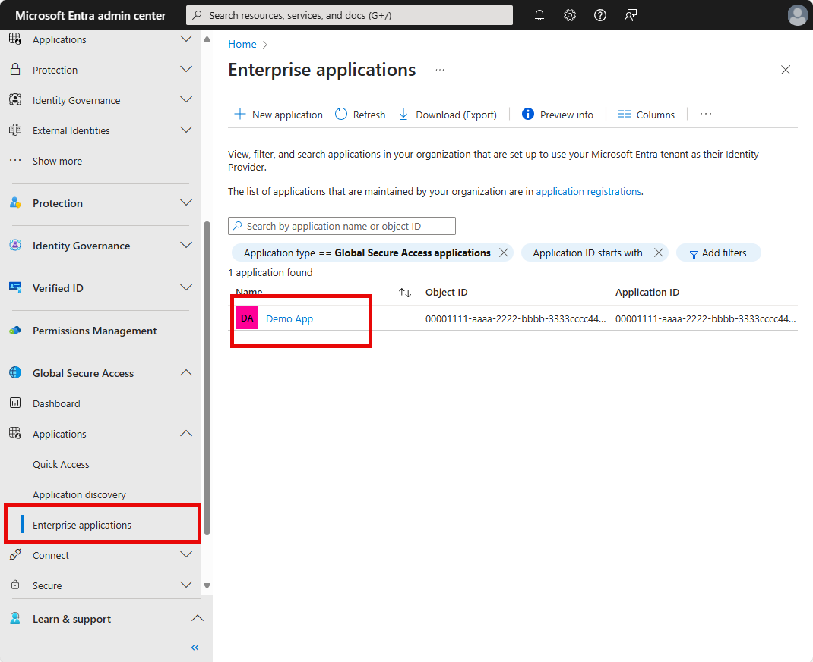

# Apply Conditional Access policies to Private Access apps

Applying Conditional Access policies to your Microsoft Entra Private Access apps is a powerful way to enforce security policies for your internal, private resources. You can apply Conditional Access policies to your Quick Access and Private Access apps.

This article describes how to apply Conditional Access policies to your Quick Access and Private Access apps.

## Prerequisites

* Administrators who interact with **Global Secure Access preview** features must have one or more of the following role assignments depending on the tasks they're performing.
   * [Global Secure Access Administrator role](../active-directory/roles/permissions-reference.md)
   * [Conditional Access Administrator](../active-directory/roles/permissions-reference.md#conditional-access-administrator) or [Security Administrator](../active-directory/roles/permissions-reference.md#security-administrator) to create and interact with Conditional Access policies.
* You must be routing your private network traffic through the **Global Secure Access preview**.
* You need to have configured Quick Access or Per-app Access.

## Conditional Access and Private Access apps

You can create a Conditional Access policy for your Quick Access or Private Access apps from Global Secure Access. Starting the process from Global Secure Access automatically adds the selected app as the **Target resource** for the policy. All you need to do is configure the policy settings.

1. Sign in to the **[Microsoft Entra admin center](https://entra.microsoft.com)** as a Conditional Access Administrator or Security Administrator.
1. Go to **Global Secure Access (preview)** > **Applications** > **Enterprise applications.**
1. Select an application from the list.

    

1. Select **Conditional Access** from the side menu. Any existing Conditional Access policies appear in a list. 

    

1. Select **Create new policy**. The selected app appears in the **Target resources** details.

    

1. Configure the conditions, access controls, and assign users and groups as needed.

## Create a Conditional Access policy targeting a Private Access application

Your Quick Access and Private Access apps are all listed in the Enterprise applications area of Global Secure Access. The process to apply a Conditional Access policy is the same for Quick Access and Private Access apps.

The following example creates a Conditional Access policy requiring multifactor authentication for your Quick Access application.

1. Sign in to the **[Microsoft Entra admin center](https://entra.microsoft.com)** as a Conditional Access Administrator or Security Administrator.
1. Go to **Global Secure Access (preview)** > **Applications** > **Enterprise applications.**
1. Select your Quick Access application from the list.
1. Select **Conditional Access** from the side menu.
1. Select **Create new policy**.
1. Give your policy a name. We recommend that organizations create a meaningful standard for the names of their policies.
1. Under **Assignments**, select **Users**:
   1. Under **Include**, select **All users**.
   1. Under **Exclude**, select **Users and groups** and choose your organization's emergency access or break-glass accounts. 
1. Under **Access controls** > **Grant**:
   1. Select **Grant access** > **Require multifactor authentication** > **Select**.
1. Confirm your settings and set **Enable policy** to **Report-only**.
1. Select **Create** to create and enable your policy.
   
After administrators confirm the policy settings using [report-only mode](../active-directory/conditional-access/howto-conditional-access-insights-reporting.md), an administrator can move the **Enable policy** toggle from **Report-only** to **On**.

## Next steps

- [Enable the Private Access traffic forwarding profile](how-to-manage-private-access-profile.md)
- [Enable source IP restoration](how-to-source-ip-restoration.md)