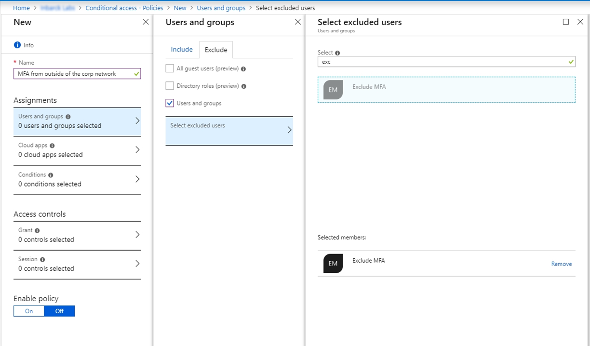
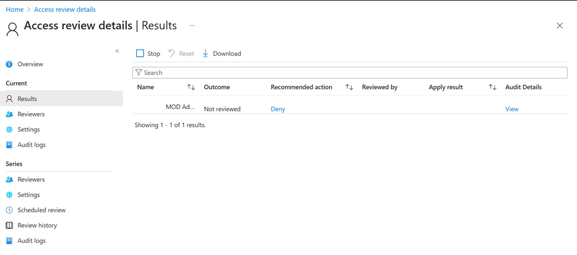

# Use Azure AD Access Reviews to manage users that have been excluded from conditional access policies

In an ideal world, all users would follow the access polices to secure access to your organization's resources. However, sometimes there are business cases that require you to make exceptions. This article describes some examples where exclusions might be required and how you, as the IT administrator, can manage this task, avoid oversight of policy exceptions, and provide auditors with proof that these exceptions are reviewed regularly using Azure Active Directory (Azure AD) Access Reviews.

> [!NOTE]
> A valid Azure AD Premium P2, Enterprise Mobility + Security E5 paid, or trial license is required to use Azure AD access reviews. For more information, see [Azure Active Directory editions](../fundamentals/active-directory-whatis.md).

## Why would you exclude users from policies?

As an IT administrator, you might use [Azure AD conditional access](../conditional-access/overview.md) to require users to authenticate using multi-factor authentication (MFA) or sign in from a trusted network or device. During the deployment planning, you find out that some of these requirements cannot be met by all users. For example, there are users who work from a remote office that is not part of your internal network or there is an executive who uses an old phone that is not supported. The business requires that these users be allowed to sign in and do their job, therefore, they are excluded from the conditional access policies.

As another example, you might use [named locations](../conditional-access/location-condition.md) in conditional access to configure a set of counties and regions from which you don't want to allow users to access their tenant.

However, in some cases, users might have a legitimate reason to sign in from these blocked countries. For example, users might be traveling for work or personal reasons. In this example, the conditional access policy to block these countries could have a dedicated cloud security group for the users who are excluded from the policy. Users who need access while traveling, can add themselves to the group using [Azure AD self-service Group management](../users-groups-roles/groups-self-service-management.md).

Another example might be that you have a conditional access policy that [blocks legacy authentication for the vast majority of your users](https://cloudblogs.microsoft.com/enterprisemobility/2018/06/07/azure-ad-conditional-access-support-for-blocking-legacy-auth-is-in-public-preview/). Microsoft strongly recommends that you block the use of legacy protocols in your tenant to improve your security posture. However, if you have some users that absolutely need to use legacy authentication methods to access your resources via Office 2010 or IMAP/SMTP/POP based clients, then you can exclude these users from the policy that block legacy authentication methods.

## Why are exclusions challenging?

In Azure AD, you can scope a conditional access policy to a set of users. You can also exclude some of these users by selecting directory roles, individual users, or guests of users. It is important to remember that when these exclusions are configured, the policy intent can't be enforced for those users. If these exclusions were configured as either a list of individual users or via a legacy on-premises security group, then it limits the visibility of this exclusion list (users may not know of its existence) and the IT administrator's control over it (users can join the security group to by-pass the policy). Additionally, users that qualified for the exclusion at one time may no longer need it or be eligible for it.

At the beginning of an exclusion, there is a short list of users who bypass the policy. Over time, more and more users are excluded, and the list grows. At some point, there is a need to review the list and confirm that each of these users should still be excluded. Managing the list from a technical point of view, can be relatively easy, but who makes the business decisions and how do you make sure it is all auditable?

However, if you configure the exclusion to the conditional access policy using an Azure AD group, then you can use access reviews as a compensating control, to drive visibility, and reduce the number of users who have an exception.

## How to create an exclusion group in a conditional access policy

Follow these steps to create a new Azure AD group and a conditional access policy that does not apply to that group.

### Create an exclusion group

1. Sign in to the Azure portal.

1. In the left navigation, click **Azure Active Directory** and then click **Groups**.

1. On the top menu, click **New Group** to open the group pane.

1. In the **Group type** list, select **Security**. Specify a name and description.

1. Make sure to set the **Membership** type to **Assigned**.

1. Select the users that should be part of this exclusion group and then click **Create**.

    

### Create a conditional access policy that excludes the group

Now you can create a conditional access policy that uses this exclusion group.

1. In the left navigation, click **Azure Active Directory** and then click **Conditional access** to open the **Policies** blade.

1. Click **New policy** to open the **New** pane.

1. Specify a name.

1. Under Assignments click **Users and groups**.

1. On the **Include** tab, select **All Users**.

1. On the **Exclude** tab, add a checkmark to **Users and groups** and then click **Select excluded users**.

1. Select the exclusion group you created.

    > [!NOTE]
    > As a best practice, it is recommended to exclude at least one administrator account from the policy when testing to make sure you are not locked out of your tenant.

1. Continue with setting up the conditional access policy based on your organizational requirements.

    

Let's cover two examples where you can use access reviews to manage exclusions in conditional access policies.

## Example 1: Access review for users accessing from blocked countries

Let's say you have a conditional access policy that blocks access from certain countries. It includes a group that is excluded from the policy. Here is a recommended access review where members of the group are reviewed.

> [!NOTE]
> A Global Administrator or User Account Administrator role is required to create access reviews.

1. The review will reoccur every week.

2. Will never end in order to make sure you're keeping this exclusion group the most up-to-date.

3. All members of this group will be in scope for the review.

4. Each user will have to self-attest that they still need to have access from these blocked countries, therefore they still need to be a member of the group.

5. If the user doesn't respond to the review request, they will be automatically removed from the group, and therefore, can no longer access the tenant while traveling to these countries.

6. Enable mail notifications so users are notified about the start and completion of the access review.

    

## Example 2: Access review for users accessing with legacy authentication

Let's say you have a conditional access policy that blocks access for users using legacy authentication and older client versions. It includes a group that is excluded from the policy. Here is a recommended access review where members of the group are reviewed.

1. This review would need to be a recurring review.

2. Everyone in the group would need to be reviewed.

3. It could be configured to list the business unit owners as the selected reviewers.

4. Auto-apply the results and remove users that have not been approved to continue using legacy authentication methods.

5. It might be beneficial to enable recommendations so reviewers of large groups can easily make their decisions.

6. Enable mail notifications so users are notified about the start and completion of the access review.

    

**Pro Tip**: If you have many exclusion groups and therefore need to create multiple access reviews, we now have an API in the Microsoft Graph beta endpoint that allows you to create and manage them programmatically. To get started, see the [Azure AD access reviews API reference](https://developer.microsoft.com/graph/docs/api-reference/beta/resources/accessreviews_root) and [Example of retrieving Azure AD access reviews via Microsoft Graph](https://techcommunity.microsoft.com/t5/Azure-Active-Directory/Example-of-retrieving-Azure-AD-access-reviews-via-Microsoft/td-p/236096).

## Access review results and audit logs

Now that you have everything in place, group, conditional access policy, and access reviews, it is time to monitor and track the results of these reviews.

1. In the Azure portal, open the  **Access reviews** blade.

1. Open the control and program you have created for managing the exclusion group.

1. Click **Results** to see who was approved to stay on the list and who was removed.

    

1. Then click **Audit logs** to see the actions that were taken during this review.

    

As an IT administrator, you know that managing exclusion groups to your policies is sometimes inevitable. However, maintaining these groups, reviewing them on a regular basis by the business owner or the users themselves, and auditing these changes can made easier with Azure AD access reviews.

## Next steps

- [Create an access review of groups or applications](create-access-review.md)
- [What is conditional access in Azure Active Directory?](../conditional-access/overview.md)
