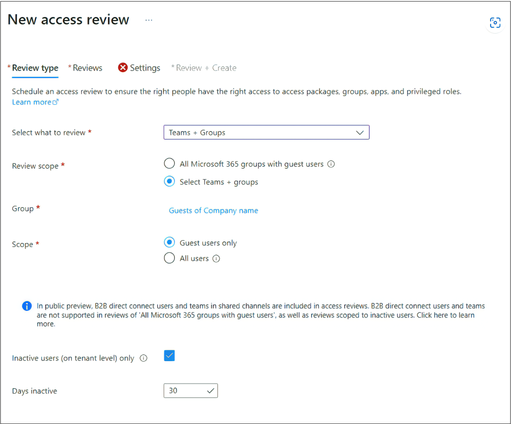
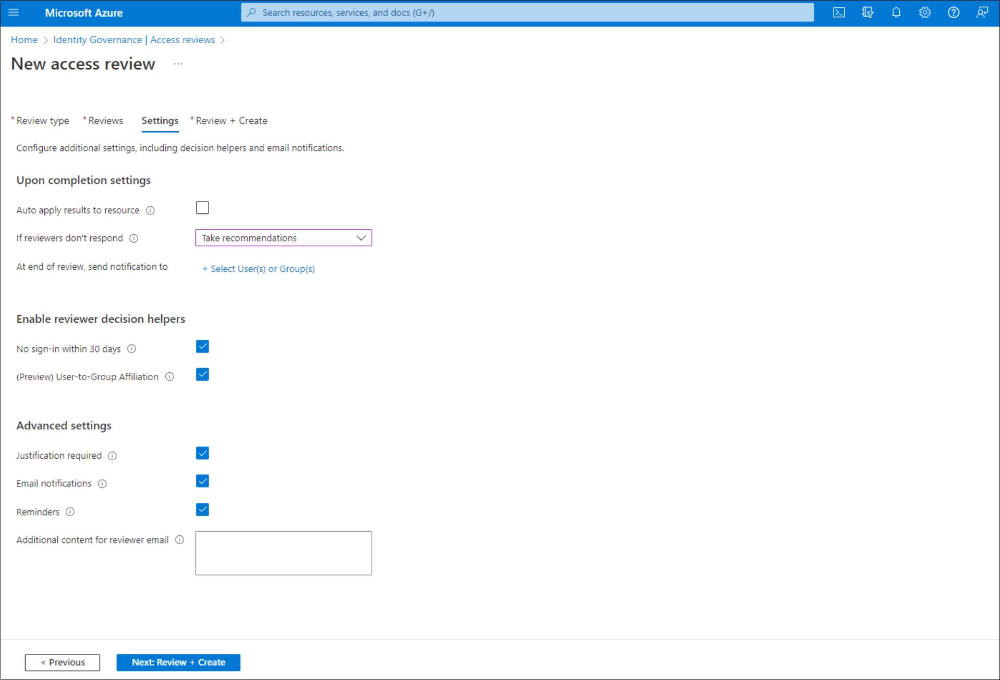
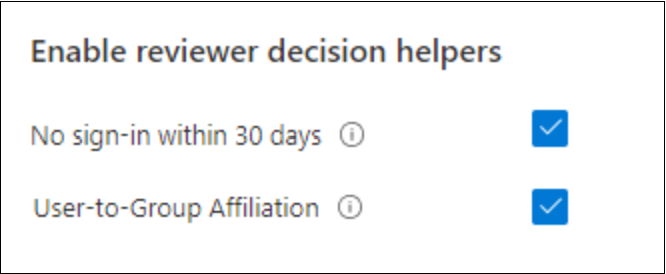
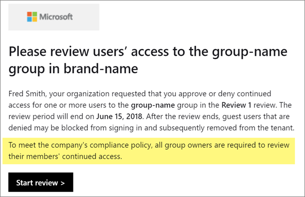
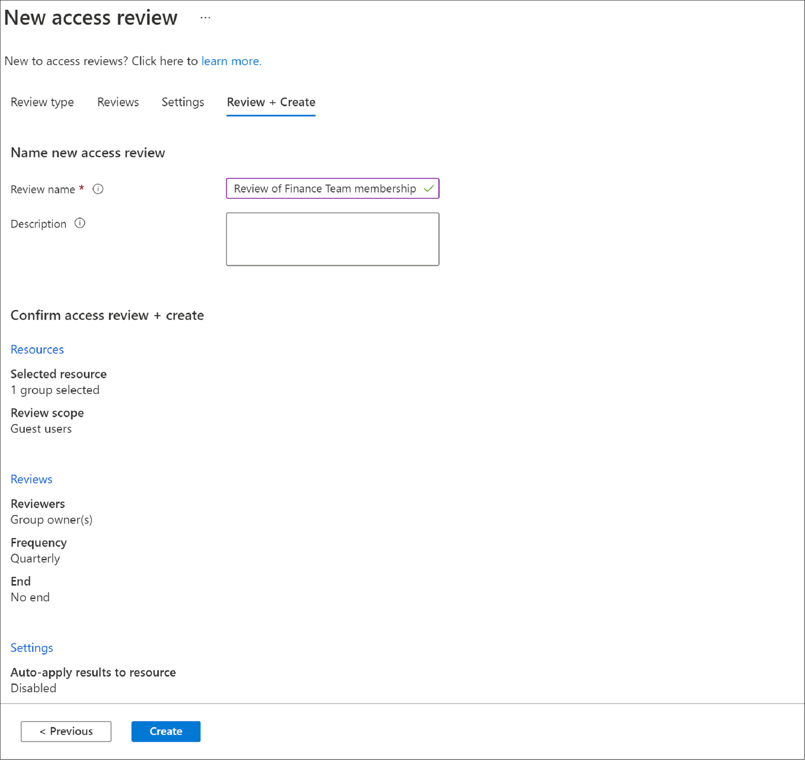
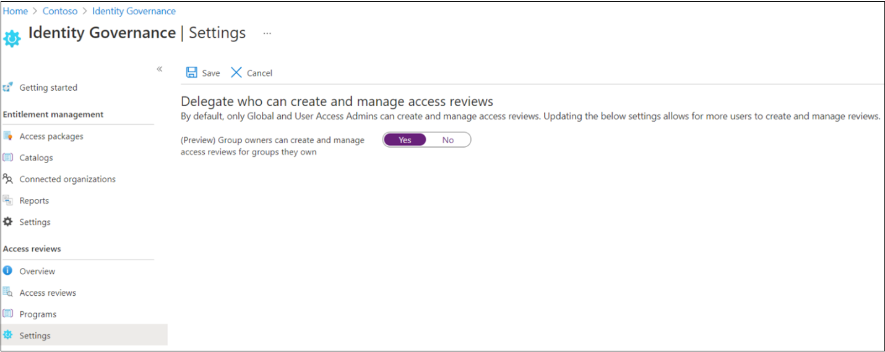
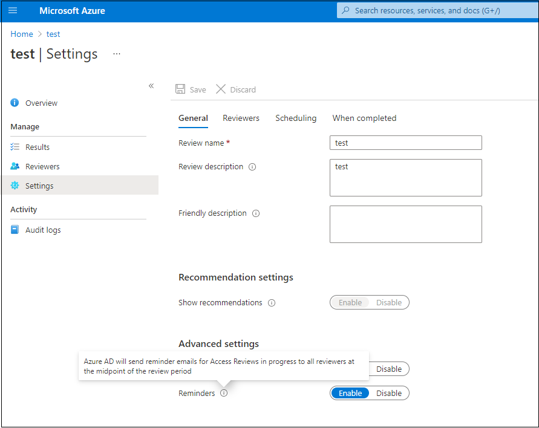

 
# Create an access review of groups and applications in Azure AD

Access to groups and applications for employees and guests changes over time. To reduce the risk associated with stale access assignments, administrators can use Azure Active Directory (Azure AD) to create access reviews for group members or application access.

Microsoft 365 and Security group owners can also use Azure AD to create access reviews for group members as long as the Global or User administrator enables the setting via the **Access Reviews Settings** pane (preview). For more information about these scenarios, see [Manage access reviews](manage-access-review.md).

Watch a short video that talks about enabling access reviews.

>[!VIDEO https://www.youtube.com/embed/X1SL2uubx9M]

This article describes how to create one or more access reviews for group members or application access.

## Prerequisites

- Azure AD Premium P2.
- Global administrator, User administrator, or Identity Governance administrator to create reviews on groups or applications.
- Global administrators and Privileged Role administrators can create reviews on role-assignable groups. For more information, see [Use Azure AD groups to manage role assignments](../roles/groups-concept.md).
- (Preview) Microsoft 365 and Security group owner.

For more information, see [License requirements](access-reviews-overview.md#license-requirements).

## Create one or more access reviews

1. Sign in to the Azure portal and open the [Identity Governance](https://portal.azure.com/#blade/Microsoft_AAD_ERM/DashboardBlade/) page.

1. On the left menu, select **Access reviews**.

1. Select **New access review** to create a new access review.

    

1. In the **Select what to review** box, select which resource you want to review.

    

1. If you selected **Teams + Groups**, you have two options:

   - **All Microsoft 365 groups with guest users**: Select this option if you want to create recurring reviews on all your guest users across all your Microsoft Teams and Microsoft 365 groups in your organization. Dynamic groups and role-assignable groups aren't included. You can also choose to exclude individual groups by selecting **Select group(s) to exclude**.
   - **Select Teams + groups**: Select this option if you want to specify a finite set of teams or groups to review. A list of groups to choose from appears on the right.

     

1. If you selected **Applications**, select one or more applications.

   

    > [!NOTE]
    > Selecting multiple groups or applications results in the creation of multiple access reviews. For example, if you select five groups to review, the result is five separate access reviews.

1. Now you can select a scope for the review. Your options are:

    - **Guest users only**: This option limits the access review to only the Azure AD B2B guest users in your directory.
    - **Everyone**: This option scopes the access review to all user objects associated with the resource.

    > [!NOTE]  
    > If you selected **All Microsoft 365 groups with guest users**, your only option is to review **Guest users only**.

1. Select **Next: Reviews**.

1. In the **Specify reviewers** section, in the **Select reviewers** box, select either one or more people to do the access reviews. You can choose from:

    - **Group owner(s)**: This option is only available when you do a review on a team or group.
    - **Selected user(s) or groups(s)**
    - **Users review their own access**
    - **Managers of users**

   If you choose either **Managers of users** or **Group owner(s)**, you can also specify a fallback reviewer. Fallback reviewers are asked to do a review when the user has no manager specified in the directory or if the group doesn't have an owner.

      

1. In the **Specify recurrence of review** section, specify the following selections:

   - **Duration (in days)**: How long a review is open for input from reviewers.
   - **Start date**: When the series of reviews begins.
   - **End date**: When the series of reviews ends. You can specify that it **Never** ends. Or, you can select **End on a specific date** or **End after number of occurrences**.

     

1. Select **Next: Settings**.

1. In the **Upon completion settings** section, you can specify what happens after the review completes.

    

    - **Auto apply results to resource**: Select this checkbox if you want access of denied users to be removed automatically after the review duration ends. If the option is disabled, you'll have to manually apply the results when the review completes. To learn more about applying the results of the review, see [Manage access reviews](manage-access-review.md).

    - **If reviewers don't respond**: Use this option to specify what happens for users not reviewed by any reviewer within the review period. This setting doesn't affect users who were reviewed by a reviewer. The dropdown list shows the following options:

       - **No change**: Leaves a user's access unchanged.
       - **Remove access**: Removes a user's access.
       - **Approve access**: Approves a user's access.
       - **Take recommendations**: Takes the system's recommendation to deny or approve the user's continued access.

    - **Action to apply on denied guest users**: This option is only available if the access review is scoped to include only guest users to specify what happens to guest users if they're denied either by a reviewer or by the **If reviewers don't respond** setting.

       - **Remove user's membership from the resource**: This option removes a denied guest user's access to the group or application being reviewed. They can still sign in to the tenant and won't lose any other access.
       - **Block user from signing-in for 30 days, then remove user from the tenant**: This option blocks a denied guest user from signing in to the tenant, no matter if they have access to other resources. If this action was taken in error, admins can reenable the guest user's access within 30 days after the guest user was disabled. If no action is taken on the disabled guest user after 30 days, they're deleted from the tenant.

    To learn more about best practices for removing guest users who no longer have access to resources in your organization, see [Use Azure AD Identity Governance to review and remove external users who no longer have resource access](access-reviews-external-users.md).

    > [!NOTE]
    > **Action to apply on denied guest users** isn't configurable on reviews scoped to more than guest users. It's also not configurable for reviews of **All Microsoft 365 groups with guest users**. When not configurable, the default option of removing a user's membership from the resource is used on denied users.

1. Use the **(Preview) At end of review, send notification to** option to send notifications to other users or groups with completion updates. This feature allows for stakeholders other than the review creator to be updated on the progress of the review. To use this feature, choose **Select User(s) or Group(s)** and add another user or group that you want to receive the status of completion.

1. In the **Enable reviewer decision helpers** section, choose whether you want your reviewer to receive recommendations during the review process. When enabled, users who have signed in during the previous 30-day period are recommended for approval. Users who haven't signed in during the past 30 days are recommended for denial.

   > [!NOTE]
   > If you create an access review based on applications, your recommendations are based on the 30-day interval period depending on when the user last signed in to the application rather than the tenant.

   

1. In the **Advanced settings** section, you can choose the following:

    - **Justification required**: Select this checkbox to require the reviewer to supply a reason for approval or denial.
    - **Email notifications**: Select this checkbox to have Azure AD send email notifications to reviewers when an access review starts and to administrators when a review completes.
    - **Reminders**: Select this checkbox to have Azure AD send reminders of access reviews in progress to all reviewers. Reviewers receive the reminders halfway through the review, no matter if they've finished their review or not.
    - **Additional content for reviewer email**: The content of the email sent to reviewers is autogenerated based on the review details, such as review name, resource name, and due date. If you need to communicate more information, you can specify details such as instructions or contact information in the box. The information that you enter is included in the invitation, and reminder emails are sent to assigned reviewers. The section highlighted in the following image shows where this information appears.

      

1. Select **Next: Review + Create**.

   

1. Name the access review. Optionally, give the review a description. The name and description are shown to the reviewers.

1. Review the information and select **Create**.

## Allow group owners to create and manage access reviews of their groups (preview)

The prerequisite role is a Global or User administrator.

1. Sign in to the Azure portal and open the [Identity Governance page](https://portal.azure.com/#blade/Microsoft_AAD_ERM/DashboardBlade/).

1. On the menu on the left, under **Access reviews**, select **Settings**.

1. On the **Delegate who can create and manage access reviews** page, set **(Preview) Group owners can create and manage access reviews for groups they own** to **Yes**.

    

    > [!NOTE]
    > By default, the setting is set to **No**. To allow group owners to create and manage access reviews, change the setting to **Yes**.

## Start the access review

After you've specified the settings for an access review, select **Start**. The access review appears in your list with an indicator of its status.

By default, Azure AD sends an email to reviewers shortly after the review starts. If you choose not to have Azure AD send the email, be sure to inform the reviewers that an access review is waiting for them to complete. You can show them the instructions for how to [review access to groups or applications](perform-access-review.md). If your review is for guests to review their own access, show them the instructions for how to [review access for yourself to groups or applications](review-your-access.md).

If you've assigned guests as reviewers and they haven't accepted their invitation to the tenant, they won't receive an email from access reviews. They must first accept the invitation before they can begin reviewing.

## Update the access review

After one or more access reviews have started, you might want to modify or update the settings of your existing access reviews. Here are some common scenarios to consider:

- **Update settings or reviewers:** If an access review is recurring, there are separate settings under **Current** and under **Series**. Updating the settings or reviewers under **Current** only applies changes to the current access review. Updating the settings under **Series** updates the settings for all future recurrences.

   

- **Add and remove reviewers:** When you update access reviews, you might choose to add a fallback reviewer in addition to the primary reviewer. Primary reviewers might be removed when you update an access review. Fallback reviewers aren't removable by design.

    > [!Note]
    > Fallback reviewers can only be added when the reviewer type is a manager or a group owner. Primary reviewers can be added when the reviewer type is the selected user.

- **Remind the reviewers:** When you update access reviews, you might choose to enable the **Reminders** option under **Advanced settings**. Users then receive an email notification at the midpoint of the review period, whether they've finished the review or not.

   

## Next steps

- [Review access to groups or applications](perform-access-review.md)
- [Review access for yourself to groups or applications](review-your-access.md)
- [Complete an access review of groups or applications](complete-access-review.md)

