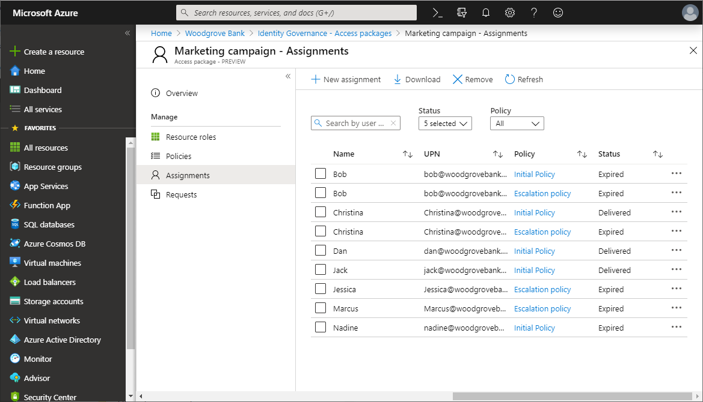
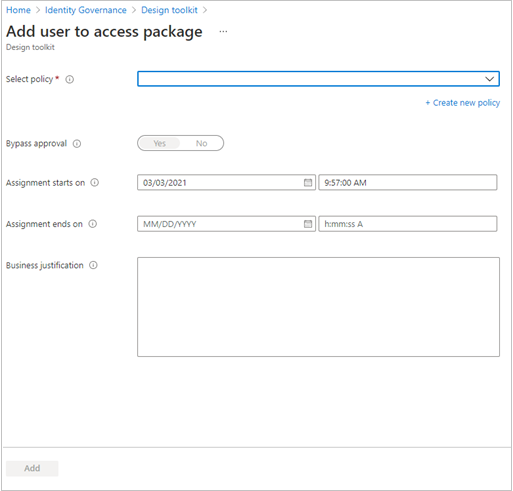

# View and change assignments for an access package in Azure AD entitlement management (Preview)

> [!IMPORTANT]
> Azure Active Directory (Azure AD) entitlement management is currently in public preview.
> This preview version is provided without a service level agreement, and it's not recommended for production workloads. Certain features might not be supported or might have constrained capabilities.
> For more information, see [Supplemental Terms of Use for Microsoft Azure Previews](https://azure.microsoft.com/support/legal/preview-supplemental-terms/).

In Azure AD entitlement management, you can see who has been assigned to access packages, their policy, and status. If an access package has an appropriate policy, you can also directly assign user to an access package. This article describes how to view and change assignments to access packages.

## View who has an assignment

**Prerequisite role:** Global administrator, User administrator, Catalog owner, or Access package manager

1. In the Azure portal, click **Azure Active Directory** and then click **Identity Governance**.

1. In the left menu, click **Access packages** and then open the access package.

1. Click **Assignments** to see a list of active assignments.

    

1. Click a specific assignment to see additional details.

1. To see a list of assignments that did not have all resource roles properly provisioned, click the filter status and select **Delivering**.

    You can see additional details on delivery errors by locating the user's corresponding request on the **Requests** page.

1. To see expired assignments, click the filter status and select **Expired**.

1. To download a CSV file of the filtered list, click **Download**.

## Directly assign a user

In some cases, you might want to directly assign specific users to an access package so that users don't have to go through the process of requesting the access package. To directly assign users, the access package must have a policy that allows administrator direct assignments.

**Prerequisite role:** Global administrator, User administrator, Catalog owner, or Access package manager

1. In the Azure portal, click **Azure Active Directory** and then click **Identity Governance**.

1. In the left menu, click **Access packages** and then open the access package.

1. In the left menu, click **Assignments**.

1. Click **New assignment** to open Add user to access package.

    

1. Click **Add users** to select the users you want to assign the access package to.

1. In the **Select policy** list, select a policy that has the [None (administrator direct assignments only)](#none-administrator-direct-assignments-only) setting.

    If this access package does not have this type of policy, you can click **Create new policy** to add one.

1. Set the date and time you want the selected users' assignment to start and end. If an end date is not provided, the policy's expiration settings will be used.

1. Optionally provide a justification for your direct assignment for record keeping.

1. Click **Add** to directly assign the selected users to the access package.

    After a few moments, click **Refresh** to see the users in the Assignments list.

## Next steps

- [Change user, request, and expiration settings](entitlement-management-access-package-policy.md)
- [View reports and logs](entitlement-management-reports.md)
