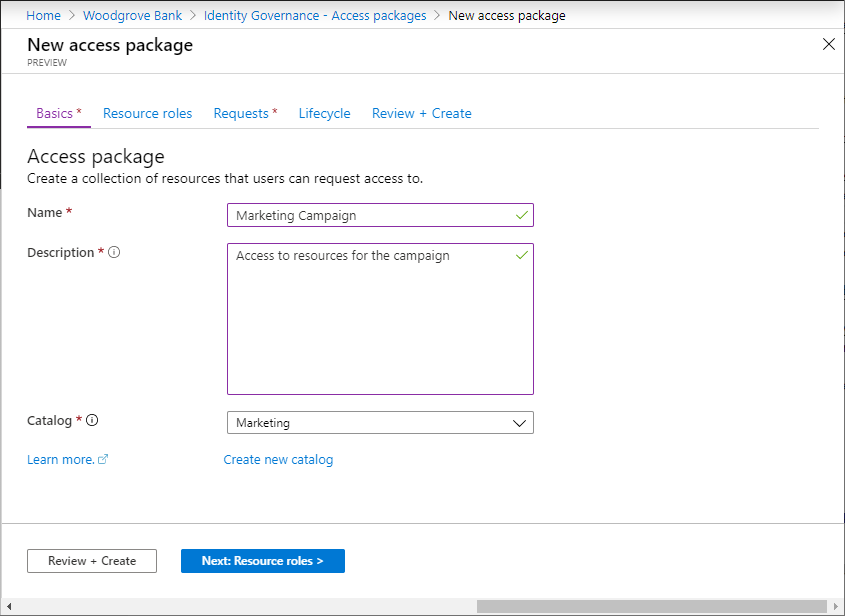
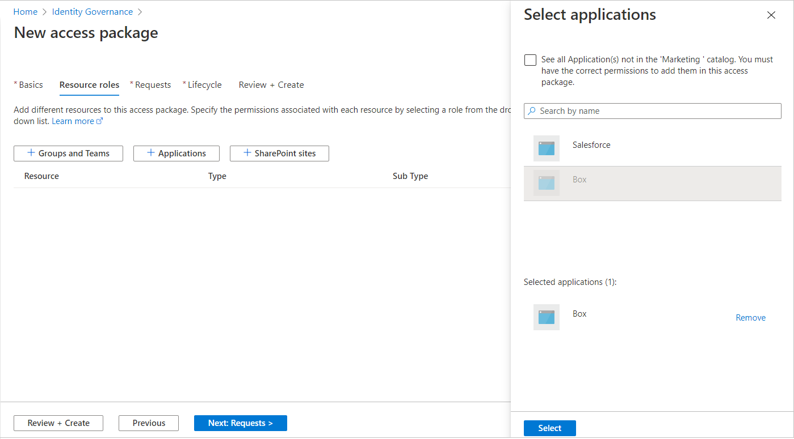
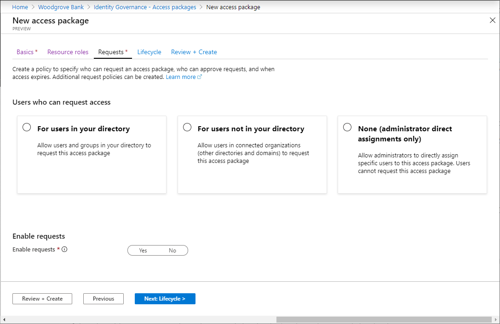

# Create a new access package in Azure AD entitlement management

An access package enables you to do a one-time setup of resources and policies that automatically administers access for the life of the access package. This article describes how to create a new access package.

## Overview

All access packages must be put in a container called a catalog. A catalog defines what resources you can add to your access package. If you don't specify a catalog, your access package will be put into the General catalog. Currently, you can't move an existing access package to a different catalog.

If you are an access package manager, you cannot add resources you own to a catalog. You are restricted to using the resources available in the catalog. If you need to add resources to a catalog, you can ask the catalog owner.

All access packages must have at least one policy. Policies specify who can request the access package and also approval and lifecycle settings. When you create a new access package, you can create an initial policy for users in your directory, for users not in your directory, for administrator direct assignments only, or you can choose to create the policy later.

Here are the high-level steps to create a new access package.

1. In Identity Governance, start the process to create a new access package.

1. Select the catalog you want to create the access package in.

1. Add resources from catalog to your access package.

1. Assign resource roles for each resource.

1. Specify users that can request access.

1. Specify any approval settings.

1. Specify lifecycle settings.

## Start new access package

**Prerequisite role:** Global administrator, Identity Governance administrator, User administrator, Catalog owner, or Access package manager

1. Sign in to the [Azure portal](https://portal.azure.com).

1. Click **Azure Active Directory** and then click **Identity Governance**.

1. In the left menu, click **Access packages**.

1. Click **New access package**.
   
    

## Basics

On the **Basics** tab, you give the access package a name and specify which catalog to create the access package in.

1. Enter a display name and description for the access package. Users will see this information when they submit a request for the access package.

1. In the **Catalog** drop-down list, select the catalog you want to create the access package in. For example, you might have a catalog owner that manages all the marketing resources that can be requested. In this case, you could select the marketing catalog.

    You will only see catalogs you have permission to create access packages in. To create an access package in an existing catalog, you must be a Global administrator, Identity Governance administrator or User administrator, or you must be a catalog owner or access package manager in that catalog.

    

    If you are a Global administrator, an Identity Governance administrator, a User administrator, or catalog creator and you would like to create your access package in a new catalog that's not listed, click **Create new catalog**. Enter the Catalog name and description and then click **Create**.

    The access package you are creating and any resources included in it will be added to the new catalog. You can also  add additional catalog owners later.

1. Click **Next**.

## Resource roles

On the **Resource roles** tab, you select the resources to include in the access package. Users who request and receive the access package will receive all the resource roles in the access package.

1. Click the resource type you want to add (**Groups and Teams**, **Applications**, or **SharePoint sites**).

1. In the Select pane that appears, select one or more resources from the list.

    

    If you are creating the access package in the General catalog or a new catalog, you will be able to pick any resource from the directory that you own. You must be at least a Global administrator, a User administrator, or Catalog creator.

    If you are creating the access package in an existing catalog, you can select any resource that is already in the catalog without owning it.

    If you are a Global administrator, a User administrator, or catalog owner, you have the additional option of selecting resources you own that are not yet in the catalog. If you select resources not currently in the selected catalog, these resources will also be added to the catalog for other catalog administrators to build access packages with. To see all the resources that can be added to the catalog, check the **See all** check box at the top of the Select pane. If you only want to select resources that are currently in the selected catalog, leave the check box **See all** unchecked (default state).

1. Once you have selected the resources, in the **Role** list, select the role you want users to be assigned for the resource.

    

1. Click **Next**.

>[!NOTE]
>You can add dynamic groups to a catalog and to an access package. However, you will be able to select only the Owner role when managing a dynamic group resource in an access package.

## Requests

On the **Requests** tab, you create the first policy to specify who can request the access package and also approval settings. Later, you can create more request policies to allow additional groups of users to request the access package with their own approval settings.

Depending on who you want to be able to request this access package, perform the steps in one of the following sections.

[!INCLUDE [Entitlement management request policy](../../../includes/active-directory-entitlement-management-request-policy.md)]

[!INCLUDE [Entitlement management lifecycle policy](../../../includes/active-directory-entitlement-management-lifecycle-policy.md)]

## Review + create

On the **Review + create** tab, you can review your settings and check for any validation errors.

1. Review the access package's settings

    

1. Click **Create** to create the access package.

    The new access package appears in the list of access packages.

## Creating an access package programmatically

You can also create an access package using Microsoft Graph. A user in an appropriate role with an application that has the delegated `EntitlementManagement.ReadWrite.All` permission can call the API to

1. [List the accessPackageResources in the catalog](/graph/api/entitlementmanagement-list-accesspackagecatalogs?tabs=http&view=graph-rest-beta&preserve-view=true) and [create an accessPackageResourceRequest](/graph/api/entitlementmanagement-post-accesspackageresourcerequests?tabs=http&view=graph-rest-beta&preserve-view=true) for any resources that are not yet in the catalog.
1. [List the accessPackageResourceRoles](/graph/api/accesspackage-list-accesspackageresourcerolescopes?tabs=http&view=graph-rest-beta&preserve-view=true) of each accessPackageResource in an accessPackageCatalog. This list of roles will then be used to select a role, when subsequently creating an accessPackageResourceRoleScope.
1. [Create an accessPackage](/graph/tutorial-access-package-api).
1. [Create an accessPackageAssignmentPolicy](/graph/api/entitlementmanagement-post-accesspackageassignmentpolicies?tabs=http&view=graph-rest-beta&preserve-view=true).
1. [Create an accessPackageResourceRoleScope](/graph/api/accesspackage-post-accesspackageresourcerolescopes?tabs=http&view=graph-rest-beta&preserve-view=true) for each resource role needed in the access package.

## Next steps

- [Share link to request an access package](entitlement-management-access-package-settings.md)
- [Change resource roles for an access package](entitlement-management-access-package-resources.md)
- [Directly assign a user to the access package](entitlement-management-access-package-assignments.md)
- [Create an access review for an access package](entitlement-management-access-reviews-create.md)
