# Tutorial: Create your first access package in Azure AD entitlement management (Preview)

> [!IMPORTANT]
> Azure Active Directory (Azure AD) entitlement management is currently in public preview.
> This preview version is provided without a service level agreement, and it's not recommended for production workloads. Certain features might not be supported or might have constrained capabilities.
> For more information, see [Supplemental Terms of Use for Microsoft Azure Previews](https://azure.microsoft.com/support/legal/preview-supplemental-terms/).

Managing access to all the resources employees need, such as groups, applications, and sites, is an important function for organizations. You want to grant employees the right level of access they need to be productive and remove their access when it is no longer needed.

In this tutorial, you work for Woodgrove Bank as an IT administrator. You've been asked to create a package of resources for a web project that internal users can self-service request. Requests require approval and user's access expires after 30 days. For this tutorial, the web project resources are just a single group, but it could be a collection of groups, applications, or SharePoint Online sites.

In this tutorial, you'll learn how to:

> [!div class="checklist"]
> * Create an access package with a group as a resource
> * Designate an approver
> * Demonstrate how an internal user can request the access package
> * Approve the access request

## Prerequisites

- Global administrator or User administrator
    - Directories that are deployed in Azure Government, China, or other specialized clouds are not currently available for use in this preview.
- Azure AD Premium P2
    - The directory where the preview is being configured must have a license for Azure AD Premium P2, or a license that contains Azure AD Premium P2 such as EMS E5. If you don't have an Azure subscription, sign up for an [EMS E5 trial](https://www.microsoft.com/en-us/cloud-platform/enterprise-mobility-security-trial) before you begin. (Note that a directory can only activate an EMS E5 trial once per directory).

## Step 1: Set up users and group

A resource directory has one or more resources to share. In this step, you create a group named **Engineering Group** in the Woodgrove Bank directory that is the target resource for entitlement management. You also set up an internal user.

**Prerequisite role:** Global administrator or User administrator

1. Sign in to the [Azure portal](https://portal.azure.com) as a Global administrator or User administrator.  

1. In the left navigation, click **Azure Active Directory**.

1. Create or configure the following two users. You can use these names or different names. **Admin1** can be the user you are currently signed in as.

    | Name | Directory role | Description |
    | --- | --- | --- |
    | **Admin1** | Global administrator -or- Limited administrator (User administrator) | Administrator and approver |
    | **User1** | User | Internal user |

    For this tutorial, the administrator and approver are the same person, but you typically designate one or more people to be approvers.

1. Create an Azure AD security group named **Engineering Group** with a membership type of **Assigned**.

    This group will be the target resource for entitlement management. The group should be empty of members to start.

## Step 2: Create an access package

An *access package* is a bundle of all the resources a user needs to work on a project or perform their job. Access packages are defined in containers called *catalogs*. In this step, you create a **Web project access package** in the **Default Catalog**.

**Prerequisite role:** Global administrator, User administrator, or Catalog owner

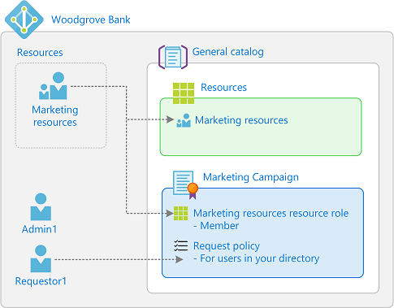

1. In the Azure portal, open the **Entitlement management** page at [https://aka.ms/elm](https://aka.ms/elm).

    

1. In the left menu, click **Access packages**.

1. Click **New access package**.

1. On the **Basics** tab, type the name **Web project access package** and description **Access package for the Engineering web project**.

1. Leave the **Catalog** drop-down list set to **Default Catalog**.

    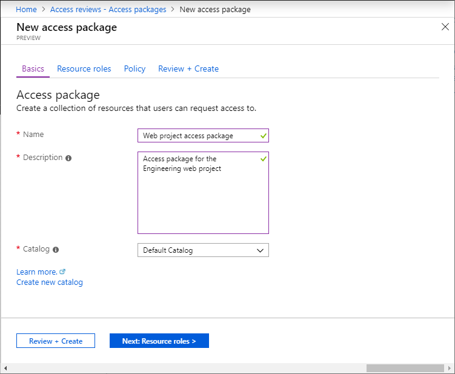

1. Click **Next** to open the **Resource roles** tab.

    On this tab, you select the permissions to include in the access package.

1. Click **Groups**.

1. In the Select groups pane, find and select the **Engineering Group** group you created earlier.

    By default, you see groups inside and outside the **Default Catalog**. When you select a group outside of the **Default Catalog**, it will be added to the **Default Catalog**.

    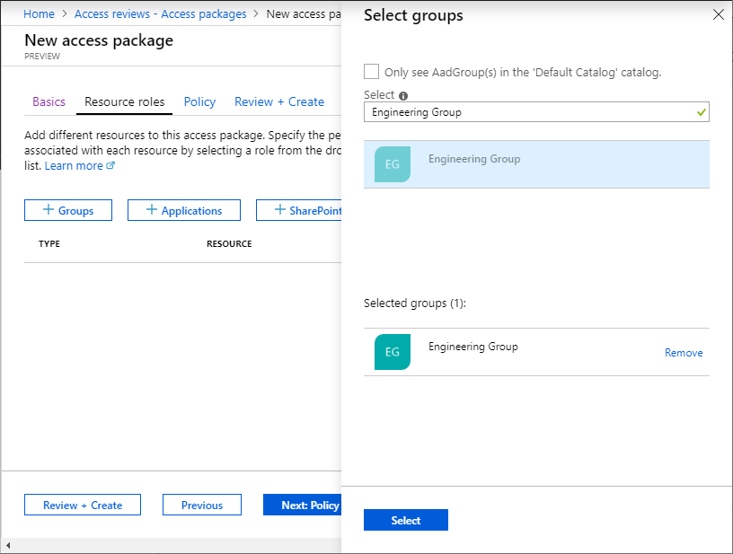

1. Click **Select** to add the group to the list.

    The Engineering Group group also gets added to the Default Catalog.

1. In the **Role** drop-down list, select **Member**.

    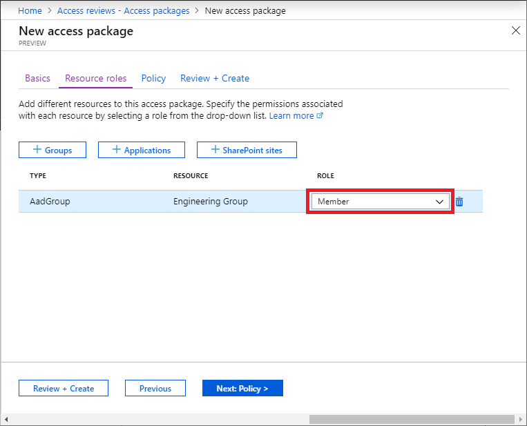

1. Click **Next** to open the **Policy** tab.

1. Set the **Create first policy** toggle to **Later**.

    You will create the policy in the next section.

    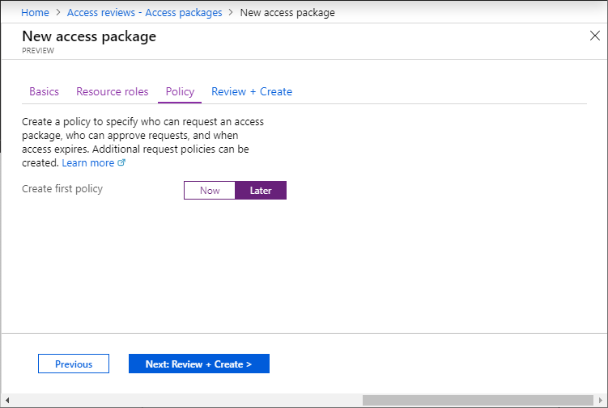

1. Click **Next** to open the **Review + create** tab.

1. Review the access package settings and then click **Create**.

    You might see a message that the access package will not be visible to users because the catalog is not yet enabled.

    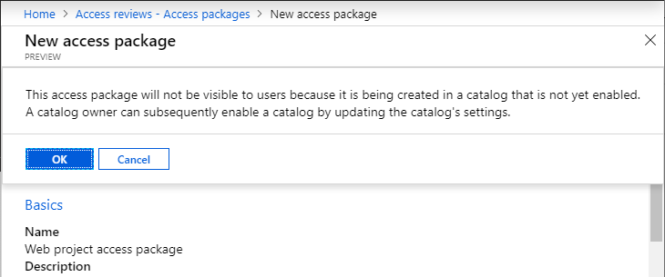

1. Click **OK**.

    After a few moments, you should see a notification that the access package was successfully created.

## Step 3: Create a policy

A *policy* defines the rules or guardrails to access an access package. In this step, you create a policy that allows users who are already in the resource directory to request access.

**Prerequisite role:** Global administrator, User administrator, or Catalog owner

1. In the Web project access package, in the left menu, click **Policies**.

    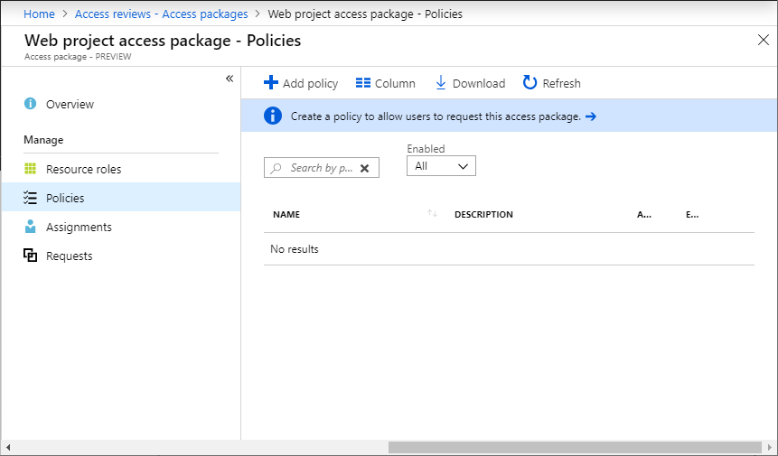

1. Click **Add policy** to open Create policy.

    Type the name **Internal user policy** and description **Allows users in this directory to request access to web project resources**.

1. In the **Users who can request access** section, click **For users in your directory**.

    Additional options appear.

    

1. Scroll down to the **Select users and groups** section and click **Add users and groups**.

1. In the Select groups pane, select the **User1** user you created earlier and then click **Select**.

1. In the **Select approvers** section, click **Add approvers**.

1. In the Select approvers pane, select the **Admin1** you created earlier and then click **Select**.

    For this tutorial, the administrator and approver are the same person, but you can designate another person as an approver.

1. In the **Expiration** section, set **Access package expires** to **Number of days**.

1. Set **Access expires after** to **30** days.

1. For **Enable policy**, click **Yes**.

    

1. Click **Create** to create the **Internal user policy**.

1. In left menu of the Web project access package, click **Overview**.

1. Copy the **MyAccess portal link**.

    You'll use this link for the next step.

    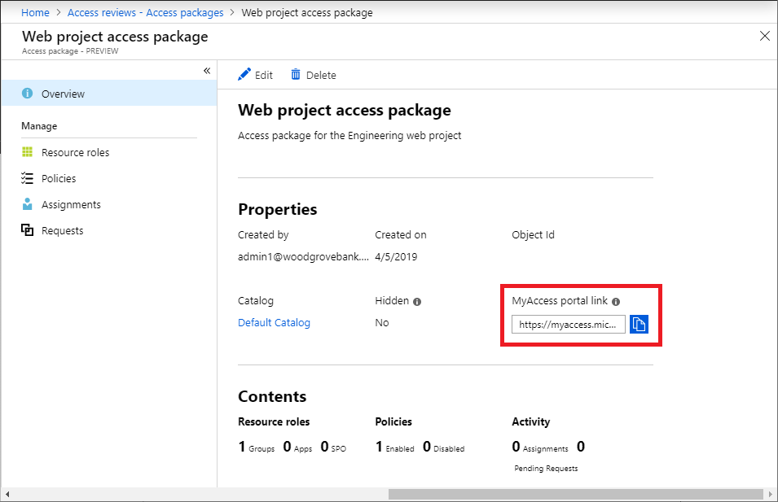

## Step 4: Request access

In this step, you perform the steps as the **internal user** and request access to the access package.

**Prerequisite role:** Internal user

1. Sign out of the Azure portal.

1. In a new browser window, navigate to the My Access portal link you copied in the previous step.

1. Sign in to the My Access portal as **User1**.

    You should see the **Web project access package**. If necessary, in the **Details** column, click the chevron to view details about the access package.

    

1. Click the checkmark to select the package.

1. Click **Request access** to open the Request access pane.

1. In the **Business justification** box, type the justification **Working on web project**.

1. Set the **Request for specific period** toggle to **Yes**.

1. Set the **Start date** to today and **End date** to tomorrow.

    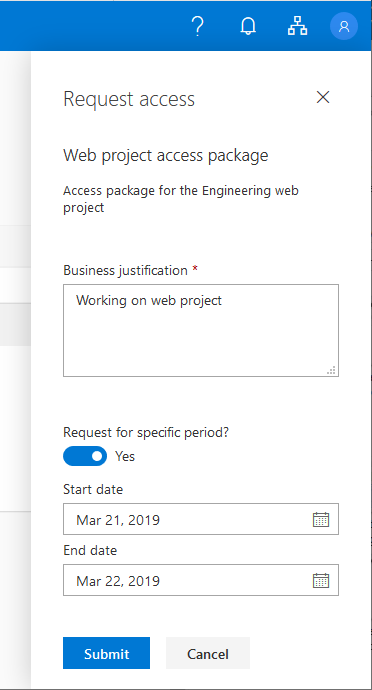

1. Click **Submit**.

1. In the left menu, click **Request history** to verify that your request was submitted or delivered.

## Step 5: Approve access request

In this step, you sign in as the **approver** user and approve the access request for an internal user.

**Prerequisite role:** Approver

1. Sign out of the My Access portal.

1. Sign in to the [My Access portal](https://myaccess.microsoft.com) as **Admin1**.

1. In the left menu, click **Approvals**.

1. On the **Pending** tab, find the **User1**.

1. In the **Details** column, click **View** to open the Access request pane.

1. Click **Approve**.

1. In the **Reason** box, type the reason **Approved access for web project**.

    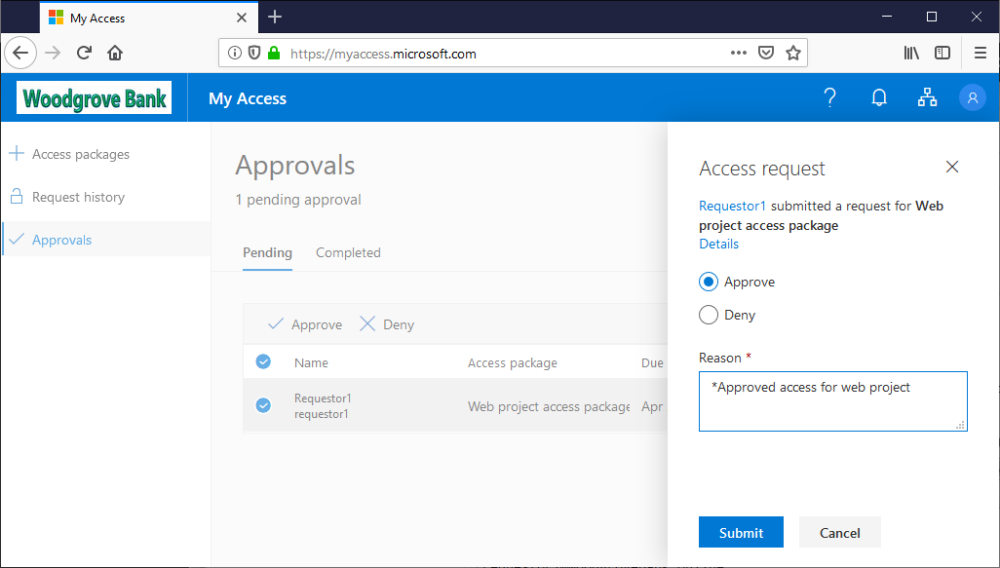

1. Click **Submit**.

## Step 6: Validate that access has been assigned

**Prerequisite role:** Global administrator, User administrator, Catalog owner, or Access package manager

1. Sign out of the My Access portal.

1. Sign in to the [Azure portal](https://portal.azure.com) as the **Admin1**.

1. Open the **Entitlement management** preview page at [https://aka.ms/elm](https://aka.ms/elm).

1. In the left menu, click **Access packages**.

1. Find and click **Web project access package**.

1. In the left menu, click **Requests**.

    You should see User1 and the Internal user policy with a status of **Fulfilled**.

1. Click the request to see the request details.

    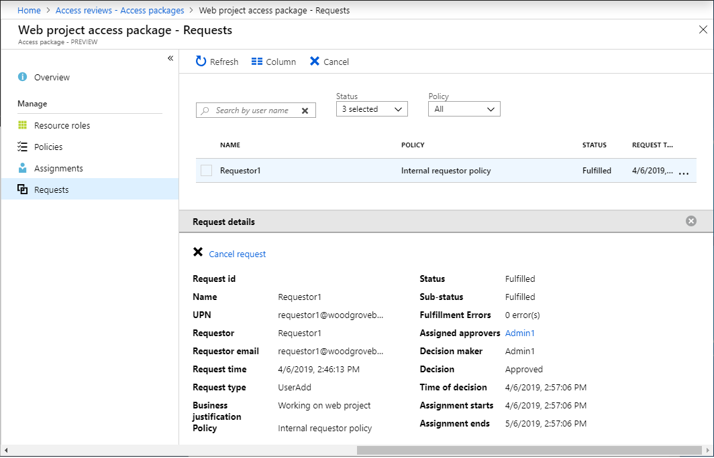

1. In the left navigation, click **Azure Active Directory**.

1. Click **Groups** and open the **Engineering Group** group.

1. Click **Members**.

    You should see **User1** listed as a member.

    

## Step 7: Clean up resources

**Prerequisite role:**  Global administrator or User administrator

1. In the Azure portal, open **Entitlement management** preview page at [https://aka.ms/elm](https://aka.ms/elm).

1. Open **Default Catalog** and then open **Web project access package**.

1. Click **Assignments**.

1. For **User1**, click the ellipsis (**...**) and then click **Remove access**.

1. Click **Policies**.

1. For **Internal user policy**, click the ellipsis (**...**) and then click **Delete**.

1. Click **Resource roles** and remove the resource roles.

1. For **Engineering Group**, click the ellipsis (**...**) and then click **Remove resource role**.

1. Open **Default Catalog**.

1. For **Web project access project**, click the ellipsis (**...**) and then click **Delete**.

1. In Azure Active Directory, delete any users you added such as **User1** and **Admin1**.

1. Delete the **Engineering Group** group.

## Next steps

- [Common scenarios](entitlement-management-scenarios.md)
- [Edit and manage an existing access package](entitlement-management-access-package-edit.md)
