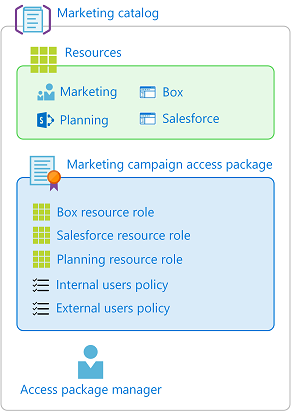
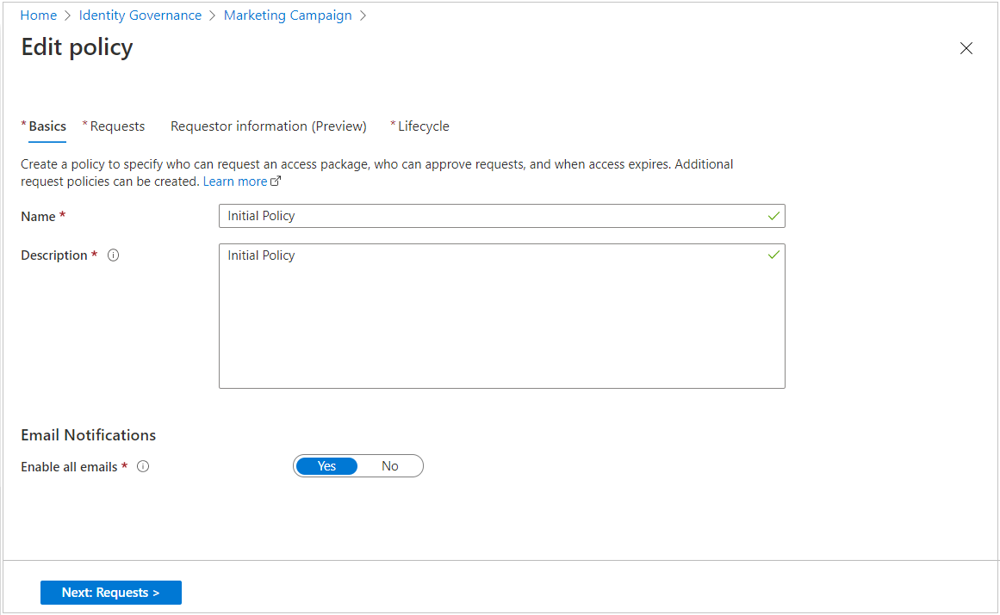

# Change request settings for an access package in Azure AD entitlement management

As an access package manager, you can change the users who can request an access package at any time by editing the policy or adding a new policy. 

This article describes how to change the request settings for an existing access package.

## Choose between one or multiple polices

The way you specify who can request an access package is with a policy. When you create an access package, you specify the request and approval setting which creates a policy. Most access packages will have a single policy, but a single access package can have multiple policies. You would create multiple policies for an access package if you want to allow different sets of users to be granted assignments with different request and approval settings. For example, a single policy cannot be used to assign internal and external users to the same access package. However, you can create two policies in the same access package -- one for internal users and one for external users. If there are multiple policies that apply to a user, they will be prompted at the time of their request to select the policy they would like to be assigned to. The following diagram shows an access package with two policies.

| Scenario | Number of policies |
| --- | --- |
| I want all users in my directory to have the same request and approval settings for an access package | One |
| I want all users in certain connected organizations to be able to request an access package | One |
| I want to allow users in my directory and also users outside my directory to request an access package | Multiple |
| I want to specify different approval settings for some users | Multiple |
| I want some users access package assignments to expire while other users can extend their access | Multiple |

For information about the priority logic that is used when multiple policies apply, see [Multiple policies](entitlement-management-troubleshoot.md#multiple-policies
).

### Open an existing policy of request and approval settings

To change the request and approval settings for an access package, you need to open the corresponding policy. Follow these steps to open the request and approval settings for an access package.

**Prerequisite role:** Global administrator, User administrator, Catalog owner, or Access package manager

1. In the Azure portal, click **Azure Active Directory** and then click **Identity Governance**.

1. In the left menu, click **Access packages** and then open the access package.

1. Click **Policies** and then click the policy you want to edit.

    The Policy details pane opens at the bottom of the page.

    

1. Click **Edit** to edit the policy.

    

1. Click the **Requests** tab to open the request and approval settings.

1. Perform the steps in one of the following request sections.

### Add a new policy of request and approval settings

If you have a set of users that should have different request and approval settings, you'll likely need to create a new policy. Follow these steps to start adding a new policy to an existing access package.

**Prerequisite role:** Global administrator, User administrator, Catalog owner, or Access package manager

1. In the Azure portal, click **Azure Active Directory** and then click **Identity Governance**.

1. In the left menu, click **Access packages** and then open the access package.

1. Click **Policies** and then **Add policy**.

1. Type a name and a description for the policy.

    

1. Click **Next** to open the **Requests** tab.

1. Perform the steps in one of the following request sections.

## For users in your directory

Follow these steps if you want to allow users in your directory to be able to request this access package. When defining the request policy, you can specify individual users, or more commonly groups of users. For example, your organization may already have a group such as **All employees**.  If that group is added in the policy for users who can request access, then any member of that group can then request access.

1. In the **Users who can request access** section, click **For users in your directory**.

    When you select this option, new options appear to further refine who in your directory can request this access package.

    

1. Select one of the following options:

    |  |  |
    | --- | --- |
    | **Specific users and groups** | Choose this option if you want only the users and groups in your directory that you specify to be able to request this access package. |
    | **All members (excluding guests)** | Choose this option if you want all member users in your directory to be able to request this access package. This option doesn't include any guest users you might have invited into your directory. |
    | **All users (including guests)** | Choose this option if you want all member users and guest users in your directory to be able to request this access package. |

    Guest users refer to external users that have been invited into your directory with [Azure AD B2B](../articles/active-directory/b2b/what-is-b2b.md). For more information about the differences between member users and guest users, see [What are the default user permissions in Azure Active Directory?](../articles/active-directory/fundamentals/users-default-permissions.md).

1. If you selected **Specific users and groups**, click **Add users and groups**.

1. In the Select users and groups pane, select the users and groups you want to add.

    

1. Click **Select** to add the users and groups.

1. Skip down to the [Approval](#approval) section.

## For users not in your directory

 **Users not in your directory** refers to users who are in another Azure AD directory or domain. These users may not have yet been invited into your directory. Azure AD directories must be configured to be allow invitations in **Collaboration restrictions**. For more information, see [Enable B2B external collaboration and manage who can invite guests](../articles/active-directory/b2b/delegate-invitations.md).

> [!NOTE]
> A guest user account will be created for a user not yet in your directory whose request is approved or auto-approved. The guest will be invited, but will not receive an invite email. Instead, they will receive an email when their access package assignment is delivered. By default, later when that guest user no longer has any access package assignments, because their last assignment has expired or been cancelled, that guest user account will be blocked from sign in and subsequently deleted. If you want to have guest users remain in your directory indefinitely, even if they have no access package assignments, you can change the settings for your entitlement management configuration. For more information about the guest user object, see [Properties of an Azure Active Directory B2B collaboration user](../articles/active-directory/b2b/user-properties.md).

Follow these steps if you want to allow users not in your directory to request this access package:

1. In the **Users who can request access** section, click **For users not in your directory**.

    When you select this option, new options appear.

    

1. Select one of the following options:

    |  |  |
    | --- | --- |
    | **Specific connected organizations** | Choose this option if you want to select from a list of organizations that your administrator previously added. All users from the selected organizations can request this access package. |
    | **All connected organizations** | Choose this option if all users from all your connected organizations can request this access package. |
    | **All users (All connected organizations + any new external users)** | Choose this option if all users from all your connected organizations can request this access package and that the B2B allow or deny list settings should take precedence for any new external user. |

    A connected organization is an external Azure AD directory or domain that you have a relationship with.

1. If you selected **Specific connected organizations**, click **Add directories** to select from a list of connected organizations that your administrator previously added.

1. Type the name or domain name to search for a previously connected organization.

    

    If the organization you want to collaborate with isn't in the list, you can ask your administrator to add it as a connected organization. For more information, see [Add a connected organization](../articles/active-directory/governance/entitlement-management-organization.md).

1. Once you've selected all your connected organizations, click **Select**.

    > [!NOTE]
    > All users from the selected connected organizations will be able to request this access package. This includes users in Azure AD from all subdomains associated with the organization, unless those domains are blocked by the Azure B2B allow or deny list. For more information, see [Allow or block invitations to B2B users from specific organizations](../articles/active-directory/b2b/allow-deny-list.md).

1. Skip down to the [Approval](#approval) section.

## None (administrator direct assignments only)

Follow these steps if you want to bypass access requests and allow administrators to directly assign specific users to this access package. Users won't have to request the access package. You can still set lifecycle settings, but there are no request settings.

1. In the **Users who can request access** section, click **None (administrator direct assignments only**.

    

    After you create the access package, you can directly assign specific internal and external users to the access package. If you specify an external user, a guest user account will be created in your directory. For information about directly assigning a user, see [View, add, and remove assignments for an access package](../articles/active-directory/governance/entitlement-management-access-package-assignments.md).

1. Skip down to the [Enable requests](#enable-requests) section.

If you are editing a policy click **Update**. If you are adding a new policy, click **Create**.

## Next steps

- [Change lifecycle settings for an access package](entitlement-management-access-package-lifecycle-policy.md)
- [View requests for an access package](entitlement-management-access-package-requests.md)