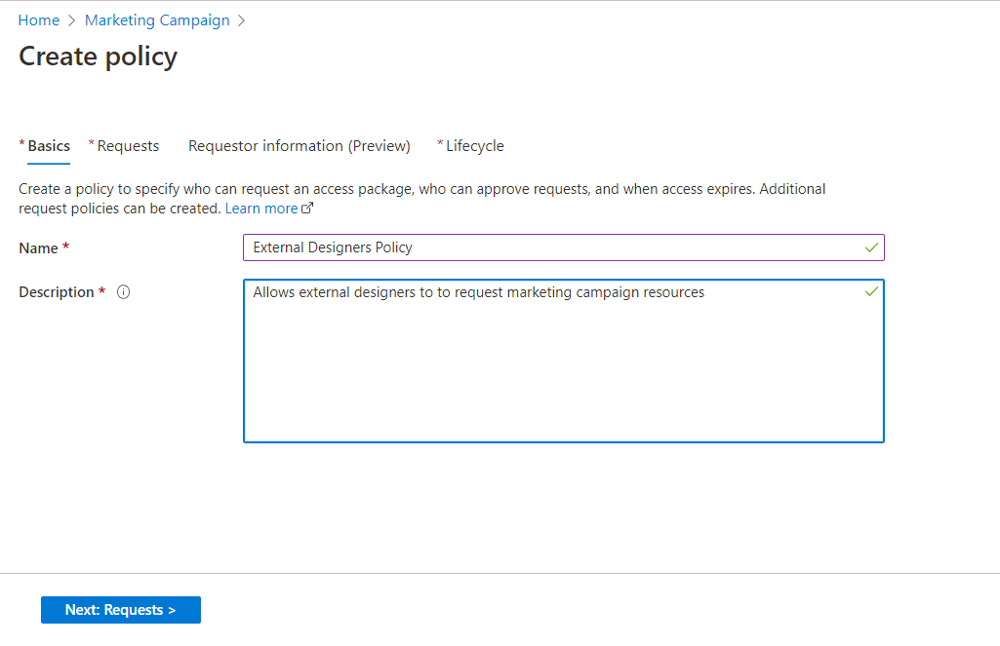

# Change request and approval settings for an access package in Azure AD entitlement management (Preview)

> [!IMPORTANT]
> Azure Active Directory (Azure AD) entitlement management is currently in public preview.
> This preview version is provided without a service level agreement, and it's not recommended for production workloads. Certain features might not be supported or might have constrained capabilities.
> For more information, see [Supplemental Terms of Use for Microsoft Azure Previews](https://azure.microsoft.com/support/legal/preview-supplemental-terms/).

As an access package manager, you can change the users who can request an access package at any time by adding a new policy or editing an existing policy. You can also change the approval settings.

This article describes how to change the user and approval settings for an existing access package.

## Choose between one or multiple polices

The way you specify who can request an access package is to create a policy. You can create multiple policies for a single access package if you want to allow different sets of users to be granted assignments with different request and approval settings. For example, a single policy cannot be used to assign internal and external users to the same access package. However, you can create two policies in the same access package -- one for internal users and one for external users. If there are multiple policies that apply to a user, they will be prompted at the time of their request to select the policy they would like to be assigned to. The following diagram shows an access package with two policies.

| Scenario | Number of policies |
| --- | --- |
| I want all users in my directory to have the same request and approval settings for an access package | One |
| I want all users in certain connected organizations to be able to request an access package | One |
| I want to allow users in my directory and also users outside my directory to request an access package | Multiple |
| I want to specify different approval settings for some users | Multiple |
| I want some users access package assignments to expire while other users can extend their access | Multiple |

### Add a new policy of request and approval settings

If you have a set of users that should have different request and approval settings, you'll likely need to create a new policy. Follow these steps to start adding a new policy to an existing access package.

**Prerequisite role:** Global administrator, User administrator, Catalog owner, or Access package manager

1. In the Azure portal, click **Azure Active Directory** and then click **Identity Governance**.

1. In the left menu, click **Access packages** and then open the access package.

1. Click **Policies** and then **Add policy**.

1. Type a name and a description for the policy.

    

1. Click **Next** to open the **Requests** tab.

1. Perform the steps in one of the following requests sections.

### Open an existing policy of request and approval settings

To change the request and approval settings for an access package, you need to open the corresponding policy. Follow these steps to open the request and approval settings for an access package.

**Prerequisite role:** Global administrator, User administrator, Catalog owner, or Access package manager

1. In the Azure portal, click **Azure Active Directory** and then click **Identity Governance**.

1. In the left menu, click **Access packages** and then open the access package.

1. Click **Policies** and then click the policy you want to edit.

    The Policy details pane opens at the bottom of the page.

    

1. Click **Edit** to edit the policy.

    

1. Click the **Requests** tab to open the request and approval settings.

1. Perform the steps in one of the following request sections.

[!INCLUDE [Entitlement management request policy](../../../includes/active-directory-entitlement-management-request-policy.md)]

[!INCLUDE [Entitlement management lifecycle policy](../../../includes/active-directory-entitlement-management-lifecycle-policy.md)]

## Next steps

- [Change expiration settings for an access package](entitlement-management-access-package-lifecycle-policy.md)
- [View requests for an access package](entitlement-management-access-package-requests.md)