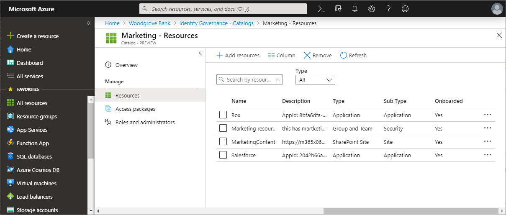
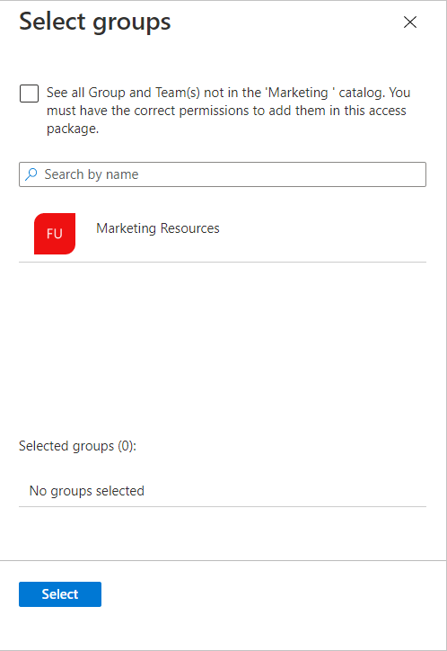
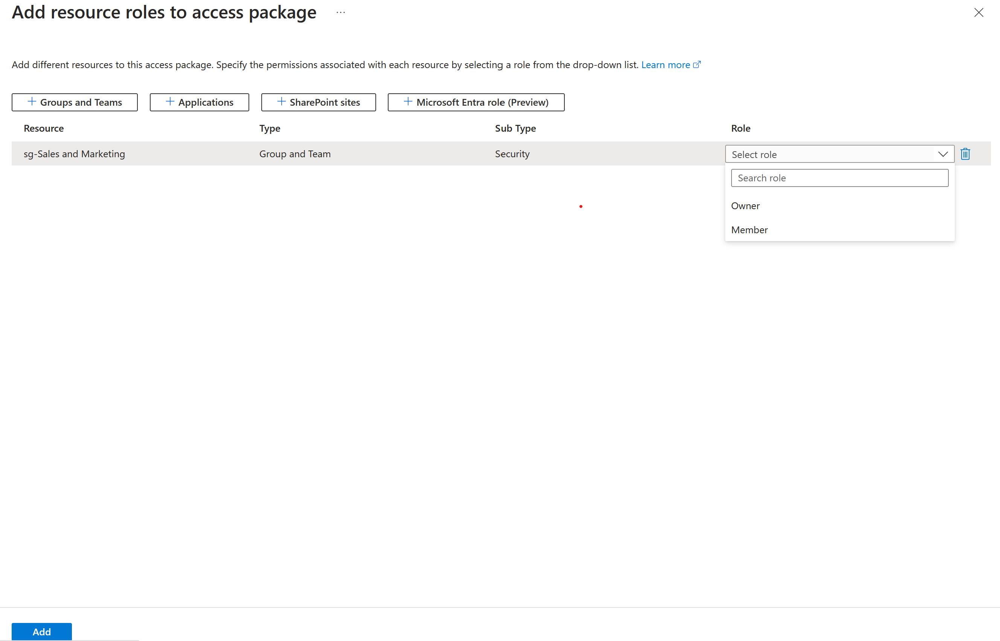
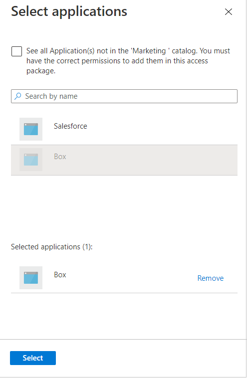
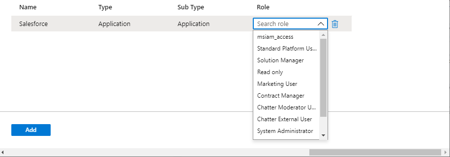
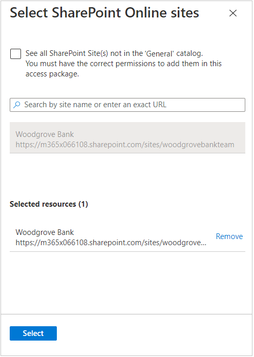
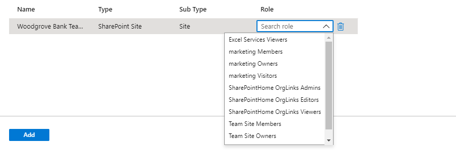

# Change resource roles for an access package in entitlement management

As an access package manager, you can change the resources in an access package at any time without worrying about provisioning the user's access to the new resources, or removing their access from the previous resources. This article describes how to change the resource roles for an existing access package.

This video provides an overview of how to change an access package.

> [!VIDEO https://www.microsoft.com/videoplayer/embed/RE3LD4Z]

## Check catalog for resources

[!INCLUDE [portal updates](../includes/portal-update.md)]

If you need to add resources to an access package, you should check whether the resources you need are available in the access package's catalog. If you're an access package manager, you can't add resources to a catalog, even if you own them. You're restricted to using the resources available in the catalog.

1. Sign in to the [Microsoft Entra admin center](https://entra.microsoft.com) as at least an [Identity Governance Administrator](../identity/role-based-access-control/permissions-reference.md#identity-governance-administrator).
    > [!TIP]
    > Other least privilege roles that can complete this task include the Catalog owner and the Access package manager.
1. Browse to **Identity governance** > **Entitlement management** > **Access package**.

1. On the **Access packages** page, open the access package you want to check to ensure that its catalog has the necessary resources.

1. In the left menu, select **Catalog** and then open the catalog.

1. In the left menu, select **Resources** to see the list of resources in this catalog.

    

1. If the resources aren't already in the catalog, and you're an administrator or a catalog owner, you can [add resources to a catalog](entitlement-management-catalog-create.md#add-resources-to-a-catalog). The types of resources you can add are groups, applications you've integrated with your directory, and SharePoint Online sites. For example:

   * Groups can be cloud-created Microsoft 365 Groups or cloud-created Microsoft Entra security groups. Groups that originate in an on-premises Active Directory can't be assigned as resources because their owner, or member, attributes can't be changed in Microsoft Entra ID. To give users access to an application that uses AD security group memberships, create a new group in Microsoft Entra ID, configure [group writeback to AD](../identity/hybrid/cloud-sync/how-to-configure-entra-to-active-directory.md), and [enable that group to be written to AD](entitlement-management-group-writeback.md). Groups that originate in Exchange Online as Distribution groups can't be modified in Microsoft Entra ID either.
   * Applications can be Microsoft Entra enterprise applications, which include software as a service (SaaS) applications, on-premises applications that use a different directory or database, and your own applications integrated with Microsoft Entra ID. If your application hasn't yet been integrated with your Microsoft Entra directory, see [govern access for applications in your environment](identity-governance-applications-prepare.md) and [integrate an application with Microsoft Entra ID](identity-governance-applications-integrate.md).
   * Sites can be SharePoint Online sites or SharePoint Online site collections.

1. If you're an access package manager and you need to add resources to the catalog, you can ask the catalog owner to add them.

## Determine which resource roles to include in an access package

A resource role is a collection of permissions associated with and defined by a resource.  Resources can be made available for users to be assigned if you add resource roles from each of the catalog's resources to your access package. You can add resource roles that are provided by groups, teams, applications, and SharePoint sites.  When a user receives an assignment to an access package, they're added to all the resource roles in the access package.

When they lose an access package assignment, then they're removed from all the resource roles in the access package.

> [!NOTE]
> If users were added to the resources outside of entitlement management, and they need to retain access even if they later recieve access package assignemtsn and their access package assignments expire, then do not add the resource roles to an access package.

If you want some users to receive different resource roles than others, then you need to create multiple access packages in the catalog, with separate access packages for each of the resource roles.  You can also mark the access packages as [incompatible](entitlement-management-access-package-incompatible.md) with each other so users can't request access to access packages that would give them excessive access.

In particular, applications can have multiple app roles. When you add an application's app role as a resource role to an access package, if that application has more than one app role, you need to specify the appropriate role for those users in the access package.

> [!NOTE]
> If an application has multiple app roles, and more than one role of that application are in an access package, then the user will receive all those application's included roles.  If instead you want users to only have some of the application's roles, then you will need to create multiple access packages in the catalog, with separate access packages for each of the app roles.

In addition, applications can also rely upon security groups for expressing permissions.  For example, an application might have a single app role `User` and also check the membership of two groups - a `Ordinary Users` group and a `Administrative Access` groups.  A user of the application must be a member of exactly one of those two groups.  If you wished to configure that users could request either permission, then you would put into a catalog three resources: the application, the group `Ordinary Users` and the group `Administrative Access`. Then, you would create in that catalog two access packages, and indicate each access package is [incompatible](entitlement-management-access-package-incompatible.md#scenarios-for-separation-of-duties-checks) with the other:

- a first access package that has two resource roles, the application's app role `User` and membership of the group `Ordinary Users`
- a second access package that has two resource roles, the application's app role `User` and membership of the group `Administrative Access`

## Check if users are already assigned to the resource role

When a resource role is added to an access package by an admin, users who are already in that resource role, but don't have assignments to the access package, will remain in the resource role, but won't be assigned to the access package. For example, if a user is a member of a group and then an access package is created and that group's member role is added to an access package, the user won't automatically receive an assignment to the access package.

If you want the users who had a resource role membership to also be assigned to the access package, you can [directly assign users](entitlement-management-access-package-assignments.md#directly-assign-a-user) to an access package using the Microsoft Entra admin center, or in bulk via Graph or PowerShell. The users you assign to the access package will then also receive access to the other resource roles in the access package.  However, as those users who were in the resource role already have access prior to being added to the access package, when their access package assignment is removed, they'll be removed from that resource role.

## Add resource roles

1. Sign in to the [Microsoft Entra admin center](https://entra.microsoft.com) as at least an [Identity Governance Administrator](../identity/role-based-access-control/permissions-reference.md#identity-governance-administrator).
    > [!TIP]
    > Other least privilege roles that can complete this task include the Catalog owner and the Access package manager.
1. Browse to **Identity governance** > **Entitlement management** > **Access package**.

1. On the **Access packages** page, open the access package you want to add resource roles to.

1. In the left menu, select **Resource roles**.

1. Select **Add resource roles** to open the Add resource roles to access package page.

    

1. Depending on whether you want to add a membership of a group or team, access to an application, SharePoint site, or Microsoft Entra role(Preview) perform the steps in one of the following resource role sections.

## Add a group or team resource role

You can have entitlement management automatically add users to a group or a team in Microsoft Teams when they're assigned an access package. 

- When a membership of a group or team is a resource role that's part of an access package and a user is assigned to that access package, the user is added as a member to that group or team, if not already present.
- When a user's access package assignment expires, they're removed from the group or team, unless they currently have an assignment to another access package that includes that same group or team.

You can select any [Microsoft Entra security group or Microsoft 365 Group](~/fundamentals/how-to-manage-groups.yml). Users in an administrator role that can manage groups can add any group to a catalog; catalog owners can add any group to the catalog if they're owner of the group. Keep the following Microsoft Entra constraints in mind when selecting a group:

- When a user, including a guest, is added as a member to a group or team, they can see all the other members of that group or team.
- Microsoft Entra ID can't change the membership of a group that was synchronized from Windows Server Active Directory using Microsoft Entra Connect, or that was created in Exchange Online as a distribution group.  If you plan to manage access to applications that use AD security groups, see [how to set up group writeback with entitlement management](entitlement-management-group-writeback.md).
- The membership of dynamic groups can't be updated by adding or removing a member, so dynamic group memberships aren't suitable for use with entitlement management.
- Microsoft 365 groups have additional constraints, described in the [overview of Microsoft 365 Groups for administrators](/microsoft-365/admin/create-groups/office-365-groups), including a limit of 100 owners per group, limits on how many members can access Group conversations concurrently, and 7,000 groups per member.

For more information, see [Compare groups](/office365/admin/create-groups/compare-groups) and [Microsoft 365 Groups and Microsoft Teams](/microsoftteams/office-365-groups).

1. On the **Add resource roles to access package** page, select **Groups and Teams** to open the Select groups pane.

1. Select the groups and teams you want to include in the access package.

    

1. Select **Select**.

    Once you select the group or team, the **Sub type** column lists one of the following subtypes:

    | Sub type | Description |
    | --- | --- |
    | Security | Used for granting access to resources. |
    | Distribution | Used for sending notifications to a group of people. |
    | Microsoft 365 | Microsoft 365 Group that isn't Teams-enabled. Used for collaboration between users, both inside and outside your company. |
    | Team | Microsoft 365 Group that is Teams-enabled. Used for collaboration between users, both inside and outside your company. |

1. In the **Role** list, select **Owner** or **Member**.

    You typically select the Member role. If you select the Owner role, then users become an owner of the group, which allows those users to add or remove other members or owners.

    

1. Select **Add**.

    Any users with existing assignments to the access package will automatically become members (or owners) of this group or team after it's added.  For more information, see [when changes are applied](#when-changes-are-applied).

## Add an application resource role

You can have Microsoft Entra ID automatically assign users access to a Microsoft Entra enterprise application, including SaaS applications, on-premises applications, and your organization's applications integrated with Microsoft Entra ID, when a user is assigned an access package. For applications that integrate with Microsoft Entra ID through federated single sign-on, Microsoft Entra ID issues federation tokens for users assigned to the application.

If your application hasn't yet been integrated with your Microsoft Entra directory, see [govern access for applications in your environment](identity-governance-applications-prepare.md) and [integrate an application with Microsoft Entra ID](identity-governance-applications-integrate.md).

Applications can have multiple app roles defined in their manifest and managed through the [app roles UI](~/identity-platform/howto-add-app-roles-in-apps.md#app-roles-ui). When you add an application's app role as a resource role to an access package, if that application has more than one app role, you need to specify the appropriate role for those users in that access package. If you're developing applications, you can read more about how those roles are added to your applications in [How to: Configure the role claim issued in the SAML token for enterprise applications](~/identity-platform/enterprise-app-role-management.md). If you're using the Microsoft Authentication Libraries, there's also a [code sample](~/identity-platform/sample-v2-code.md) for how to use app roles for access control.

> [!NOTE]
> If an application has multiple app roles, and more than one role of that application are in an access package, then the user will receive all those application's included roles.  If instead you want users to only have some of the application's roles, then you will need to create multiple access packages in the catalog, with separate access packages for each of the app roles.

Once an app role is a resource of an access package:

- When a user is assigned that access package, the user is added to that app role, if not already present.  If the application requires attributes, the values of the attributes collected from the request will be written onto the user.
- When a user's access package assignment expires, their access is removed from the application, unless they have an assignment to another access package that includes that app role.  If the application required attributes, those attributes are removed from the user.

Here are some considerations when selecting an application:

- Applications can also have groups assigned to their app roles as well.  You can choose to add a group in place of an application and its role in an access package, however then the application won't be visible to the user as part of the access package in the My Access portal.
- Microsoft Entra admin center can also show service principals for services that can't be selected as applications.  In particular, **Exchange Online** and **SharePoint Online** are services, not applications that have resource roles in the directory, so they can't be included in an access package.  Instead, use group-based licensing to establish an appropriate license for a user who needs access to those services.
- Applications that only support Personal Microsoft Account users for authentication, and don't support organizational accounts in your directory, don't have application roles and can't be added to access package catalogs.

1. On the **Add resource roles to access package** page, select **Applications** to open the Select applications pane.

1. Select the applications you want to include in the access package.

    

1. Select **Select**.

1. In the **Role** list, select an app role.

    

1. Select **Add**.

    Any users with existing assignments to the access package will automatically be given access to this application when it's added.  For more information, see [when changes are applied](#when-changes-are-applied).

## Add a SharePoint site resource role

Microsoft Entra ID can automatically assign users access to a SharePoint Online site or SharePoint Online site collection when they're assigned an access package.

1. On the **Add resource roles to access package** page, select **SharePoint sites** to open the Select SharePoint Online sites pane.

    :::image type="content" source="media/entitlement-management-access-package-resources/resource-sharepoint-add.png" alt-text="Access package - Add resource roles - Select SharePoint sites - Portal view":::

1. Select the SharePoint Online sites you want to include in the access package.

    

1. Select **Select**.

1. In the **Role** list, select a SharePoint Online site role.

    

1. Select **Add**.

    Any users with existing assignments to the access package will automatically be given access to this SharePoint Online site when it's added.  For more information, see [when changes are applied](#when-changes-are-applied).

## Add a Microsoft Entra role assignment
When users need additional permissions to access your organization's resources, you can manage those permissions by assigning them Microsoft Entra roles through access packages. By assigning Microsoft Entra roles to employees, and guests, using Entitlement Management, you can look at a user's entitlements to quickly determine which roles are assigned to that user. When you include a Microsoft Entra role as a resource in an access package, you can also specify whether that role assignment is “eligible” or “active”.

Assigning Microsoft Entra roles through access packages helps to efficiently manage role assignments at scale and improves the role assignment lifecycle.

> [!NOTE]
> We recommend that you use Privileged Identity Management to provide just-in-time access to a user to perform a task that requires elevated permissions. These permissions are provided through the Microsoft Entra Roles, that are tagged as “privileged”, in our documentation here: Microsoft Entra built-in roles. Entitlement Management is better suited for assigning users a bundle of resources, which can include a Microsoft Entra role, necessary to do one’s job. Users assigned to access packages tend to have more longstanding access to resources. While we recommend that you manage high-privileged roles through Privileged Identity Management, you can set up eligibility for those roles through access packages in Entitlement Management.

Follow these steps to include a Microsoft Entra role as a resource in an access package: 

1. Sign in to the [Microsoft Entra admin center](https://entra.microsoft.com) as at least an [Identity Governance Administrator](~/identity/role-based-access-control/permissions-reference.md#identity-governance-administrator).

1. Browse to **Identity governance** > **Entitlement management** > **Access packages**.

1. On the Access packages page, open the access package you want to add resource roles to and select **Resource roles**. 

1. On the **Add resource roles to access package page**, select **Microsoft Entra roles (Preview)** to open the Select Microsoft Entra roles pane. 

1. Select the Microsoft Entra roles you want to include in the access package.
    :::image type="content" source="media/entitlement-management-roles/select-role-access-package.png" alt-text="Screenshot of selecting role for access package.":::  

1. In the **Role** list, select **Eligible Member** or **Active Member**. 
    :::image type="content" source="media/entitlement-management-roles/access-package-role.png" alt-text="Screenshot of choosing role for resource role in access package.":::
1. Select **Add**.

> [!NOTE]
> If you select **Eligible**, users will become eligible for that role and can activate their assignment using Privileged Identity Management in the Microsoft Entra admin center. If you select **Active**, users will have an active role assignment until they no longer have access to the access package. For Entra roles that are tagged as *“privileged”*, you'll only be able to select **Eligible**. You can find a list of privileged roles here: [Microsoft Entra built-in roles](../identity/role-based-access-control/permissions-reference.md).

To add a Microsoft Entra role programmatically, see: [Add a Microsoft Entra role as a resource in an access package programmatically](entitlement-management-roles.md#add-a-microsoft-entra-role-as-a-resource-in-an-access-package-programmatically).

## Add resource roles programmatically

There are two ways to add a resource role to an access package programmatically, through Microsoft Graph, and through the PowerShell cmdlets for Microsoft Graph.

### Add resource roles to an access package with Microsoft Graph

You can add a resource role to an access package using Microsoft Graph. A user in an appropriate role with an application that has the delegated `EntitlementManagement.ReadWrite.All` permission can call the API to:

1. [List the resources in the catalog](/graph/api/accesspackagecatalog-list-resources?view=graph-rest-1.0&tabs=http&preserve-view=true) and [create an accessPackageResourceRequest](/graph/api/entitlementmanagement-post-resourcerequests?view=graph-rest-1.0&tabs=http&preserve-view=true) for any resources that aren't yet in the catalog.
1. [Retrieve the roles and scopes of each resource in the catalog](/graph/api/accesspackagecatalog-list-resources?view=graph-rest-1.0&tabs=http#example-2-retrieve-the-roles-and-scopes-of-a-single-resource-in-a-catalog). This list of roles will then be used to select a role, when subsequently creating a resourceRoleScope.
1. [Create a resourceRoleScope](/graph/api/accesspackage-post-resourcerolescopes?view=graph-rest-1.0&preserve-view=true) for each resource role needed in the access package.

### Add resource roles to an access package with Microsoft PowerShell

You can also add resource roles to an access package in PowerShell with the cmdlets from the [Microsoft Graph PowerShell cmdlets for Identity Governance](https://www.powershellgallery.com/packages/Microsoft.Graph.Identity.Governance/) module version 2.1.x or later module version.

First, retrieve the ID of the catalog, and of the resource in that catalog and its scopes and roles, that you want to include in the access package. Use a script similar to the following example. This assumes there's a single application resource in the catalog.

```powershell
Connect-MgGraph -Scopes "EntitlementManagement.ReadWrite.All"

$catalog = Get-MgEntitlementManagementCatalog -Filter "displayName eq 'Marketing'" -All
if ($catalog -eq $null) { throw "catalog not found" }
$rsc = Get-MgEntitlementManagementCatalogResource -AccessPackageCatalogId $catalog.id -Filter "originSystem eq 'AadApplication'" -ExpandProperty scopes
if ($rsc -eq $null) { throw "resource not found" }
$filt = "(id eq '" + $rsc.Id + "')"
$rrs = Get-MgEntitlementManagementCatalogResource -AccessPackageCatalogId $catalog.id -Filter $filt -ExpandProperty roles,scopes
```


Then, assign the resource role from that resource to the access package.  For example, if you wished to include the first resource role of the resource returned earlier as a resource role of an access package, you would use a script similar to the following.

```powershell
$apid = "cdd5f06b-752a-4c9f-97a6-82f4eda6c76d"

$rparams = @{
    role = @{
        id =  $rrs.Roles[0].Id
        displayName =  $rrs.Roles[0].DisplayName
        description =  $rrs.Roles[0].Description
        originSystem =  $rrs.Roles[0].OriginSystem
        originId =  $rrs.Roles[0].OriginId
        resource = @{
            id = $rrs.Id
            originId = $rrs.OriginId
            originSystem = $rrs.OriginSystem
        }
    }
    scope = @{
        id = $rsc.Scopes[0].Id
        originId = $rsc.Scopes[0].OriginId
        originSystem = $rsc.Scopes[0].OriginSystem
    }
}

New-MgEntitlementManagementAccessPackageResourceRoleScope -AccessPackageId $apid -BodyParameter $rparams
```

## Remove resource roles

1. Sign in to the [Microsoft Entra admin center](https://entra.microsoft.com) as at least an [Identity Governance Administrator](../identity/role-based-access-control/permissions-reference.md#identity-governance-administrator).
    > [!TIP]
    > Other least privilege roles that can complete this task include the Catalog owner and the Access package manager.
1. Browse to **Identity governance** > **Entitlement management** > **Access package**.

1. On the **Access packages** page, open the access package you want to remove resource roles for.

1. In the left menu, select **Resource roles**.

1. In the list of resource roles, find the resource role you want to remove.

1. Select the ellipsis (**...**) and then select **Remove resource role**.

    Any users with existing assignments to the access package will automatically have their access revoked to this resource role when it's removed.

## When changes are applied

In entitlement management, Microsoft Entra ID processes bulk changes for assignment and resources in your access packages several times a day. So, if you make an assignment, or change the resource roles of your access package, it can take up to 24 hours for that change to be made in Microsoft Entra ID, plus the amount of time it takes to propagate those changes to other Microsoft Online Services or connected SaaS applications. If your change affects just a few objects, the change will likely only take a few minutes to apply in Microsoft Entra ID, after which other Microsoft Entra components will then detect that change and update the SaaS applications. If your change affects thousands of objects, the change takes longer. For example, if you have an access package with 2 applications and 100 user assignments, and you decide to add a SharePoint site role to the access package, there can be a delay until all the users are part of that SharePoint site role. You can monitor the progress through the Microsoft Entra audit log, the Microsoft Entra provisioning log, and the SharePoint site audit logs.

When you remove a member of a team, they're removed from the Microsoft 365 Group as well. Removal from the team's chat functionality might be delayed. For more information, see [Group membership](/microsoftteams/office-365-groups#group-membership).

## Next steps

- [Create a basic group and add members using Microsoft Entra ID](~/fundamentals/how-to-manage-groups.yml)
- [How to: Configure the role claim issued in the SAML token for enterprise applications](~/identity-platform/enterprise-app-role-management.md)
- [Introduction to SharePoint Online](/sharepoint/introduction)
