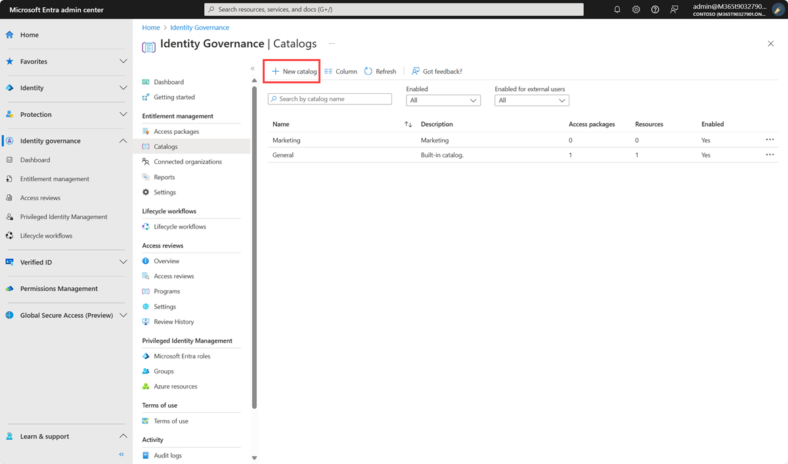
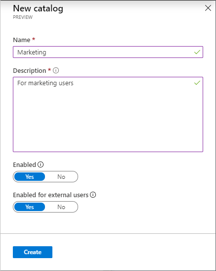
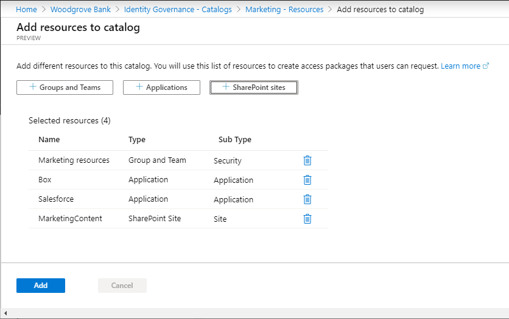
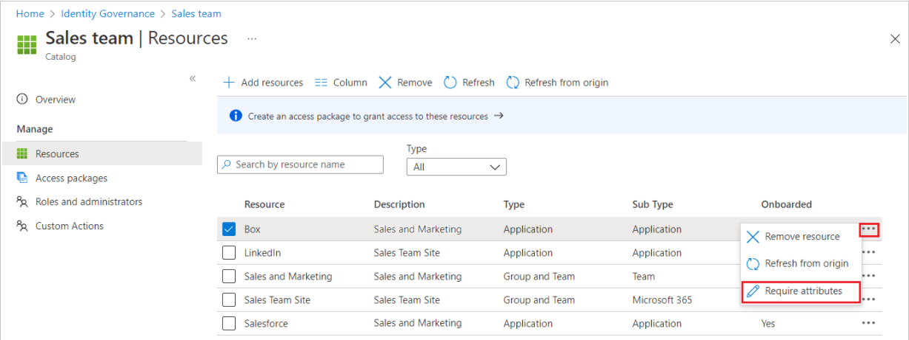
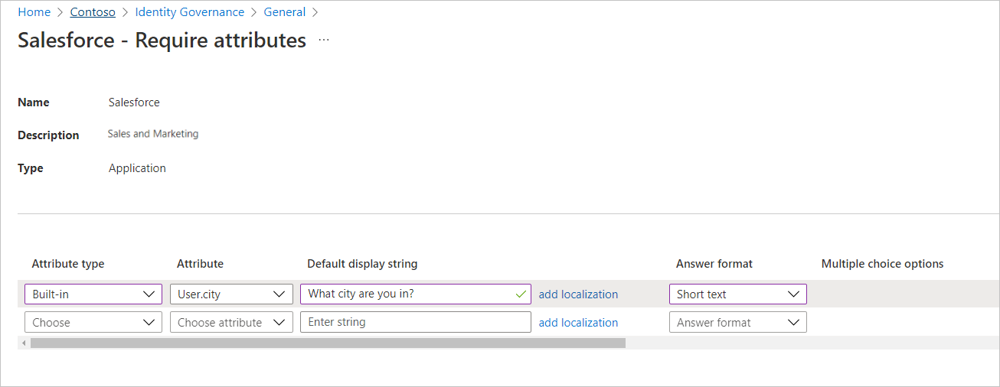
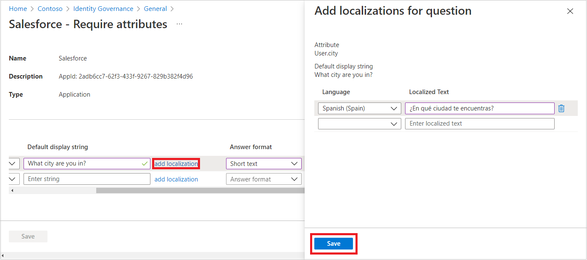

# Create and manage a catalog of resources in Azure AD entitlement management

## Create a catalog

A catalog is a container of resources and access packages. You create a catalog when you want to group related resources and access packages. Whoever creates the catalog becomes the first catalog owner. A catalog owner can add additional catalog owners.

**Prerequisite role:** Global administrator, Identity Governance administrator, User administrator, or Catalog creator

> [!NOTE]
> Users that have been assigned the User administrator role will no longer be able to create catalogs or manage access packages in a catalog they do not own. If users in your organization have been assigned the User administrator role to configure catalogs, access packages, or policies in entitlement management, you should instead assign these users the **Identity Governance administrator** role.

1. In the Azure portal, click **Azure Active Directory** and then click **Identity Governance**.

1. In the left menu, click **Catalogs**.

    

1. Click **New catalog**.

1. Enter a unique name for the catalog and provide a description.

    Users will see this information in an access package's details.

1. If you want the access packages in this catalog to be available for users to request as soon as they are created, set **Enabled** to **Yes**.

1. If you want to allow users in selected external directories to be able to request access packages in this catalog, set **Enabled for external users** to **Yes**.

    

1. Click **Create** to create the catalog.

## Create a catalog programmatically
### Create a catalog with Microsoft Graph

You can also create a catalog using Microsoft Graph.  A user in an appropriate role with an application that has the delegated `EntitlementManagement.ReadWrite.All` permission, or an application with that application permission, can call the API to [create an accessPackageCatalog](/graph/api/accesspackagecatalog-post?view=graph-rest-beta&preserve-view=true).

### Create a catalog  with PowerShell

You can create a catalog in PowerShell with the `New-MgEntitlementManagementAccessPackageCatalog` cmdlet from the [Microsoft Graph PowerShell cmdlets for Identity Governance](https://www.powershellgallery.com/packages/Microsoft.Graph.Identity.Governance/) module version 1.6.0 or later.

```powershell
Connect-MgGraph -Scopes "EntitlementManagement.ReadWrite.All"
Select-MgProfile -Name "beta"
$catalog = New-MgEntitlementManagementAccessPackageCatalog -DisplayName "Marketing"
```

## Add resources to a catalog

To include resources in an access package, the resources must exist in a catalog. The types of resources you can add are groups, applications, and SharePoint Online sites.

* The groups can be cloud-created Microsoft 365 Groups or cloud-created Azure AD security groups.  Groups that originate in an on-premises Active Directory cannot be assigned as resources because their owner or member attributes cannot be changed in Azure AD.   Groups that originate in Exchange Online as Distribution groups cannot be modified in Azure AD either.
* The applications can be Azure AD enterprise applications, including both SaaS applications and your own applications integrated with Azure AD. For more information on selecting appropriate resources for applications with multiple roles, see [add resource roles](entitlement-management-access-package-resources.md#add-resource-roles).
* The sites can be SharePoint Online sites or SharePoint Online site collections.

**Prerequisite role:** See [Required roles to add resources to a catalog](entitlement-management-delegate.md#required-roles-to-add-resources-to-a-catalog)

1. In the Azure portal, click **Azure Active Directory** and then click **Identity Governance**.

1. In the left menu, click **Catalogs** and then open the catalog you want to add resources to.

1. In the left menu, click **Resources**.

1. Click **Add resources**.

1. Click a resource type: **Groups and Teams**, **Applications**, or **SharePoint sites**.

    If you don't see a resource that you want to add or you're unable to add a resource, make sure you have the required Azure AD directory role and entitlement management role. You might need to have someone with the required roles add the resource to your catalog. For more information, see [Required roles to add resources to a catalog](entitlement-management-delegate.md#required-roles-to-add-resources-to-a-catalog).

1. Select one or more resources of the type that you would like to add to the catalog.

    

1. When finished, click **Add**.

    These resources can now be included in access packages within the catalog.

### Add resource attributes (Preview) in the catalog

Attributes are required fields that requestors will be asked to answer before submitting their access request. Their answers for these attributes will be shown to approvers and also stamped on the user object in Azure Active Directory. 

> [!NOTE]
>All attributes set up on a resource would require an answer before a request for an access package containing that resource can be submitted. If requestors don't provide an answer, there request won't be processed.

To require attributes for access requests, use the following steps:

1. Click **Resources** in the left menu, and a list of resources in the catalog will appear. 

1. Click on the ellipses next to the resource you want to add attributes, then select **Require attributes (Preview)**. 

    <kbd><kbd>
 
1.	Select the attribute type:

    1. **Built-in**: includes Azure Active Directory user profile attributes.
    1. **Directory schema extension**: provides a way to store additional data in Azure Active Directory on user objects and other directory objects. This includes groups, tenant details, and service principals. Only extension attributes on user objects can be used to send out claims to applications.
    1. If you choose **Built-in**, you can choose an attribute from the dropdown list. If you choose **Directory schema extension**, you can enter the attribute name in the textbox.

    > [!NOTE]
    > The User.mobilePhone attribute can be updated only for non-administrator users. Learn more [here](/graph/permissions-reference#remarks-5). 

1.	Select the Answer format in which you would like requestors to answer. Answer formats include: **short text**, **multiple choice**, and **long text**.

1.	If selecting multiple choice, click on the **Edit and localize** button to configure the answer options.
    1. After selecting Edit and localize, the **View/edit question** pane will open.
    1. Type in the response options you wish to give the requestor when answering the question in the **Answer values** boxes.
    1. Select the language the for the response option. You can localize response options if you choose additional languages.
    1. Type in as many responses as you need then click **Save**.

1. If you want the attribute value to be editable during direct assignments and self-service requests, select **Yes**.

    > [!NOTE]
    > - If you select **No** in Attribute value is editable field, and the attribute value **is empty**, users will have the ability to enter the value of that attribute. Once saved, the value will no longer be editable. 
    > - If you select **No** in Attribute value is editable field, and the attribute value **is not empty**, then users will not be able to edit the pre-existing value, both during direct assignments and during self-service requests.
 
    <kbd><kbd>

1.	If you would like to add localization, click **Add localization**.

    1. Once in the **Add localizations for questions** pane, select the language code for the language in which you want to localize the question related to the selected attribute.
    1. In the language you configured, type the question in the **Localized Text** box.
    1. Once you've added all of the localizations needed, click **Save**.

    <kbd><kbd>

1.	Once all attribute information is completed on the **Require attributes (Preview)** page, click **Save**.

### Add a Multi-geo SharePoint Site

1. If you have [Multi-Geo](/microsoft-365/enterprise/multi-geo-capabilities-in-onedrive-and-sharepoint-online-in-microsoft-365) enabled for SharePoint, select the environment you would like to select sites from.
    
    :::image type="content" source="media/entitlement-management-catalog-create/sharepoint-multi-geo-select.png" alt-text="Access package - Add resource roles - Select SharePoint Multi-geo sites":::

1. Then select the sites you would like to be added to the catalog. 

### Adding a resource to a catalog programmatically

You can also add a resource to a catalog using Microsoft Graph.  A user in an appropriate role, or a catalog and resource owner, with an application that has the delegated `EntitlementManagement.ReadWrite.All` permission can call the API to [create an accessPackageResourceRequest](/graph/api/accesspackageresourcerequest-post?view=graph-rest-beta&preserve-view=true).  An application with application permissions cannot yet programmatically add a resource without a user context at the time of the request, however.

## Remove resources from a catalog

You can remove resources from a catalog. A resource can only be removed from a catalog if it isn't being used in any of the catalog's access packages.

**Prerequisite role:** See [Required roles to add resources to a catalog](entitlement-management-delegate.md#required-roles-to-add-resources-to-a-catalog)

1. In the Azure portal, click **Azure Active Directory** and then click **Identity Governance**.

1. In the left menu, click **Catalogs** and then open the catalog you want to remove resources from.

1. In the left menu, click **Resources**.

1. Select the resources you want to remove.

1. Click **Remove** (or click the ellipsis (**...**) and then click **Remove resource**).


## Add additional catalog owners

The user that created a catalog becomes the first catalog owner. To delegate management of a catalog, you add users to the catalog owner role. This helps share the catalog management responsibilities. 

Follow these steps to assign a user to the catalog owner role:

**Prerequisite role:** Global administrator, Identity Governance administrator, User administrator, or Catalog owner

1. In the Azure portal, click **Azure Active Directory** and then click **Identity Governance**.

1. In the left menu, click **Catalogs** and then open the catalog you want to add administrators to.

1. In the left menu, click **Roles and administrators**.

    

1. Click **Add owners** to select the members for these roles.

1. Click **Select** to add these members.

## Edit a catalog

You can edit the name and description for a catalog. Users see this information in an access package's details.

**Prerequisite role:** Global administrator, Identity Governance administrator, User administrator, or Catalog owner

1. In the Azure portal, click **Azure Active Directory** and then click **Identity Governance**.

1. In the left menu, click **Catalogs** and then open the catalog you want to edit.

1. On the catalog's **Overview** page, click **Edit**.

1. Edit the catalog's name, description, or enabled settings.

    

1. Click **Save**.

## Delete a catalog

You can delete a catalog, but only if it doesn't have any access packages.

**Prerequisite role:** Global administrator, Identity Governance administrator, User administrator, or Catalog owner

1. In the Azure portal, click **Azure Active Directory** and then click **Identity Governance**.

1. In the left menu, click **Catalogs** and then open the catalog you want to delete.

1. On the catalog's **Overview**, click **Delete**.

1. In the message box that appears, click **Yes**.

### Deleting a catalog programmatically

You can also delete a catalog using Microsoft Graph.  A user in an appropriate role with an application that has the delegated `EntitlementManagement.ReadWrite.All` permission can call the API to [delete an accessPackageCatalog](/graph/api/accesspackagecatalog-delete?view=graph-rest-beta&preserve-view=true).

## Next steps

- [Delegate access governance to access package managers](entitlement-management-delegate-managers.md)