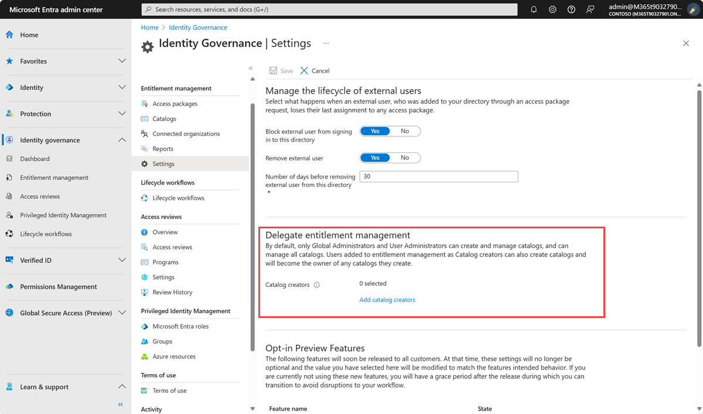
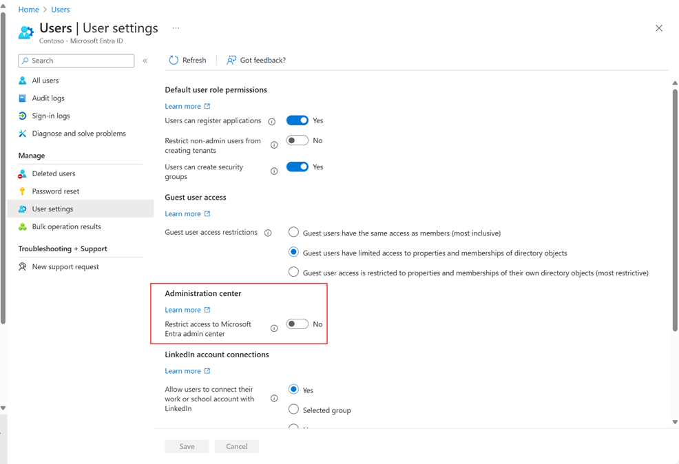

# Delegate access governance to catalog creators in entitlement management

A catalog is a container of resources and access packages. You create a catalog when you want to group related resources and access packages. By default, a Global administrator or an Identity governance administrator can [create a catalog](entitlement-management-catalog-create.md), and can add additional users as catalog owners.

There are three ways an organization can delegate with catalogs:

- When getting started in a pilot project, identity governance administrators can [create](entitlement-management-catalog-create.md) and manage the catalog.  Later, when moving from pilot to production, they could delegate a catalog by [assigning non-administrators as owners to the catalog](entitlement-management-catalog-create.md#add-more-catalog-owners), so that those users could maintain the policies going forward.
- If there are resources that don't have owners, then administrators can create catalogs, add those resources to each catalog, and then [assign non-administrators as owners to a catalog](entitlement-management-catalog-create.md#add-more-catalog-owners).  This allows users who aren't administrators and aren't resource owners to manage their own access policies for those resources.
- If resources have owners, then administrators can assign a collection of users, such as an `All Employees` dynamic group, to the catalog creators role, so a user who are in that group and own resources can create a catalog for their own resources.

This article illustrates how to delegate to users who aren't administrators, so that they can create their own catalogs. You can add those users to the Microsoft Entra entitlement management-defined catalog creator role. You can add individual users, or you can add a group whose members are then able to create catalogs.  After creating a catalog, they can subsequently add resources they own to their catalog.  They can create access packages and policies, including policies referencing existing [connected organizations](entitlement-management-organization.md).

If you have existing catalogs to delegate, then continue at the [create and manage a catalog of resources](entitlement-management-catalog-create.md#add-more-catalog-owners) article.

## As an IT administrator, delegate to a catalog creator

[!INCLUDE [portal updates](~/includes/portal-update.md)]

Follow these steps to assign a user to the catalog creator role.

**Prerequisite role:** Global Administrator or Identity Governance Administrator

1. Sign in to the [Microsoft Entra admin center](https://entra.microsoft.com) as at least an [Identity Governance Administrator](~/identity/role-based-access-control/permissions-reference.md#identity-governance-administrator).

1. Browse to **Identity governance** > **Entitlement management** > **settings**.

1. Select **Edit**.

    

1. In the **Delegate entitlement management** section, select **Add catalog creators** to select the users or groups that you want to delegate this entitlement management role to.

1. Select **Select**.

1. Select **Save**.

## Allow delegated roles to access the Microsoft Entra admin center

To allow delegated roles, such as catalog creators and access package managers, to access the Microsoft Entra admin center to manage access packages, you should check the administration portal setting.

**Prerequisite role:** Global Administrator or Identity Governance Administrator

1. Sign in to the [Microsoft Entra admin center](https://entra.microsoft.com) as at least an [Identity Governance Administrator](~/identity/role-based-access-control/permissions-reference.md#identity-governance-administrator).

1. Browse to **Identity** > **Users** > **User settings**.

1. Make sure **Restrict access to Microsoft Entra administration portal** is set to **No**.

    

## Manage role assignments programmatically

You can also view and update catalog creators and entitlement management catalog-specific role assignments using Microsoft Graph.  A user in an appropriate role with an application that has the delegated `EntitlementManagement.ReadWrite.All` permission can call the Graph API to [list the role definitions](/graph/api/rbacapplication-list-roledefinitions) of entitlement management, and [list role assignments](/graph/api/rbacapplication-list-roleassignments) to those role definitions.

To retrieve a list of the users and groups assigned to the catalog creators role, the role with definition ID `ba92d953-d8e0-4e39-a797-0cbedb0a89e8`, use the Graph query

```http
GET https://graph.microsoft.com/v1.0/roleManagement/entitlementManagement/roleAssignments?$filter=roleDefinitionId eq 'ba92d953-d8e0-4e39-a797-0cbedb0a89e8'&$expand=principal
```


## Next steps

- [Create and manage a catalog of resources](entitlement-management-catalog-create.md)
- [Delegate access governance to access package managers](entitlement-management-delegate-managers.md)
- [Delegate access governance to resource owners](entitlement-management-delegate.md)
