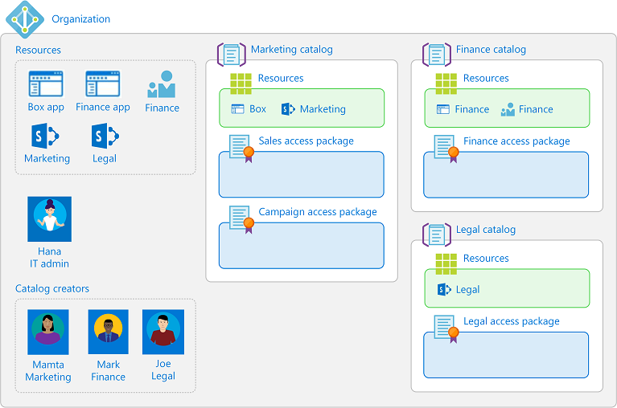

# Delegate access governance to others in Azure AD entitlement management (Preview)

> [!IMPORTANT]
> Azure Active Directory (Azure AD) entitlement management is currently in public preview.
> This preview version is provided without a service level agreement, and it's not recommended for production workloads. Certain features might not be supported or might have constrained capabilities.
> For more information, see [Supplemental Terms of Use for Microsoft Azure Previews](https://azure.microsoft.com/support/legal/preview-supplemental-terms/).

By default, Global administrators and User administrators can create and manage all aspects of Azure AD entitlement management. However, the users in these roles may not know all the scenarios where access packages are required. Typically it is users within departments who know who need to collaborate. 

Instead of granting unrestricted permissions to non-administrators, you can grant users the least permissions they need to perform their job and avoid creating conflicting or inappropriate access rights. This article describes the roles that you can assign to delegate various tasks in entitlement management. 

## Delegate example for departmental adoption

To understand how you might delegate tasks in entitlement management, it helps to consider an example. 

Suppose your organization has the following five users:

| User | Department | Notes |
| --- | --- | --- |
| Alice | IT | Global administrator |
| Bob | Research | Bob is also owner of a Research group |
| Carole | Research |  |
| Dave | Marketing |  |
| Elisa | Marketing | Elisa is also owner of a Marketing application |

Both the Research and Marketing departments want to use entitlement management for their users. Alice is not yet ready for other departments to use entitlement management. Here is one way that Alice could delegate tasks to the research and marketing departments.

1. Alice creates a new Azure AD security group for catalog creators, and adds Bob, Carol, Dave, and Elisa as members of that group.

1. Alice uses the entitlement management settings to add that group to the catalog creators role.

1. Carol creates a **Research** catalog, and adds Bob as a co-owner of that catalog. Bob adds the research group he owns to the catalog as a resource, so that it can be used in an access package for research collaboration.

1. Dave creates a **Marketing** catalog, and adds Elisa as a co-owner of that catalog. Elisa adds the marketing application she owns to the catalog as a resource, so that it can be used in an access package for marketing collaboration.

Now the research and marketing departments can utilize entitlement management. Bob, Carol, Dave, and Elisa can create and manage access packages in their respective catalogs.

## Add a catalog creator

If you want to delegate catalog creation, you add users to the catalog creator role.  You can add individual users, or for convenience can add a group, whose members are then able to create catalogs. Follow these steps to assign a user to the catalog creator role.

**Prerequisite role:** Global administrator or User administrator

1. In the Azure portal, click **Azure Active Directory** and then click **Identity Governance**.

1. In the left menu, in the **Entitlement management** section, click **Settings**.

1. Click **Edit**.

    

1. In the **Delegate entitlement management** section, click **Add catalog creators** to select the users or groups who will be the members for this entitlement management role.

1. Click **Select**.

1. Click **Save**.

## Add a catalog owner or an access package manager

To delegate management of a catalog or access packages in the catalog, you add users to the catalog owner or access package manager roles. Whoever creates a catalog becomes the first catalog owner. 

The assigned catalog owner or access package manager must be familiar with the project. The catalog creator should create the access package if involved in the day to day operations of the project, and they know the following information:
- what resources are needed
- who will need access
- who needs to approve access
- how long the project will last

The catalog creator should delegate the task to the project lead, who will create and manage the access package, if not involved in the day to day operations of the project. Follow these steps to assign a user to the catalog owner or access package manager role:

**Prerequisite role:** Global administrator, User administrator or Catalog owner

1. In the Azure portal, click **Azure Active Directory** and then click **Identity Governance**.

1. In the left menu, click **Catalogs** and then open the catalog you want to add administrators to.

1. In the left menu, click **Roles and administrators**.

1. Click **Add owners** or **Add access package managers** to select the members for these roles.

1. Click **Select** to add these members.

## Next steps

- [Add approvers](entitlement-management-access-package-edit.md#policy-request)
- [Add resources to a catalog](entitlement-management-catalog-create.md#add-resources-to-a-catalog)
