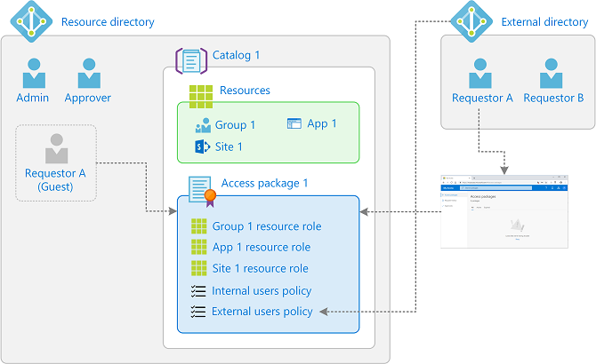

# Manage access for external users in Azure AD entitlement management (Preview)

> [!IMPORTANT]
> Azure Active Directory (Azure AD) entitlement management is currently in public preview.
> This preview version is provided without a service level agreement, and it's not recommended for production workloads. Certain features might not be supported or might have constrained capabilities.
> For more information, see [Supplemental Terms of Use for Microsoft Azure Previews](https://azure.microsoft.com/support/legal/preview-supplemental-terms/).

Azure AD entitlement management utilizes [Azure AD B2B](../b2b/what-is-b2b.md) to collaborate with people outside your organization in another Azure AD directory. With Azure AD B2B, external users authenticate to their home directory, but have a representation in your directory. The representation in your directory enables the user to be assigned access to your resources.

This article describes the settings you can specify to manage access for external users.

## How access works for external users

The following diagram shows an overview of how access to access packages works for external users.

1. You create an access package in your directory that includes a policy [For users not in your directory](entitlement-management-access-package-create.md#policy-for-users-not-in-your-directory).

1. You send the external user a [My Access portal link](entitlement-management-access-package-edit.md#copy-my-access-portal-link) that they can use to request the access package.

1. The external user (**Requestor A** in this example) uses the My Access portal link to [request access](entitlement-management-request-access.md) to the access package.

1. An approver [approves the request](entitlement-management-request-approve.md) (or the request is auto-approved).

1. The request goes into the [delivering state](entitlement-management-process.md).

1. Using the B2B invite process, a guest user account is created in your directory (**Requestor A (Guest)** in this example). If there an [allow list or a deny list](../b2b/allow-deny-list.md) is defined, those setting will be applied.

1. The guest user is assigned access to all of the resources in the access package.

1. The external user receives an email indicating that their access was [delivered](entitlement-management-process.md).

1. To access the resources, the external user must click the link in the email to complete the invitation process.

1. Depending on the policy settings, the access package assignment for the external user expires, and the external user's access is removed.

1. Depending on the lifecycle of external users settings, when the external user no longer has any access package assignments, the external user is blocked from signing in and the guest user account is removed from your directory.

## Manage the lifecycle of external users

You can select what happens when an external user, who was invited to your directory through an access package request being approved, no longer has any access package assignments. This can happen if the user relinquishes all their access package assignments, or their last access package assignment expires.

**Prerequisite role:** Global administrator or User administrator

1. In the Azure portal, click **Azure Active Directory** and then click **Identity Governance**.

1. In the left menu, in the **Entitlement management** section, click **Settings**.

1. Click **Edit**.

    

1. In the **Manage the lifecycle of external users** section, select the different settings for external users.

1. Once an external user loses their last assignment to any access packages, if you want to block them from signing in to this directory, set the **Block external user from signing in to this directory** to **Yes**.

1. Once an external user loses their last assignment to any access packages, if you want to remove their guest user account in your directory, set **Remove external user** to **Yes**.

    > [!NOTE]
    > Entitlement management only removes accounts that were invited through entitlement management. Also, note that user will be blocked from sign-in and removed from your directory even if that user was added to resources in your directory that were not access package assignments. If the guest was present in your directory prior to receiving access package assignments, they will remain. However, if the guest was invited through an access package assignment, and after being invited was also assigned to a OneDrive for Business or SharePoint Online site, they will still be removed.

1. If you want to remove the guest user account in your directory, you can set the number of days before it is removed. If you want to remove the guest user account as soon as they lose their last assignment to any access packages, set **Number of days before removing external user from this directory** to **0**.

1. Click **Save**.

## Enable a catalog for external users

When you create a [new catalog](entitlement-management-catalog-create.md), there is a setting to enable users from external directories to request access packages in the catalog. If you don't want external users to have permissions to request access packages in the catalog, set **Enabled for external users** to **No**.

**Prerequisite role:** Global administrator, User administrator, or Catalog owner

You can also change this setting after you have created the catalog.

## Next steps

- [Policy: For users not in your directory](entitlement-management-access-package-create.md#policy-for-users-not-in-your-directory)
- [Create and manage a catalog](entitlement-management-catalog-create.md)
- [Delegate tasks](entitlement-management-delegate.md)
