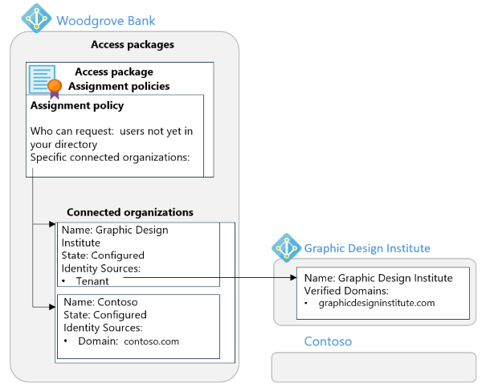
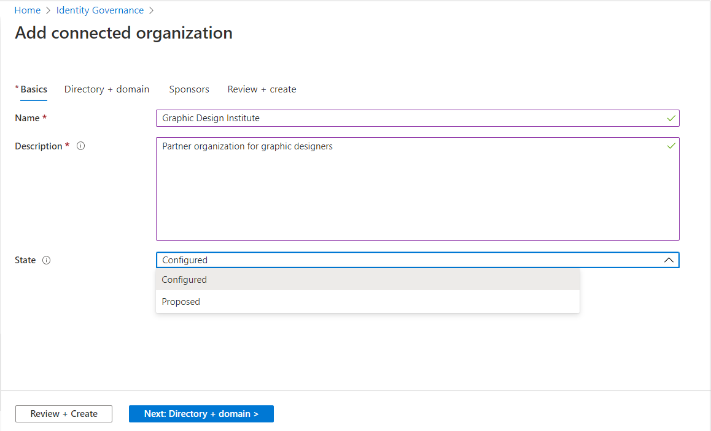
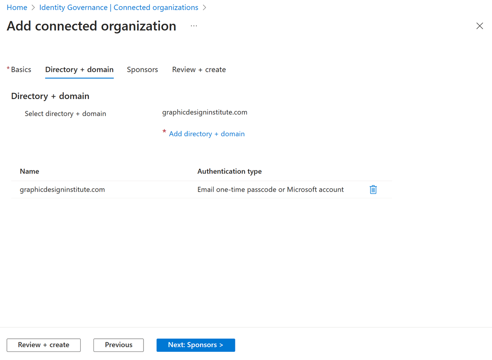
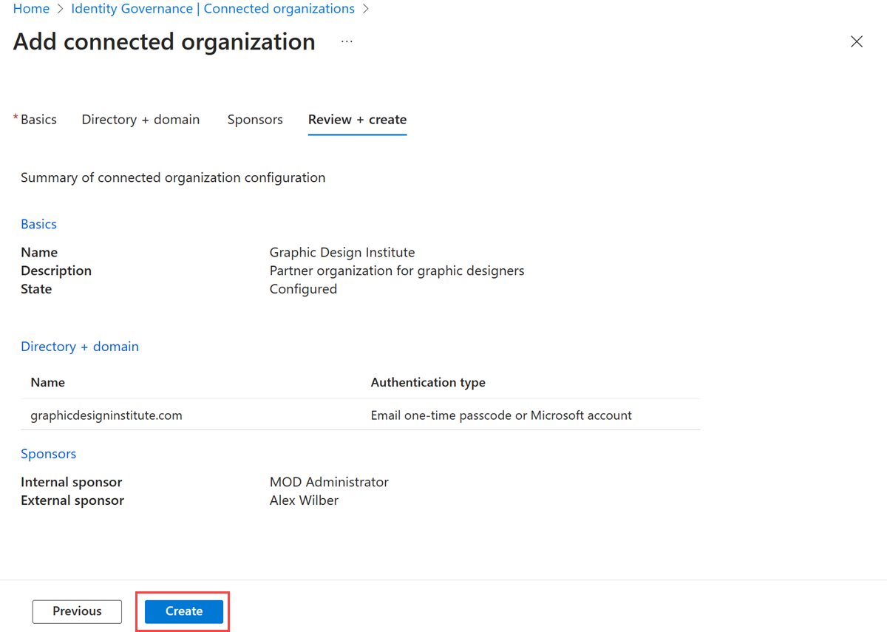

# Add a connected organization in Azure AD entitlement management (Preview)

Azure AD entitlement management enables you to collaborate with people outside your organization. If you frequently collaborate with users in an external Azure AD directory or domain, you can add them as a connected organization. This article describes how to add a connected organization so that you can allow users outside your organization to request resources in your directory.

## What is a connected organization?

A connected organization is an external Azure AD directory or domain that you have a relationship with.

For example, suppose you work at Woodgrove Bank and you want to collaborate with two external organizations: Graphic Design Institute and Contoso. You've been told by your contact at Graphic Design Institute that they use Azure AD, and that Graphic Design Institute's users have a user principal name that ends with `graphicdesigninstitute.com`. And you've been told by your contact at Contoso that they do not yet use Azure AD, but that Contoso's users have a user principal name that ends with `contoso.com`.

You can configure two connected organizations -- one for Graphic Design Institute with the domain `graphicdesigninstitute.com`, and one for Contoso with the domain `contoso.com`. If you then add those two connected organizations to a policy, users from each organization that have a user principal name that matches the policy can request access packages. Furthermore, because Graphic Design Institute has been identified as using Azure AD, then if Graphic Design Institute subsequently has subdomains, such as `graphicdesigninstitute.example`, then users with that user principal name will also be able to request access packages using the same policy.

 The authentication types for connected organizations are the following:

| Authentication type | Status |
| --- | --- |
| Azure AD | Supported |
| [Direct federation](../b2b/direct-federation.md) | Preview |
| [One-time passcode](../b2b/one-time-passcode.md) (domain) | Preview |

## Add a connected organization

Follow these steps to add an external Azure AD directory or domain as a connected organization.

**Prerequisite role:** Global administrator, User administrator, or Guest inviter

1. In the Azure portal, click **Azure Active Directory** and then click **Identity Governance**.

1. In the left menu, click **Connected organizations** and then click **Add connected organization**.

    

1. On the **Basics** tab, enter a display name and description for the organization.

    

1. On the **Directory + domain** tab, click **Add directory + domain** to open the Select directories + domains pane.

1. Type a domain name to search for the Azure AD directory or domain. You must type the entire domain name.

1. Verify it is the correct organization by the provided name and authentication type. How users will sign in depends on the authentication type.

    

1. Click **Add** to add the Azure AD directory or domain. Currently, you can only add one Azure AD directory or domain per connected organization.

    > [!NOTE]
    > All users from the Azure AD directory or domain will be able to request this access package. This includes users in Azure AD from all subdomains associated with the directory, unless those domains are blocked by the Azure B2B allow or deny list. For more information, see [Allow or block invitations to B2B users from specific organizations](../b2b/allow-deny-list.md).

1. Once you have added the Azure AD directory or domain, click **Select**.

    The organization appears in the list.

    

1. On the **Sponsors** tab, add optional sponsors for this connected organization.

    Sponsors are internal or external users already in your directory that are the point of contact for the relationship with this connected organization. Internal sponsors are member users in your directory. External sponsors are guest users from the connected organization that were previously invited and are already in your directory. Sponsors can be utilized as approvers when users in this connected organization request access to this access package. For information about how to invite a guest user to your directory, see [Add Azure Active Directory B2B collaboration users in the Azure portal](../b2b/add-users-administrator.md).

    When you click **Add/Remove**, a pane appears to select the internal or external sponsors. The pane displays an unfiltered list of users and groups in your directory.

    

1. On the **Review + create** tab, review your organization settings and then click **Create**.

    

## Next steps

- [Govern access for external users](entitlement-management-organization.md)
- [For users not in your directory](entitlement-management-access-package-request-policy.md#for-users-not-in-your-directory)
