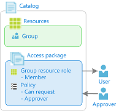

# Common steps in Azure AD entitlement management? (Preview)

> [!IMPORTANT]
> Azure Active Directory (Azure AD) entitlement management is currently in public preview.
> This preview version is provided without a service level agreement, and it's not recommended for production workloads. Certain features might not be supported or might have constrained capabilities.
> For more information, see [Supplemental Terms of Use for Microsoft Azure Previews](https://azure.microsoft.com/support/legal/preview-supplemental-terms/).

There are several ways that you can configure entitlement management for your organization. However, if you are just getting started, it's helpful to understand the common steps to make resources available to users.

## Administrator setup

### Share resources with users in your directory

- Users in your directory in specific groups can request access
- Time-limited access
- Groups, applications, and SharePoint Online sites in your directory

| # | Step | Example | Who can perform |
| ---: | --- | --- | --- |
| 1 | Add resources to a catalog - Groups - Applications - SharePoint sites |  | User admin Catalog owner |
| 2 | Create an access package in catalog |  | User admin Catalog owner |
| 3 | Add resource roles to access package |  | User admin Catalog owner Access package manager |
| 4 | Add policy for users in your directory - Who can request access - Who can approve - Expiration settings |  | User admin Catalog owner Access package manager |

### Share resources in another department with users in your directory

- Internal users in specific groups can request access
- Another department will manage the resources that can be shared
- Time-limited access
- Groups, applications, and SharePoint Online sites in your directory

| # | Step | Example | Who can perform |
| ---: | --- | --- | --- |
| 1 | If necessary, create a new catalog for the department | | User admin Catalog creator |
| 2 | Add catalog owners |  | User admin Catalog owner |
| 3 | Add resources to catalog - Groups - Applications - SharePoint sites |  | User admin Catalog owner |
| 4 | Create an access package in catalog |  | User admin Catalog owner |
| 5 | Add resource roles to access package |  | User admin Catalog owner Access package manager |
| 6 | Add policy for users in your directory - Who can request access - Who can approve - Expiration settings |  | User admin Catalog owner Access package manager |

### Share resources with specific users from your business partners

- Specific users from your business partners (including users not yet in your directory) can request access
- Self-service request
- Approval process
- Groups, applications, and SharePoint Online sites in your directory

### Share resources with any users from your business partners

- Any users from your business partners (including users not yet in your directory) can request access
- Self-service request
- Colleagues can share request link with peers
- Approval process
- Groups, applications, and SharePoint Online sites in your directory

| # | Step | Example | Who can perform |
| ---: | --- | --- | --- |
| 1 | Add resources to a catalog - Groups - Applications - SharePoint sites |  | User admin Catalog owner |
| 2 | Create an access package in catalog |  | User admin Catalog owner |
| 3 | Add resource roles to access package |  | User admin Catalog owner Access package manager |
| 4 | Add policy for users not in your directory - Who can request access - Who can approve - Expiration settings |  | User admin Catalog owner Access package manager |
| 5 | Send **My Access portal link** to request access package to your business partner contact to share with their users to request access |  | User admin Catalog owner Access package manager |

### Share resources with anyone

- Anyone (including social) can request access, for example to submit a contract bid
- Self-service request
- Colleagues can share request link with peers
- Approval process
- Groups, applications, and SharePoint Online sites in your directory

### Allow users from your business partners to sign up for an Azure AD account

- Any users from your business partners not yet in your directory to sign up for an Azure AD account in your directory
- Self-service sign up
- Automatically removed after a predetermined time

## Administrator audit

## Approvers

### Approve an access package request

| # | Step | Example | Who can perform |
| ---: | --- | --- | --- |
| 1 | Sign in to the My Access portal |  | Approver |
| 2 | Find access package in the list of pending approvals |  | Approver |
| 7 | Approve access request |  | Approver |

## Users

### Request an access package

| # | Step | Example | Who can perform |
| ---: | --- | --- | --- |
| 1 | Sign in to the My Access portal |  | User |
| 2 | Find access package in the list |  | User |
| 3 | Request access |  | User |

### Request an access package with a direct link

| # | Step | Example | Who can perform |
| ---: | --- | --- | --- |
| 1 | Open the my access page link you received |  | User |
| 2 | Sign in to the My Access portal |  | User |
| 3 | Request access |  | User |

### View access packages they already have access to

### View history of their request

### Share access package request link with a colleague

## Next steps

- [Tutorial: Get started with Azure AD entitlement management](entitlement-management-get-started.md)
