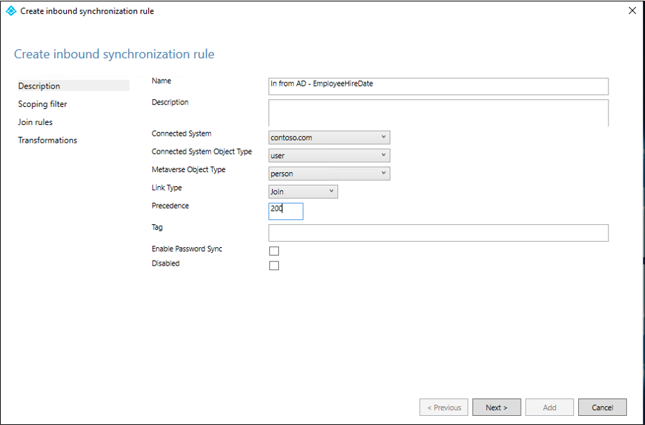
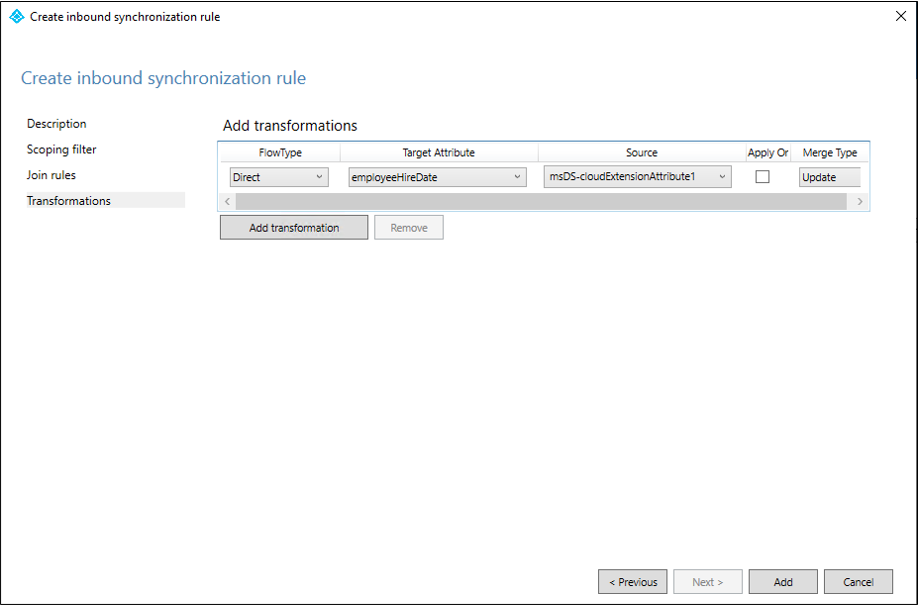
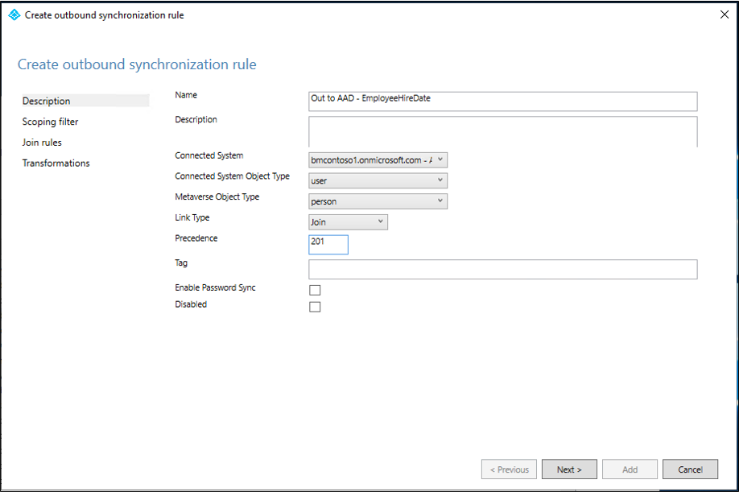

# How to synchronize attributes for Lifecycle workflows
Workflows, contain specific tasks, which can run automatically against users based on the specified execution conditions. Automatic workflow scheduling is supported based on the employeeHireDate and employeeLeaveDateTime user attributes in Azure AD.

To take full advantage of Lifecycle Workflows, user provisioning should be automated, and the scheduling relevant attributes should be synchronized. 

## Scheduling relevant attributes
The following table shows the scheduling (trigger) relevant attributes and the methods of  synchronization that are supported.

|Attribute|Type|Supported in HR Inbound Provisioning|Support in Azure AD Connect Cloud Sync|Support in Azure AD Connect Sync| 
|-----|-----|-----|-----|-----|
|employeeHireDate|DateTimeOffset|Yes|Yes|Yes|
|employeeLeaveDateTime|DateTimeOffset|Yes|Not currently|Not currently|

These attributes **are not** automatically populated using such synchronization methods such as Azure AD Connect or Azure AD Connect cloud sync.

This document explains how to set up synchronization from on-premises Azure AD Connect cloud sync and Azure AD Connect for the required attributes.

>[!NOTE]
> There's no corresponding EmployeeHireDate or EmployeeLeaveDateTime attribute in Active Directory.  If you're importing from on-premises AD, you'll need to identify an attribute in AD that can be used.  This attribute must be a string.

## Understanding EmployeeHireDate and EmployeeLeaveDateTime formatting
The EmployeeHireDate and EmployeeLeaveDateTime contain dates and times that must be formatted in a specific way.  This means that you may need to use an expression to convert the value of your source attribute to a format that will be accepted by the EmployeeHireDate or EmployeeLeaveDateTime.  The table below outlines the format that is expected and provides an example expression on how to convert the values.

|Scenario|Expression/Format|Target|More Information|
|-----|-----|-----|-----|
|Workday to Active Directory User Provisioning|FormatDateTime([StatusHireDate], , "yyyy-MM-ddzzz", "yyyyMMddHHmmss.fZ")|On-premises AD string attribute|[Attribute mappings for Workday](../saas-apps/workday-inbound-tutorial.md#workday-to-ad-attribute-mapping-and-configuration-questionsworkday-inbound-tutorial)|
|SuccessFactors to Active Directory User Provisioning|FormatDateTime([endDate], ,"M/d/yyyy hh:mm:ss tt"," yyyyMMddHHmmss.fZ ")|On-premises AD string attribute|[Attribute mappings for SAP Success Factors](../saas-apps/sap-successfactors-inbound-provisioning-tutorial.md)|
|Custom import to Active Directory|Must be in the format "yyyyMMddHHmmss.fZ"|On-premises AD string attribute||
|Microsoft Graph User API|Must be in the format "YYYY-MM-DDThh:mm:ssZ"|EmployeeHireDate and EmployeeLeaveDateTime||
|Workday to Azure AD User Provisioning|Can use a direct mapping.  No expression is needed but may be used to adjust the time portion of EmployeeHireDate and EmployeeLeaveDateTime|EmployeeHireDate and EmployeeLeaveDateTime||
|-	SuccessFactors to Azure AD User Provisioning|Can use a direct mapping.  No expression is needed but may be used to adjust the time portion of EmployeeHireDate and EmployeeLeaveDateTime|EmployeeHireDate and EmployeeLeaveDateTime||

For more information on expressions, see [Reference for writing expressions for attribute mappings in Azure Active Directory](../app-provisioning/functions-for-customizing-application-data.md)

The expression examples above use endDate for SAP and StatusHireDate for Workday.  However, you may opt to use different attributes.

For example, you might use StatusContinuesFirstDayOfWork instead of StatusHireDate for Workday.  In this instance your expression would be:  

`FormatDateTime([StatusContinuesFirstDayOfWork], , "yyyy-MM-ddzzz", "yyyyMMddHHmmss.fZ")`

The following table has a list of suggested attributes and their scenario recommendations.

|HR Attribute|HR System|Scenario|Azure AD attribute|
|-----|-----|-----|-----|
|StatusHireDate|Workday|Joiner|EmployeeHireDate|
|StatusContinuousFirstDayOfWork|Workday|Joiner|EmployeeHireDate|	
StatusDateEnteredWorkforce|Workday|Joiner|EmployeeHireDate|
StatusOriginalHireDate|Workday|Joiner|EmployeeHireDate|
|StatusEndEmploymentDate|Workday|Leaver|EmployeeLeaveDateTime|
|StatusResignationDate|Workday|Leaver|EmployeeLeaveDateTime|
|StatusRetirementDate|Workday|Leaver|EmployeeLeaveDateTime|
|StatusTerminationDate|Workday|Leaver|EmployeeLeaveDateTime|
|startDate|SAP SF|Joiner|EmployeeHireDate|
|firstDateWorked|SAP SF|Joiner|EmployeeHireDate|
|lastDateWorked|SAP SF|Leaver|EmployeeLeaveDateTime|
|endDate|SAP SF|Leaver|EmployeeLeaveDateTime|

For more attributes, see the [Workday attribute reference](../app-provisioning/workday-attribute-reference.md) and [SAP SuccessFactors attribute reference](../app-provisioning/sap-successfactors-attribute-reference.md)

## Importance of time
To ensure timing accuracy of scheduled workflows it’s curial to consider:

- The time portion of the attribute must be set accordingly, for example the `employeeHireDate` should have a time at the beginning of the day like 1AM or 5AM and the `employeeLeaveDateTime` should have time at the end of the day like 9PM or 11PM
    - Workflow won't run earlier than the time specified in the attribute, however the [tenant schedule (default 3h)](customize-workflow-schedule.md) may delay the workflow run.  For instance, if you set the `employeeHireDate` to 8AM but the tenant schedule doesn't run until 9AM, the workflow won't be processed until then.  If a new hire is starting at 8AM, you would want to set the time to something like (start time - tenant schedule) to ensure it had run before the employee arrives.
- It's recommended, that if you're using temporary access pass (TAP), that you set the maximum lifetime to 24 hours.  Doing this will help ensure that the TAP hasn't expired after being sent to an employee who may be in a different timezone.  For more information, see [Configure Temporary Access Pass in Azure AD to register Passwordless authentication methods.](../authentication/howto-authentication-temporary-access-pass.md#enable-the-temporary-access-pass-policy)
- When importing the data, you should understand if and how the source provides time zone information for your users to potentially make adjustments to ensure timing accuracy.

## Create a custom synch rule in Azure AD Connect cloud sync for EmployeeHireDate
 The following steps will guide you through creating a synchronization rule using cloud sync.
 1.  In the Azure portal, select **Azure Active Directory**.
 2.  Select **Azure AD Connect**.
 3.  Select **Manage cloud sync**.
 4. Under **Configuration**, select your configuration.
 5. Select **Click to edit mappings**.  This link opens the **Attribute mappings** screen.
 6. Select **Add attribute**.
 7. Fill in the following information: 
     - Mapping Type: Direct
     - Source attribute: msDS-cloudExtensionAttribute1
     - Default value: Leave blank
     - Target attribute: employeeHireDate
     - Apply this mapping: Always
     
 8. Select **Apply**.
 9. Back on the **Attribute mappings** screen, you should see your new attribute mapping.  
 10. Select **Save schema**.

For more information on attributes, see [Attribute mapping in Azure AD Connect cloud sync.](../cloud-sync/how-to-attribute-mapping.md)

## How to create a custom synch rule in Azure AD Connect for EmployeeHireDate
The following example will walk you through setting up a custom synchronization rule that synchronizes the Active Directory attribute to the employeeHireDate attribute in Azure AD.

   1. Open a PowerShell window as administrator and run `Set-ADSyncScheduler -SyncCycleEnabled $false`.
   2. Go to Start\Azure AD Connect\ and open the Synchronization Rules Editor
   3. Ensure the direction at the top is set to **Inbound**.
   4. Select **Add Rule.**
   5. On the **Create Inbound synchronization rule** screen, enter the following information and select **Next**.
      - Name:  In from AD - EmployeeHireDate
      - Connected System:  contoso.com
      - Connected System Object Type: user
      - Metaverse Object Type: person
      - Precedence: 200
     
   6. On the **Scoping filter** screen, select **Next.**
   7. On the **Join rules** screen, select **Next**.
   8. On the **Transformations** screen, Under **Add transformations,** enter the following information.
      - FlowType:  Direct
      - Target Attribute: employeeHireDate
      - Source:  msDS-cloudExtensionAttribute1
     
   9.  Select **Add**.
   10. In the Synchronization Rules Editor, ensure the direction at the top is set to **Outbound**.
   11. Select **Add Rule.**  
   12. On the **Create Outbound synchronization rule** screen, enter the following information and select **Next**.
       - Name:  Out to AAD - EmployeeHireDate
       - Connected System:  &lt;your tenant&gt;
       - Connected System Object Type: user
       - Metaverse Object Type: person
       - Precedence: 201
     
   13. On the **Scoping filter** screen, select **Next.**
   14. On the **Join rules** screen, select **Next**.
   15. On the **Transformations** screen, Under **Add transformations,** enter the following information.
       - FlowType:  Direct
       - Target Attribute: employeeHireDate
       - Source:  employeeHireDate
     
   16.  Select **Add**.
   17. Close the Synchronization Rules Editor

For more information, see [How to customize a synchronization rule](../hybrid/how-to-connect-create-custom-sync-rule.md) and [Make a change to the default configuration.](../hybrid/how-to-connect-sync-change-the-configuration.md)

## Next steps
- [What are lifecycle workflows?](what-are-lifecycle-workflows.md)
- [Create a custom workflow using the Azure portal](tutorial-onboard-custom-workflow-portal.md)
- [Create a Lifecycle workflow](create-lifecycle-workflow.md)