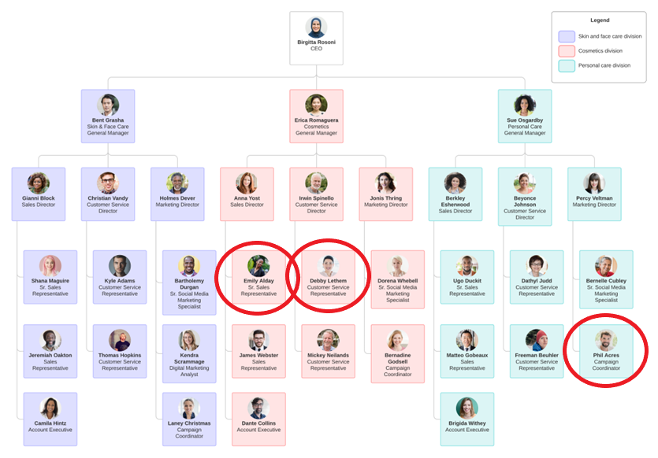

# Review access with peer outlier recommendations

## Prerequisites
 
- Azure AD Premium P2
 
For more information, see [License requirements](access-reviews-overview.md#license-requirements).

## Peer outlier recommendations
Decision makers who review users' access and perform access reviews can use system based recommendations to help them decide whether to continue their access or deny their access to resources. If review decision helpers are enabled by the creator of the access review, reviewers can receive peer outlier recommendations for reviews of group access reviews.

Peer analysis recommendation detects users with outlier access to a group, based on reporting-structure similarity with other group members. The outlier recommendation relies on a scoring mechanism which is calculated by computing the user’s average distance to the remaining users in the group.

A *peer* in an organization’s chart is defined as two or more users who share similar characteristics in the organization's reporting structure. Users who are very distant from all the other group members based on their organization's chart, are considered a “peer outlier” in a group. The following image has an example of an organization's reporting structure in a cosmetics company: 

Based on the reporting structure in the example image, members outside of a division that is under a group review, would be denied access by the system if the peer outlier recommendation was taken by the reviewer. 

For example, Phil who works within the Personal care division is in a group with Debbie and Emily who both work within the Cosmetics division. The group is called *Fresh Skin*. If an Access Review for the group Fresh Skin is performed, based on the reporting structure and distance away from the other group members, Phil would be considered an outlier. The system will create a **Deny** recommendation in the group access review.

## Next Steps
- [Create an access review](create-access-review.md)
- - [Review access to groups or applications](perform-access-review.md)

