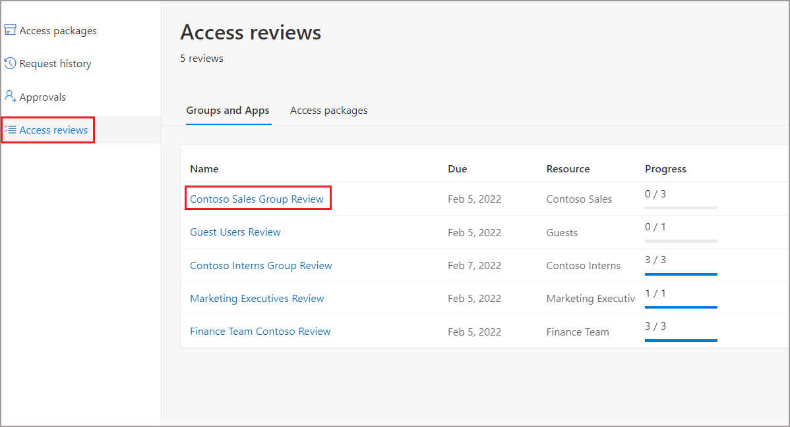
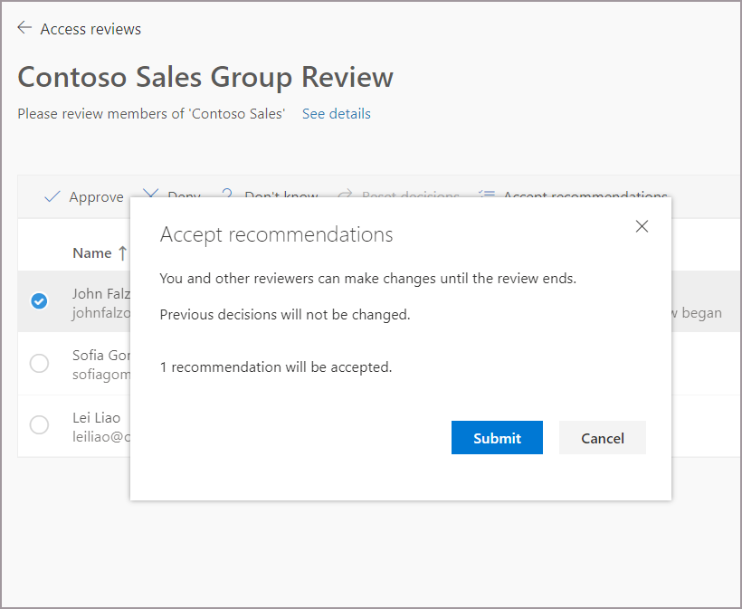

# Review access to groups and applications in Azure AD access reviews

Azure Active Directory (Azure AD) simplifies how enterprises manage access to groups and applications in Azure AD and other Microsoft Online Services with a feature called Azure AD access reviews. This article will go over how a designated reviewer performs an access review for members of a group or users with access to an application. If you would like to review access to an access package read [Review access of an access package in Azure AD entitlement management](entitlement-management-access-reviews-review-access.md)

## Perform access review using My Access
You can review access to groups and applications via My Access, an end-user friendly portal for granting, approving, and reviewing access needs.

### Use email to navigate to My Access

>[!IMPORTANT]
> There could be delays in receiving email and it some cases it could take up to 24 hours. Add azure-noreply@microsoft.com to your safe recipients list to make sure that you are receiving all emails.

1. Look for an email from Microsoft asking you to review access. You can see an example email message below:

   

1. Click the **Start review** link to open the access review.git pu

### Navigate directly to My Access 

You can also view your pending access reviews by using your browser to open My Access.

1. Sign in to the My Access at https://myaccess.microsoft.com/

2. Select **Access reviews** from the menu on the left side bar to see a list of pending access reviews assigned to you.

## Review access for one or more users

After you open My Access under Groups and Apps you can see:

- **Name** The name of the access review.
- **Due** The due date for the review. After this date denied users could be removed from the group or app being reviewed.
- **Resource** The name of the resource under review.
- **Progress** The number of users reviewed over the total number of users part of this access review.

Click on the name of an access review to get started.

Once that it opens, you will see the list of users in scope for the access review. 

> [!NOTE] 
> If the request is to review your own access, the page will look different. For more information, see [Review access for yourself to groups or applications](review-your-access.md).

There are two ways that you can approve or deny access:

- You can manually approve or deny access for one or more users.
- You can accept the system recommendations.

### Manually review access for one or more users

1. Review the list of users and decide whether to approve or deny their continued access.

1. Select one or more users by clicking the circle next to their names.

1. Select **Approve** or **Deny** on the bar above.
    - If you are unsure if a user should continue to have access or not, you can click **Don't know**. The user gets to keep their access and your choice is recorded in the audit logs. It is important that you keep in mind that any information you provide will be available to other reviewers. They can read your comments and take them into account when they review the request.

    

1. The administrator of the access review may require that you supply a reason in the **Reason** box for your decision. Even when a reason is not required. You can still provide a reason for your decision and the information that you include will be available to other approvers for review.

1. Click **Submit**.
    - You can change your response at any time until the access review has ended. If you want to change your response, select the row and update the response. For example, you can approve a previously denied user or deny a previously approved user.

 > [!IMPORTANT]
 > - If a user is denied access, they aren't removed immediately. They are removed when the review period has ended or when an administrator stops the review. 
 > - If there are multiple reviewers, the last submitted response is recorded. Consider an example where an administrator designates two reviewers – Alice and  Bob. Alice opens the access review first and approves a user's access request. Before the review period ends, Bob opens the access review and denies access on the same request previously approved by Alice. The last decision denying the access is the response that gets recorded.

### Review access based on recommendations

To make access reviews easier and faster for you, we also provide recommendations that you can accept with a single click. The recommendations are generated based on the user's sign-in activity.

1. Select one or more users and then Click **Accept recommendations**.

    

1. Or to accept recommendations for all unreviewed users, make sure that no users are selected and click on the **Accept recommendations** button on the top bar.

1. Click **Submit** to accept the recommendations.

> [!NOTE]
> When you accept recommendations previous decisions will not be changed.

### Review access for one or more users in a multi-stage access review (preview)

If multi-stage access reviews have been enabled by the administrator, there will be 2 or 3 total stages of review. Each stage of review will have a specified reviewer.

You will review access either manually or accept the recommendations based on sign-in activity for the stage you are assigned as the reviewer.

If you are the 2nd stage or 3rd stage reviewer, you will also see the decisions made by the reviewers in the prior stage(s) if the administrator enabled this setting when creating the access review. The decision made by a 2nd or 3rd stage reviewer will overwrite the previous stage. So, the decision the 2nd stage reviewer makes will overwrite the first stage, and the 3rd stage reviewer's decision will overwrite the second stage.

 

Approve or deny access as outlined in [Review access for one or more users](#review-access-for-one-or-more-users).

> [!NOTE]
> The next stage of the review won't become active until the duration specified during the access review setup has passed. If the administrator believes a stage is done but the review duration for this stage has not expired yet, they can use the **Stop current stage** button in the overview of the access review in the Azure AD portal. This will close the active stage and start the next stage. 

### Review access of B2B direct connect users and teams in Teams shared channels (preview)

1. As the reviewer, you should receive an email that requests you to review access for the team or group. Click the link in the email, or navigate directly to https://myaccess.microsoft.com/.

1. Follow the instructions in [Review access for one or more users](#review-access-for-one-or-more-users) to make decisions to approve or deny the users access to the Teams.

> [!NOTE]
> Unlike internal users and B2B Collaboration users, B2B Direct Connect users and Teams **don't** have recommendations based on last sign-in activity to make decisions when you perform the review. 

## If no action is taken on access review
When the access review is setup, the administrator has the option to use advanced settings to determine what will happen in the event a reviewer doesn't respond to an access review request. 

The administrator can set up the review so that if reviewers do not respond at the end of the review period, all unreviewed users can have an automatic decision made on their access. This includes the loss of access to the group or application under review.

## Next steps

- [Complete an access review of groups or applications](complete-access-review.md)
