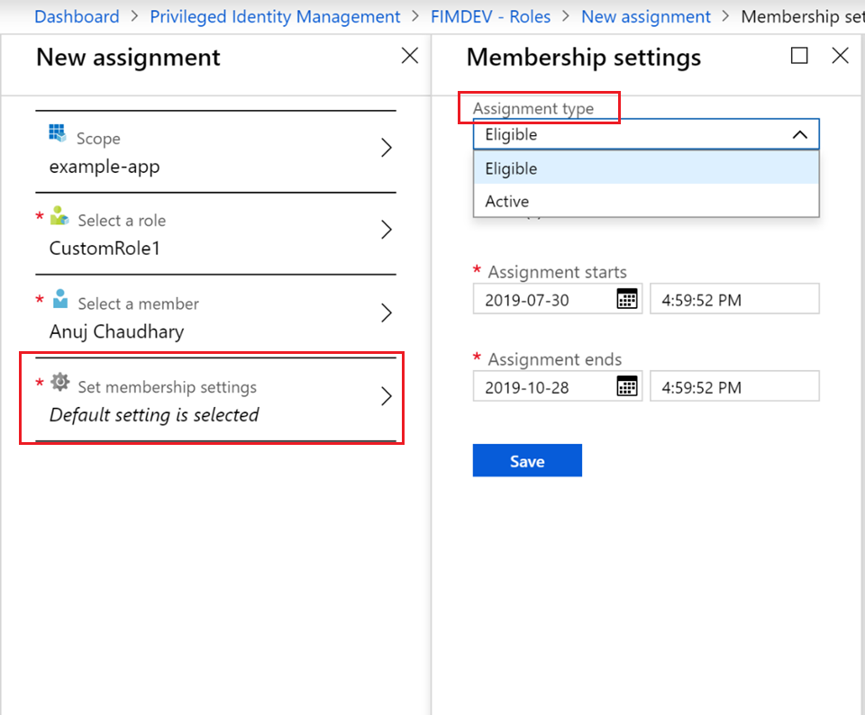

# Assign an Azure AD custom role in Privileged Identity Management

This article tells you how to use Privileged Identity Management (PIM) to create just-in-time and time-bound assignment to custom roles created for application management in the Azure Active Directory (Azure AD) administrative experience. For more information about creating custom roles to delegate application management in Azure AD, see [Custom administrator roles in Azure Active Directory (preview)](../users-groups-roles/roles-custom-overview.md). If you haven't used Privileged Identity Management yet, get more information at [Start using PIM](pim-getting-started.md).

> [!NOTE]
> Azure AD custom roles are not integrated with the built-in directory roles during preview. Once the capability is generally available, role management will appear as in the built-in roles experience.

## Assign a role

Privileged Identity Management (PIM) can manage custom roles you can create in Azure Active Directory (Azure AD) application management. For information about how to grant another administrator access to manage Privileged Identity Management, see [Grant access to other administrators to manage PIM](pim-how-to-give-access-to-pim.md). The following steps make an eligible assignment to a custom directory role.

1. Sign in to [Privileged Identity Management](https://portal.azure.com/?Microsoft_AAD_IAM_enableCustomRoleManagement=true&Microsoft_AAD_IAM_enableCustomRoleAssignment=true&feature.rbacv2roles=true&feature.rbacv2=true&Microsoft_AAD_RegisteredApps=demo#blade/Microsoft_Azure_PIMCommon/CommonMenuBlade/quickStart) in the Azure portal with a user account that is assigned to the Privileged Role administrator role.
1. Select **Azure AD custom roles (Preview)**.

    

1. Select **Roles** to see a list of custom roles for Azure AD applications.

    

1. Select **Add member** to open the assignment pane.
1. To restrict the scope of the role assignment to a single application, select **Scope** to specify an application scope.

    

1. Select **Select a role** to open the **Select a role** page.

    

1. Select a role you want to assign and then click **Select**. The **Select a member** pane opens.

    

1. Select a user you want to assign to the role and then click **Select**. The **Membership settings** page opens.

    

1. On the **Membership settings** page, select **Eligible** or **Active**:

    - **Eligible** assignments require the user assigned to the role to perform an action before they can use the role. Actions might include performing a multi-factor authentication (MFA) check, providing a business justification, or requesting approval from designated approvers.
    - **Active** assignments don't require the assigned user to perform any action to use the role. Users assigned as active have the privileges assigned to the role at all times.

1. Specify whether the assignment is permanent:
    - Select the **Permanent** check box to to make the assignment permanent (permanently eligible or permanently assigned). Depending on the role settings, the check box might not appear or might be unavailable.
    - Clear the **Permanent** check box and update the start and end date and time boxes to specify an assignment duration.

1. To create the new role assignment, click **Save** and then **Add**. A notification of the status is displayed.

## Next steps

- [Role definitions in Azure AD](../users-groups-roles/directory-assign-admin-roles.md)
- [License requirements to use PIM](subscription-requirements.md)
- [Securing privileged access for hybrid and cloud deployments in Azure AD](../users-groups-roles/directory-admin-roles-secure.md?toc=%2fazure%2factive-directory%2fprivileged-identity-management%2ftoc.json)
- [Deploy PIM](pim-deployment-plan.md)
