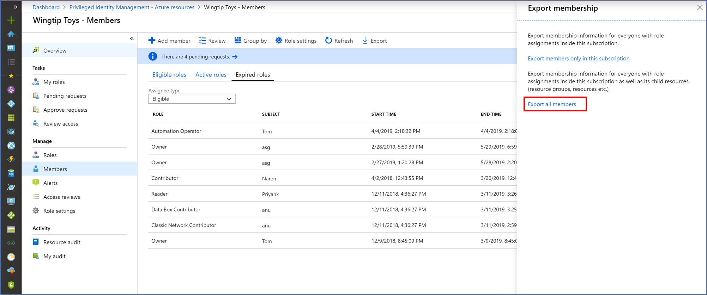

# View who has Azure resource roles in PIM

With Azure Active Directory Privileged Identity Management (PIM), you can manage, control, and monitor access to Azure resources within your organization. This includes subscriptions, resource groups, and even virtual machines. Any resource within the Azure portal that leverages the Azure role-based access control (RBAC) functionality can take advantage of the security and lifecycle management capabilities in Azure AD PIM. 

## PIM for Azure resources helps resource administrators

- See which users and groups are assigned roles for the Azure resources you administer
- Enable on-demand, "just in time" access to manage resources such as Subscriptions, Resource Groups, and more
- Expire assigned users/groups resource access automatically with new time-bound assignment settings
- Assign temporary resource access for quick tasks or on-call schedules
- Enforce Multi-Factor Authentication for resource access on any built-in or custom role 
- Get reports about resource access correlated resource activity during a user’s active session
- Get alerts when new users or groups are assigned resource access, and when they activate eligible assignments

## View activation and Azure resource activity

In the event you need to see what actions a specific user took on various resources, you can review the Azure resource activity associated with a given activation period (for eligible users). Start by selecting a user from the Members view or from the list of members in a specific role. The result displays a graphical view of the user’s actions on Azure resources by date, and the recent role activations over that same time period.

Selecting a specific role activation will show the role activation details, and corresponding Azure resource activity that occurred while that user was active.

## Review who has access in a subscription

To review role assignments in your Subscription, select the Members tab from the left navigation, or select roles, and choose a specific role to review members. 

Select Review from the action bar to view existing access reviews and select Add to create a new review.

[Learn more about access reviews](pim-how-to-perform-security-review.md)

>[!NOTE]
Reviews are only supported for Subscription resource types at this time.

## Export role assignments with children

You may have a compliance requirement where you must provide a complete list of role assignments to auditors. PIM enables you to query role assignments at a specific resource, as well as all its child resources. Previously, it was difficult to get a list of all role assignments for a subscription. Using PIM, you can query for all eligible and active role assignments in a subscription including role assignments for all resource groups and resources.

1. Sign in to the [Azure portal](https://portal.azure.com) with a user that is a member of the [Privileged Role Administrator](../users-groups-roles/directory-assign-admin-roles.md#privileged-role-administrator) role.

1. Open **Azure AD Privileged Identity Management**.

1. Click **Azure resources**.

1. Click the resource you want to export role assignments for, such as a subscription.

1. Click **Members**.

1. Click **Export** to open the Export membership pane.

    

1. Click **Export all members** to export all role assignments in a CSV file.

    

## Next steps

- [Assign Azure resource roles in PIM](pim-resource-roles-assign-roles.md)
- [Approve or deny requests for Azure resource roles in PIM](pim-resource-roles-approval-workflow.md)
- [Built-in roles in Azure](../../role-based-access-control/built-in-roles.md)
