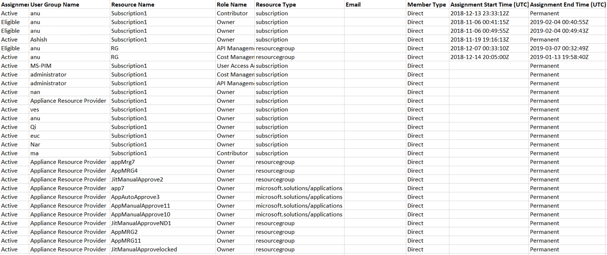
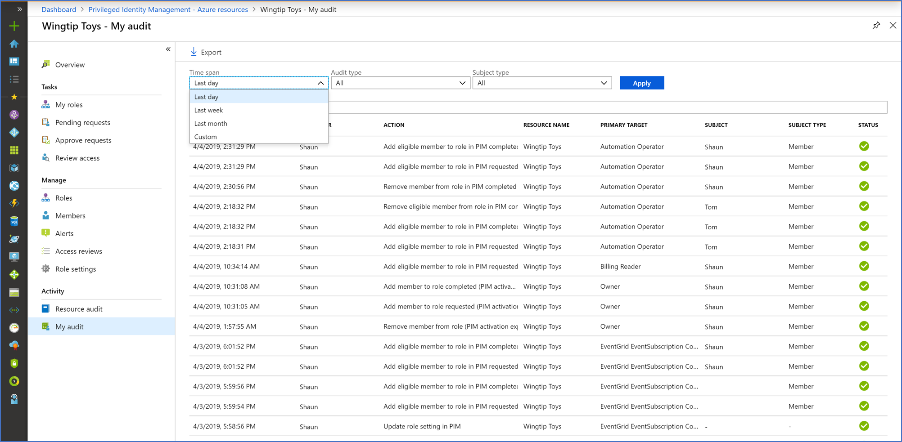

# View activity and audit history for Azure resource roles in PIM

With Azure Active Directory (Azure AD) Privileged Identity Management (PIM), you can view activity, activations, and audit history for Azure resources roles within your organization. This includes subscriptions, resource groups, and even virtual machines. Any resource within the Azure portal that leverages the Azure role-based access control (RBAC) functionality can take advantage of the security and lifecycle management capabilities in PIM.

## View activity and activations

To see what actions a specific user took in various resources, you can view the Azure resource activity that's associated with a given activation period.

1. Open **Azure AD Privileged Identity Management**.

1. Click **Azure resources**.

1. Click the resource you want to view activity and activations for.

1. Click **Roles** or **Members**.

1. Click a user.

    You see a graphical view of the user's actions in Azure resources by date. It also shows the recent role activations over that same time period.

    

1. Click a specific role activation to see details and corresponding Azure resource activity that occurred while that user was active.

    

## Export role assignments with children

You may have a compliance requirement where you must provide a complete list of role assignments to auditors. PIM enables you to query role assignments at a specific resource, as well as all its child resources. Previously, it was difficult to get a list of all role assignments for a subscription. Using PIM, you can query for all eligible and active role assignments in a subscription including role assignments for all resource groups and resources.

1. Open **Azure AD Privileged Identity Management**.

1. Click **Azure resources**.

1. Click the resource you want to export role assignments for, such as a subscription.

1. Click **Members**.

1. Click **Export** to open the Export membership pane.

    

1. Click **Export all members** to export all role assignments in a CSV file.

    

## View resource audit history

Resource audit gives you a view of all role activity for a resource.

1. Open **Azure AD Privileged Identity Management**.

1. Click **Azure resources**.

1. Click the resource you want to view audit history for.

1. Click **Resource audit**.

1. Filter the history using a predefined date or custom range.

    

1. For **Audit type**, select **Activate (Assigned + Activated)**.

    

1. Under **Action**, click **(activity)** for a user to see that user's activity detail in Azure resources.

    

## View my audit

My audit enables you to view your personal role activity.

1. Open **Azure AD Privileged Identity Management**.

1. Click **Azure resources**.

1. Click the resource you want to view audit history for.

1. Click **My audit**.

1. Filter the history using a predefined date or custom range.

    

## Next steps

- [Assign Azure resource roles in PIM](pim-resource-roles-assign-roles.md)
- [Approve or deny requests for Azure resource roles in PIM](pim-resource-roles-approval-workflow.md)
- [Built-in roles in Azure](../../role-based-access-control/built-in-roles.md)
