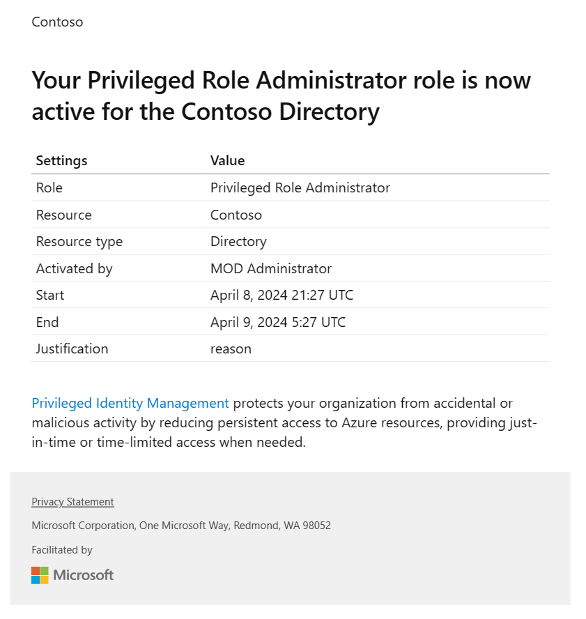
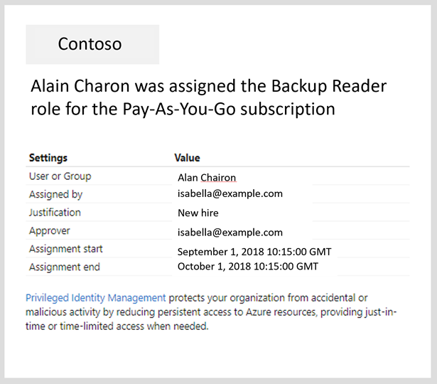

# Email notifications in PIM

When key events occur in Azure AD Privileged Identity Management (PIM), email notifications are sent. For example, PIM sends emails for the following events:

- When a privileged role activation is pending approval
- When a privileged role activation request is completed
- When a privileged role is activated
- When a privileged role is assigned
- When Azure AD PIM is enabled

## PIM emails for Azure AD roles

The email notifications sent for Azure AD roles depends on your role, the event, and notifications setting:

| User | Role activation is pending approval | Role activation request is completed | Role is activated | Role is assigned | PIM is enabled |
| --- | --- | --- | --- | --- | --- |
| Privileged Role Administrator | Yes | Yes | Yes | Yes | Yes |
| Security Administrator | Yes* | Yes* | Yes* | Yes* | Yes* |
| Global Administrator | Yes* | Yes* | Yes* | Yes* | Yes* |
| Eligible role member | No | Yes | No | Yes | No |

\* If the [**Notifications** setting](pim-how-to-change-default-settings.md#notifications) is set to **Enable**.

Starting at the end of July 2018, the PIM email notifications for Azure AD roles have an updated design. All events that previously triggered an email notification will continue to send an email. Some emails will have updated content providing more targeted information. The following shows an example email that is sent when a user activates a privileged role for the fictional Contoso organization.

Previously, when a user activated a privileged role, the email looked like the following.

### Weekly PIM digest email for Azure AD roles

A weekly PIM summary email for Azure AD roles is sent to customers with PIM configured. This weekly email provides a snapshot of PIM activities for the week as well as privileged role assignments. Here's an example email:

The email includes four tiles:

| Tile | Description |
| --- | --- |
| **Users activated** | Number of times users activated their eligible role inside the tenant. |
| **Users made permanent** | Number of times users with an eligible assignment is made permanent. |
| **Role assignments in PIM** | Number of times users are assigned an eligible role inside PIM. |
| **Role assignments outside of PIM** | Number of times users are assigned a permanent role outside of PIM (inside Azure AD). |

The **Overview of your top roles** section lists your top five roles based on total number of permanent and eligible administrators for each role. The **Take action** link opens the [PIM wizard](pim-security-wizard.md) where you can convert their permanent administrators to eligible administrators in batches.

## PIM emails for Azure resource roles

The email notifications sent for Azure resource roles depends on your role and the event:

| User | Role activation is pending approval | Role activation request is completed | Role is activated | Role is assigned | PIM is enabled |
| --- | --- | --- | --- | --- | --- |
| Privileged Role Administrator | Yes | Yes | Yes | Yes | Yes |
| Security Administrator | No | No | No | No | No |
| Global Administrator | No | No | No | No | No |
| Eligible role member | No | Yes | No | Yes | No |

Starting at the end of July 2018, the PIM email notifications for Azure resource roles have an updated design. All events that previously triggered an email notification will continue to send an email. Some emails will have updated content providing more targeted information. The following shows an example email that is sent when a user is assigned a privileged role for the fictional Contoso organization.

Previously, when a user was assigned a privileged role, the email looked like the following.

## Sender email address

Starting at the end of July 2018, email notifications sent through PIM have a new sender email address for both Azure AD and Azure resource roles. Email notifications have the following address:

- Email address:  **azure-noreply@microsoft.com**
- Display name: Microsoft Azure

Previously, email notifications had the following address:

- Email address:  **azureadnotifications@microsoft.com**
- Display name: Microsoft Azure AD Notification Service

## Email subject line

Starting at the end of July 2018, email notifications for both Azure AD and Azure resource roles have a **PIM** prefix in the subject line. Here's an example:

- PIM: Alain Charon was permanently assigned the Backup Reader role.

## Next steps

- [Configure Azure AD directory role settings in PIM](pim-how-to-change-default-settings.md)
- [Approve or deny requests for Azure AD directory roles in PIM](azure-ad-pim-approval-workflow.md)
