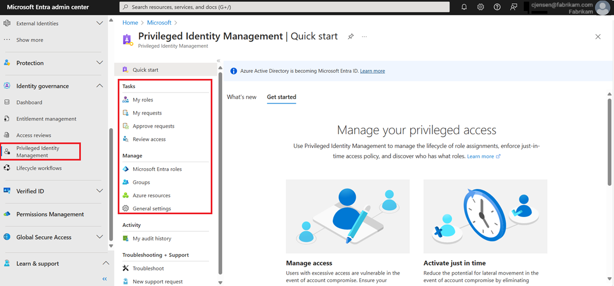

# Start using Privileged Identity Management

This article describes how to enable Privileged Identity Management (PIM) and get started using it.

Use Privileged Identity Management (PIM) to manage, control, and monitor access within your Azure Active Directory (Azure AD) organization. With PIM you can provide as-needed and just-in-time access to Azure resources, Azure AD resources, and other Microsoft online services like Microsoft 365 or Microsoft Intune.

## Prerequisites

To use Privileged Identity Management, you must have one of the following licenses:

- Azure AD Premium P2
- Enterprise Mobility + Security (EMS) E5

For more information, see [License requirements to use Privileged Identity Management](subscription-requirements.md).

> [!Note]
> When a user who is active in a privileged role in an Azure AD organization with a Premium P2 license goes to **Roles and administrators** in Azure AD and selects a role:
>
> - We automatically enable PIM for the organization
> - Their experience is now that they can either assign a "regular" role assignment or an eligible role assignment

## Prepare PIM for Azure AD roles

Here are the tasks we recommend for you to prepare Privileged Identity Management to manage Azure AD roles:

1. [Configure Azure AD role settings](pim-how-to-change-default-settings.md).
1. [Give eligible assignments](pim-how-to-add-role-to-user.md).
1. [Allow eligible users to activate their Azure AD role just-in-time](pim-how-to-activate-role.md).

## Prepare PIM for Azure roles

Here are the tasks we recommend for you to prepare Privileged Identity Management to manage Azure roles for a subscription:

1. [Discover Azure resources](pim-resource-roles-discover-resources.md)
1. [Configure Azure role settings](pim-resource-roles-configure-role-settings.md).
1. [Give eligible assignments](pim-resource-roles-assign-roles.md).
1. [Allow eligible users to activate their Azure roles just-in-time](pim-resource-roles-activate-your-roles.md).

## Navigate to your tasks

Once Privileged Identity Management is set up, you can learn your way around.

| Task + Manage | Description |
| --- | --- |
| **My roles**  | Displays a list of eligible and active roles assigned to you. This is where you can activate any assigned eligible roles. |
| **My requests** | Displays your pending requests to activate eligible role assignments. |
| **Approve requests** | Displays a list of requests to activate eligible roles by users in your directory that you are designated to approve. |
| **Review access** | Lists active access reviews you are assigned to complete, whether you're reviewing access for yourself or someone else. |
| **Azure AD roles** | Displays a dashboard and settings for Privileged role administrators to manage Azure AD role assignments. This dashboard is disabled for anyone who isn't a privileged role administrator. These users have access to a special dashboard titled My view. The My view dashboard only displays information about the user accessing the dashboard, not the entire organization. |
| **Azure resources** | Displays a dashboard and settings for Privileged role administrators to manage Azure resource role assignments. This dashboard is disabled for anyone who isn't a privileged role administrator. These users have access to a special dashboard titled My view. The My view dashboard only displays information about the user accessing the dashboard, not the entire organization. |

## Add a PIM tile to the dashboard

To make it easier to open Privileged Identity Management, add a PIM tile to your Azure portal dashboard.

1. Sign in to the [Azure portal](https://portal.azure.com/).

1. Select **All services** and find the **Azure AD Privileged Identity Management** service.

    

1. Select the Privileged Identity Management **Quick start**.

1. Select **Pin blade to dashboard** to pin the Privileged Identity Management **Quick start** page to the dashboard.

    

    On the Azure dashboard, you'll see a tile like this:

    

## Next steps

- [Assign Azure AD roles in Privileged Identity Management](pim-how-to-add-role-to-user.md)
- [Manage Azure resource access in Privileged Identity Management](pim-resource-roles-discover-resources.md)
