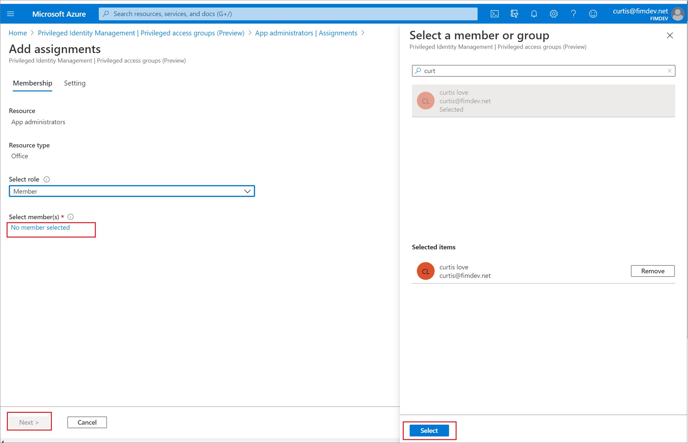
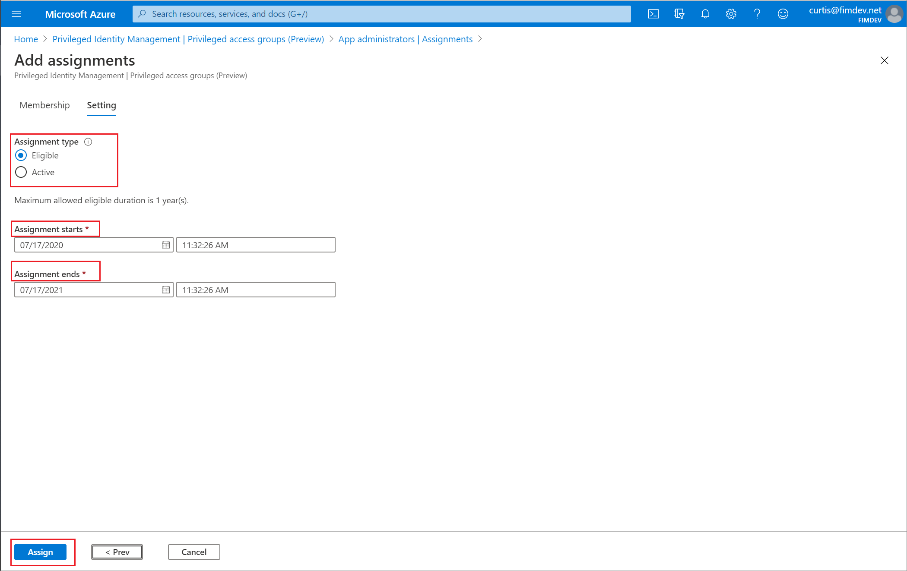

# Assign eligibility for a role-assignable group in Privileged Identity Management

Azure Active Directory (Azure AD) Privileged Identity Management (PIM) can help you manage the eligibility and activation of assignments to privileged access groups in Azure AD. You can assign elegibility to members or owners of the group. For more information about role-assignable groups in Azure AD, see [Assign Azure AD built-in roles to cloud groups](../users-groups-roles/roles-groups-concept.md).

>[!NOTE]
>Every user who is eligible for membership in or ownership of a role-assignable group must have an Azure AD Premium P2 license. For more information, see [License requirements to use Privileged Identity Management](subscription-requirements.md).

## Assign an owner or member of a group

Follow these steps to make a user eligible to be a member or owner of a privileged access group.

1. Sign in to [Privileged Identity Management](https://portal.azure.com/) in the Azure portal with  [Privileged role administrator](../users-groups-roles/directory-assign-admin-roles.md#privileged-role-administrator) role permissions.

    For information about how to grant another administrator access to manage Privileged Identity Management, see [Grant access to other administrators to manage Privileged Identity Management](pim-how-to-give-access-to-pim.md).

1. Open **Azure AD Privileged Identity Management**.

1. Select **Privileged access groups (Preview)**.

1. You can search for a group name and use the **Group type** to filter the list to select the group you want to manage.

    

1. Under **Manage**, select **Assignments**.

1. Select **Add assignments**.

    

1. Select the members or owners you want to make eligible for the privileged access group.

    

1. Select **Next** to set the membership or ownership duration.

    

1. In the **Assignment type** list, select **Eligible** or **Active**. Privileged access groups provide two distinct assignment types:

    - **Eligible** assignments require the member of the role to perform an action to use the role. Actions might include performing a multi-factor authentication (MFA) check, providing a business justification, or requesting approval from designated approvers.

    - **Active** assignments don't require the member to perform any action to use the role. Members assigned as active have the privileges assigned to the role at all times.

1. If the assignment should be permanent (permanently eligible or permanently assigned), select the **Permanently** checkbox. Depending on your organization's settings, the check box might not appear or might not be editable.

1. When finished, select **Assign**.

1. To create the new role assignment, select **Add**. A notification of the status is displayed.

    

## Update or remove an existing role assignment

Follow these steps to update or remove an existing role assignment.

1. Open **Azure AD Privileged Identity Management**.

1. Select **Privileged access groups (Preview)**.

1. You can search for a group name and use the **Group type** to filter the list to select the group you want to manage.

    

1. Under **Manage**, select **Assignments**.

1. Select the role that you want to update or remove.

1. Find the role assignment on the **Eligible roles** or **Active roles** tabs.

    

1. Select **Update** or **Remove** to update or remove the role assignment.

    For information about extending a role assignment, see [Extend or renew Azure resource roles in Privileged Identity Management](pim-resource-roles-renew-extend.md).

## Next steps

- [Extend or renew Azure resource roles in Privileged Identity Management](pim-resource-roles-renew-extend.md)
- [Configure Azure resource role settings in Privileged Identity Management](pim-resource-roles-configure-role-settings.md)
- [Assign Azure AD roles in Privileged Identity Management](pim-how-to-add-role-to-user.md)
