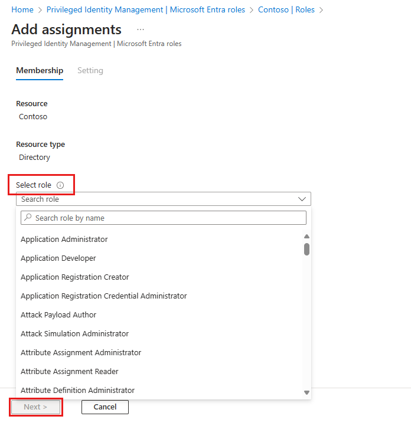
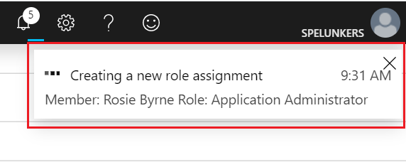
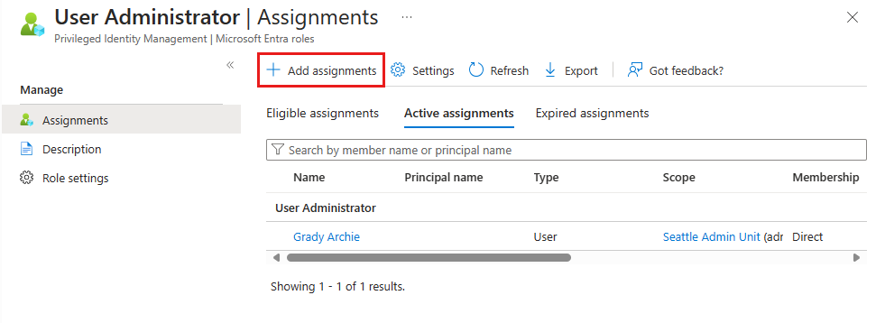
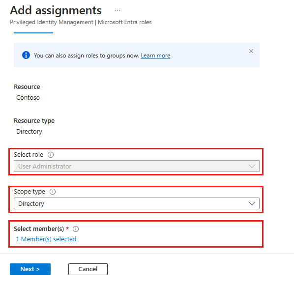

# Assign Azure AD roles in Privileged Identity Management

With Azure Active Directory (Azure AD), a Global administrator can make **permanent** Azure AD admin role assignments. These role assignments can be created using the [Azure portal](../roles/permissions-reference.md) or using [PowerShell commands](/powershell/module/azuread#directory_roles).

The Azure AD Privileged Identity Management (PIM) service also allows Privileged role administrators to make permanent admin role assignments. Additionally, Privileged role administrators can make users **eligible** for Azure AD admin roles. An eligible administrator can activate the role when they need it, and then their permissions expire once they're done.

## Determine your version of PIM

Beginning in November 2019, the Azure AD roles portion of Privileged Identity Management is being updated to a new version that matches the experiences for Azure resource roles. This creates additional features as well as [changes to the existing API](azure-ad-roles-features.md#api-changes). While the new version is being rolled out, which procedures that you follow in this article depend on version of Privileged Identity Management you currently have. Follow the steps in this section to determine which version of Privileged Identity Management you have. After you know your version of Privileged Identity Management, you can select the procedures in this article that match that version.

1. Sign in to the [Azure portal](https://portal.azure.com/) with a user who is in the [Privileged role administrator](../roles/permissions-reference.md#privileged-role-administrator) role.
1. Open **Azure AD Privileged Identity Management**. If you have a banner on the top of the overview page, follow the instructions in the **New version** tab of this article. Otherwise, follow the instructions in the **Previous version** tab.

  

# [New version](#tab/new)

## Assign a role

Follow these steps to make a user eligible for an Azure AD admin role.

1. Sign in to [Azure portal](https://portal.azure.com/) with a user that is a member of the [Privileged role administrator](../roles/permissions-reference.md#privileged-role-administrator) role.

    For information about how to grant another administrator access to manage Privileged Identity Management, see [Grant access to other administrators to manage Privileged Identity Management](pim-how-to-give-access-to-pim.md).

1. Open **Azure AD Privileged Identity Management**.

1. Select **Azure AD roles**.

1. Select **Roles** to see the list of roles for Azure AD permissions.

    

1. Select **Add assignments** to open the **Add assignments** page.

1. Select **Select a role** to open the **Select a role** page.

    

1. Select a role you want to assign, select a member to whom you want to assign to the role, and then select **Next**.

1. In the **Assignment type** list on the **Membership settings** pane, select **Eligible** or **Active**.

    - **Eligible** assignments require the member of the role to perform an action to use the role. Actions might include performing a multi-factor authentication (MFA) check, providing a business justification, or requesting approval from designated approvers.

    - **Active** assignments don't require the member to perform any action to use the role. Members assigned as active have the privileges assigned to the role at all times.

1. To specify a specific assignment duration, add a start and end date and time boxes. When finished, select **Assign** to create the new role assignment.

    

1. After the role is assigned, a assignment status notification is displayed.

    

## Assign a role with restricted scope

For certain roles, the scope of the granted permissions can be restricted to a single admin unit, service principal, or application. This procedure is an example if assigning a role that has the scope of an administrative unit. For a list of roles that support scope via administrative unit, see [Assign scoped roles to an administrative unit](../roles/admin-units-assign-roles.md). This feature is currently being rolled out to Azure AD organizations.

1. Sign in to the [Azure Active Directory admin center](https://aad.portal.azure.com) with Privileged Role Administrator permissions.

1. Select **Azure Active Directory** > **Roles and administrators**.

1. Select the **User Administrator**.

    

1. ​Select **Add assignments**.

    

1. On the **Add assignments** page, you can:

   - Select a user or group to be assigned to the role
   - Select the role scope (in this case, administrative units)
   - Select an administrative unit for the scope

For more information about creating administrative units, see [Add and remove administrative units](../roles/admin-units-manage.md).

## Update or remove an existing role assignment

Follow these steps to update or remove an existing role assignment. **Azure AD P2 licensed customers only** Don't assign a group as Active to a role through both Azure AD and Privileged Identity Management (PIM). For an detailed explanation, see the [Known issues]()../roles/groups-concept.md#known-issues) section.

1. Open **Azure AD Privileged Identity Management**.

1. Select **Azure AD roles**.

1. Select **Roles** to see the list of roles for Azure AD.

1. Select the role that you want to update or remove.

1. Find the role assignment on the **Eligible roles** or **Active roles** tabs.

    

1. Select **Update** or **Remove** to update or remove the role assignment.

# [Previous version](#tab/previous)

## Make a user eligible for a role

Follow these steps to make a user eligible for an Azure AD admin role.

1. Select **Roles** or **Members**.

    

1. Select **Add member** to open **Add managed members**.

1. Select **Select a role**, select a role you want to manage, and then select **Select**.

    

1. Select **Select members**, select the users you want to assign to the role, and then select **Select**.

    

1. In **Add managed members**, select **OK** to add the user to the role.

1. In the list of roles, select the role you just assigned to see the list of members.

     When the role is assigned, the user you selected will appear in the members list as **Eligible** for the role.

    

1. Now that the user is eligible for the role, let them know that they can activate it according to the instructions in [Activate my Azure AD roles in Privileged Identity Management](pim-how-to-activate-role.md).

    Eligible administrators are asked to register for Azure AD Multi-Factor Authentication during activation. If a user cannot register for MFA, or is using a Microsoft account (such as @outlook.com), you need to make them permanent in all their roles.

## Make a role assignment permanent

By default, new users are only *eligible* for an Azure AD admin role. Follow these steps if you want to make a role assignment permanent.

1. Open **Azure AD Privileged Identity Management**.

1. Select **Azure AD roles**.

1. Select **Members**.

    

1. Select an **Eligible** role that you want to make permanent.

1. Select **More** and then select **Make perm**.

    

    The role is now listed as **permanent**.

    

## Remove a user from a role

You can remove users from role assignments, but make sure there is always at least one user who is a permanent Global Administrator. If you're not sure which users still need their role assignments, you can [start an access review for the role](pim-how-to-start-security-review.md).

Follow these steps to remove a specific user from an Azure AD admin role.

1. Open **Azure AD Privileged Identity Management**.

1. Select **Azure AD roles**.

1. Select **Members**.

    

1. Select a role assignment you want to remove.

1. Select **More** and then select **Remove**.

    

1. In the message that asks you to confirm, select **Yes**.

    

    The role assignment is removed.

## Authorization error when assigning roles

If you recently enabled Privileged Identity Management for a subscription and you get an authorization error when you try to make a user eligible for an Azure AD admin role, it might be because the MS-PIM service principal does not yet have the appropriate permissions. The MS-PIM service principal must have the [User Access Administrator](../../role-based-access-control/built-in-roles.md#user-access-administrator) role to assign roles to others. Instead of waiting until MS-PIM is assigned the User Access Administrator role, you can assign it manually.

Follow these steps to assign the User Access Administrator role to the MS-PIM service principal for a subscription.

1. Sign into the Azure portal as a Global Administrator.

1. Choose **All services** and then **Subscriptions**.

1. Choose your subscription.

1. Choose **Access control (IAM)**.

1. Choose **Role assignments** to see the current list of role assignments at the subscription scope.

   

1. Check whether the **MS-PIM** service principal is assigned the **User Access Administrator** role.

1. If not, choose **Add role assignment** to open the **Add role assignment** pane.

1. In the **Role** drop-down list, select the **User Access Administrator** role.

1. In the **Select** list, find and select the **MS-PIM** service principal.

   

1. Choose **Save** to assign the role.

   After a few moments, the MS-PIM service principal is assigned the User Access Administrator role at the subscription scope.

   

 ---

## Next steps

- [Configure Azure AD admin role settings in Privileged Identity Management](pim-how-to-change-default-settings.md)
- [Assign Azure resource roles in Privileged Identity Management](pim-resource-roles-assign-roles.md)