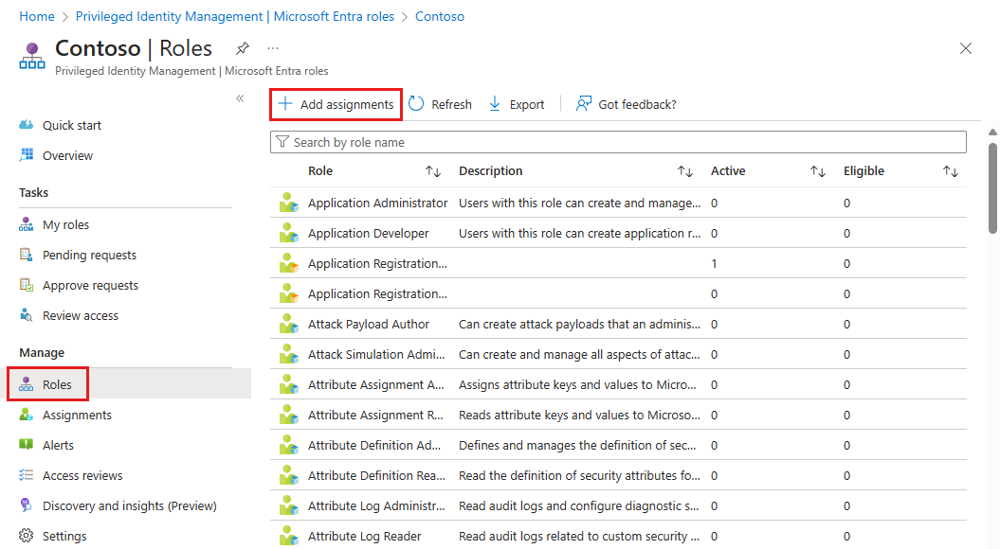

# Assign Azure AD roles in Privileged Identity Management

With Azure Active Directory (Azure AD), a Global administrator can make **permanent** Azure AD admin role assignments. These role assignments can be created using the [Azure portal](../roles/permissions-reference.md) or using [PowerShell commands](/powershell/module/azuread#directory_roles).

The Azure AD Privileged Identity Management (PIM) service also allows Privileged role administrators to make permanent admin role assignments. Additionally, Privileged role administrators can make users **eligible** for Azure AD admin roles. An eligible administrator can activate the role when they need it, and then their permissions expire once they're done.

## Assign a role

Follow these steps to make a user eligible for an Azure AD admin role.

1. Sign in to [Azure portal](https://portal.azure.com/) with a user that is a member of the [Privileged role administrator](../roles/permissions-reference.md#privileged-role-administrator) role.

    For information about how to grant another administrator access to manage Privileged Identity Management, see [Grant access to other administrators to manage Privileged Identity Management](pim-how-to-give-access-to-pim.md).

1. Open **Azure AD Privileged Identity Management**.

1. Select **Azure AD roles**.

1. Select **Roles** to see the list of roles for Azure AD permissions.

    

1. Select **Add assignments** to open the **Add assignments** page.

1. Select **Select a role** to open the **Select a role** page.

    

1. Select a role you want to assign, select a member to whom you want to assign to the role, and then select **Next**.

1. In the **Assignment type** list on the **Membership settings** pane, select **Eligible** or **Active**.

    - **Eligible** assignments require the member of the role to perform an action to use the role. Actions might include performing a multi-factor authentication (MFA) check, providing a business justification, or requesting approval from designated approvers.

    - **Active** assignments don't require the member to perform any action to use the role. Members assigned as active have the privileges assigned to the role at all times.

1. To specify a specific assignment duration, add a start and end date and time boxes. When finished, select **Assign** to create the new role assignment.

    

1. After the role is assigned, a assignment status notification is displayed.

    

## Assign a role with restricted scope

For certain roles, the scope of the granted permissions can be restricted to a single admin unit, service principal, or application. This procedure is an example if assigning a role that has the scope of an administrative unit. For a list of roles that support scope via administrative unit, see [Assign scoped roles to an administrative unit](../roles/admin-units-assign-roles.md). This feature is currently being rolled out to Azure AD organizations.

1. Sign in to the [Azure Active Directory admin center](https://aad.portal.azure.com) with Privileged Role Administrator permissions.

1. Select **Azure Active Directory** > **Roles and administrators**.

1. Select the **User Administrator**.

    

1. ​Select **Add assignments**.

    

1. On the **Add assignments** page, you can:

   - Select a user or group to be assigned to the role
   - Select the role scope (in this case, administrative units)
   - Select an administrative unit for the scope

For more information about creating administrative units, see [Add and remove administrative units](../roles/admin-units-manage.md).

## Update or remove an existing role assignment

Follow these steps to update or remove an existing role assignment. **Azure AD P2 licensed customers only**: Don't assign a group as Active to a role through both Azure AD and Privileged Identity Management (PIM). For a detailed explanation, see [Known issues](../roles/groups-concept.md#known-issues).

1. Open **Azure AD Privileged Identity Management**.

1. Select **Azure AD roles**.

1. Select **Roles** to see the list of roles for Azure AD.

1. Select the role that you want to update or remove.

1. Find the role assignment on the **Eligible roles** or **Active roles** tabs.

    

1. Select **Update** or **Remove** to update or remove the role assignment.

## Next steps

- [Configure Azure AD admin role settings in Privileged Identity Management](pim-how-to-change-default-settings.md)
- [Assign Azure resource roles in Privileged Identity Management](pim-resource-roles-assign-roles.md)