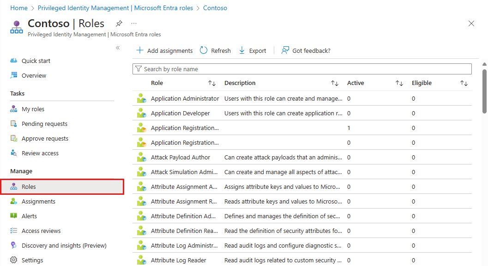
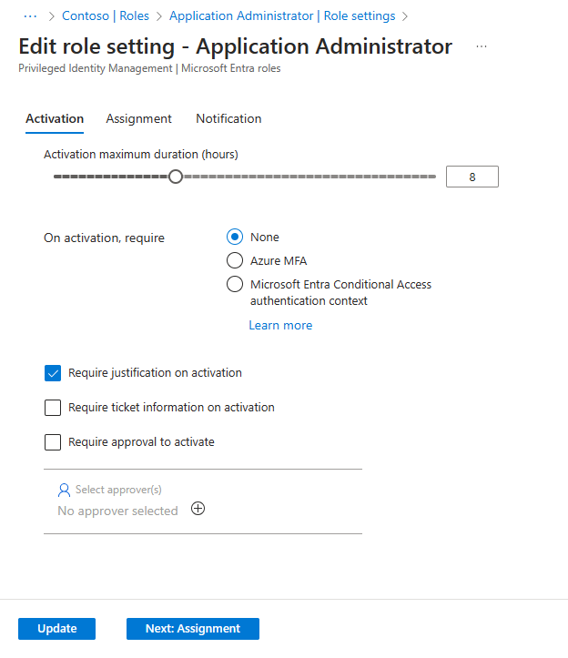

# Configure Azure AD role settings in Privileged Identity Management

A privileged role administrator can customize Privileged Identity Management (PIM) in their Azure Active Directory (Azure AD) organization, including changing the experience for a user who is activating an eligible role assignment.

## Open role settings

Follow these steps to open the settings for an Azure AD role.

1. Sign in to [Azure portal](https://portal.azure.com/) with a user in the [Privileged Role Administrator](../roles/permissions-reference.md#privileged-role-administrator) role.

1. Open **Azure AD Privileged Identity Management** &gt; **Azure AD roles** &gt; **Role settings**.

    

1. Select the role whose settings you want to configure.

    

1. Select **Edit** to open the Role settings page.

    

    On the Role setting pane for each role, there are several settings you can configure.

## Assignment duration

You can choose from two assignment duration options for each assignment type (eligible and active) when you configure settings for a role. These options become the default maximum duration when a user is assigned to the role in Privileged Identity Management.

You can choose one of these **eligible** assignment duration options:

| Setting | Description |
| --- | --- |
| Allow permanent eligible assignment | Global admins and Privileged role admins can assign permanent eligible assignment. |
| Expire eligible assignment after | Global admins and Privileged role admins can require that all eligible assignments have a specified start and end date. |

And, you can choose one of these **active** assignment duration options:

| Setting | Description |
| --- | --- |
| Allow permanent active assignment | Global admins and Privileged role admins can assign permanent active assignment. |
| Expire active assignment after | Global admins and Privileged role admins can require that all active assignments have a specified start and end date. |

> [!NOTE]
> All assignments that have a specified end date can be renewed by Global admins and Privileged role admins. Also, users can initiate self-service requests to [extend or renew role assignments](pim-resource-roles-renew-extend.md).

## Require multifactor authentication

Privileged Identity Management provides enforcement of Azure AD Multi-Factor Authentication on activation and on active assignment.

### On activation

You can require users who are eligible for a role to prove who they are using Azure AD Multi-Factor Authentication before they can activate. Multifactor authentication ensures that the user is who they say they are with reasonable certainty. Enforcing this option protects critical resources in situations when the user account might have been compromised.

To require multifactor authentication to activate the role assignment, select the **On activation, require Azure MFA** option in the Activation tab of **Edit role setting**.

### On active assignment

This option requires admins must complete a multi-factor authentication before creating an active (as opposed to eligible) role assignment. Privileged Identity Management can't enforce multifactor authentication when the user uses their role assignment because they are already active in the role from the time that it is assigned.

To require multifactor authentication when creating an active role assignment, select the **Require Azure Multi-Factor Authentication on active assignment** option in the Assignment tab of **Edit role setting**.

For more information, see [Multifactor authentication and Privileged Identity Management](pim-how-to-require-mfa.md).

## Activation maximum duration

Use the **Activation maximum duration** slider to set the maximum time, in hours, that a role stays active before it expires. This value can be from one to 24 hours.

## Require justification

You can require that users enter a business justification when they activate. To require justification, check the **Require justification on active assignment** box or the **Require justification on activation** box.

## Require approval to activate

If setting multiple approvers, approval completes as soon as one of them approves or denies. You can't force approval from a second or subsequent approver. To require approval to activate a role, follow these steps.

1. Check the **Require approval to activate** check box.

1. Select **Select approvers**.

    

1. Select at least one user and then click **Select**. Select at least one approver. If no specific approvers are selected, Privileged Role Administrators and Global Administrators become the default approvers.

1. Select **Update** to save your changes.

## Next steps

- [Assign Azure AD roles in Privileged Identity Management](pim-how-to-add-role-to-user.md)
- [Configure security alerts for Azure AD roles in Privileged Identity Management](pim-how-to-configure-security-alerts.md)
