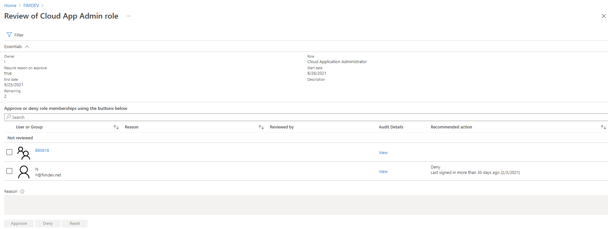

# Perform an access review of Azure resource and Azure AD roles in PIM

Privileged Identity Management (PIM) simplifies how enterprises manage privileged access to resources in Azure Active Directory (AD) and other Microsoft online services like Microsoft 365 or Microsoft Intune. Follow the steps in this article to perform reviews of access to roles.

If you are assigned to an administrative role, your organization's privileged role administrator may ask you to regularly confirm that you still need that role for your job. You might get an email that includes a link, or you can go straight to the [Azure portal](https://portal.azure.com) and begin.

If you're a privileged role administrator or global administrator interested in access reviews, get more details at [How to start an access review](pim-create-azure-ad-roles-and-resource-roles-review.md).

## Approve or deny access

You can approve or deny access based on whether the user still needs access to the role. Choose **Approve** if you want them to stay in the role, or **Deny** if they do not need the access anymore. The users' assignment status will not change until the review closes and the administrator applies the results. Common scenarios in which certain denied users cannot have results applied to them may include the following:

- **Reviewing members of a synced on-premises Windows AD group**: If the group is synced from an on-premises Windows AD, the group cannot be managed in Azure AD and therefore membership cannot be changed.
- **Reviewing a role with nested groups assigned**: For users who have membership through a nested group, the access review will not remove their membership to the nested group and therefore they will retain access to the role being reviewed.
- **User not found or other errors**: These may also result in an apply result not being supported.

Follow these steps to find and complete the access review:

1. Sign in to the [Azure portal](https://portal.azure.com/).
1. Select **Azure Active Directory** and open **Privileged Identity Management**.
1. Select **Review access**. If you have any pending access reviews, they will appear in the access reviews page.

   <kbd></kbd>

1. Select the review you want to complete.
1. Choose **Approve** or **Deny**. In the **Provide a reason box**, enter a business justification for your decision as needed.

     <kbd></kbd>

## Next steps

- [Create an access review of Azure resource and Azure AD roles in PIM](pim-create-azure-ad-roles-and-resource-roles-review.md)
- [Complete an access review of Azure resource and Azure AD roles in PIM](pim-complete-azure-ad-roles-and-resource-roles-review.md)
