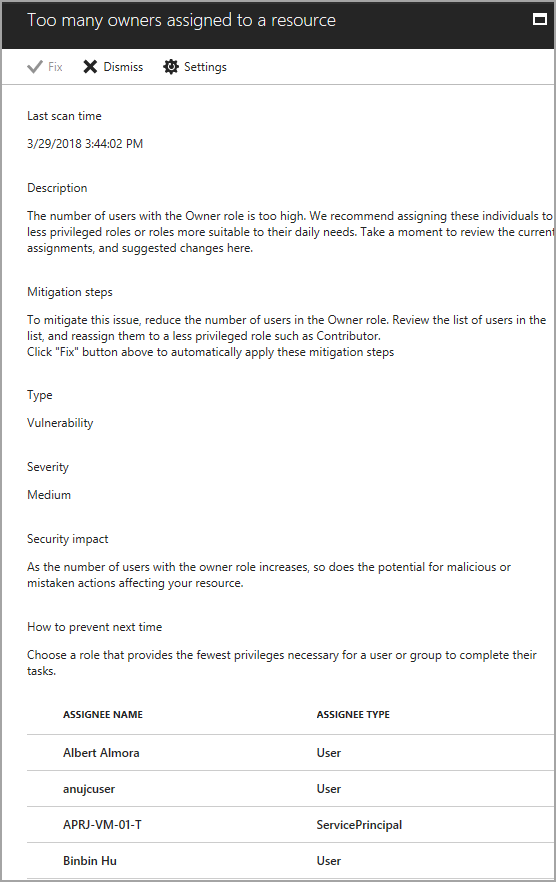

# Configure security alerts for Azure resource roles in Privileged Identity Management

Privileged Identity Management (PIM) generates alerts when there is suspicious or unsafe activity in your Azure Active Directory (Azure AD) organization. When an alert is triggered, it shows up on the Alerts page.

## Review alerts

Select an alert to see a report that lists the users or roles that triggered the alert, along with remediation guidance.

## Alerts

Alert | Severity | Trigger | Recommendation
--- | --- | --- | ---
**Too many owners assigned to a resource** |Medium |Too many users have the owner role. |Review the users in the list and reassign some to less privileged roles.
**Too many permanent owners assigned to a resource** |Medium |Too many users are permanently assigned to a role. |Review the users in the list and re-assign some to require activation for role use.
**Duplicate role created** |Medium |Multiple roles have the same criteria. |Use only one of these roles.
**Roles are being assigned outside of Privileged Identity Management (Preview)** | High | Roles are being managed directly through the Azure IAM resource blade or the Azure Resource Manager API | Review the users in the list and remove them from privileged roles assigned outside of Privilege Identity Management. 

> [!Note]
> For the alert **Roles are being assigned outside of Privileged Identity Management (Preview)** during public preview, we only support only permissions that are assigned at the subscription level. 

### Severity

- **High**: Requires immediate action because of a policy violation. 
- **Medium**: Does not require immediate action but signals a potential policy violation.
- **Low**: Does not require immediate action but suggests a preferred policy change.

## Configure security alert settings

From the Alerts page, go to **Settings**.

Customize settings on the different alerts to work with your environment and security goals.

## Next steps

- [Configure Azure resource role settings in Privileged Identity Management](pim-resource-roles-configure-role-settings.md)
