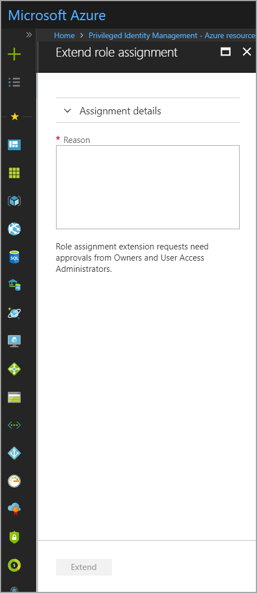
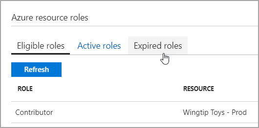
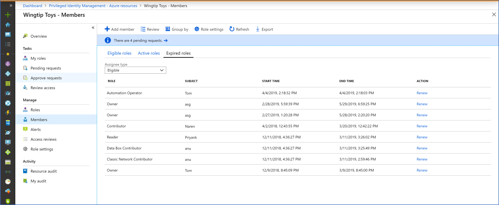

# Extend or renew Azure resource role assignments in Privileged Identity Management

Azure Active Directory (Azure AD) Privileged Identity Management (PIM) provides controls to manage the access and assignment lifecycle for Azure resources. Administrators can assign roles using start and end date-time properties. When the assignment end approaches, Privileged Identity Management sends email notifications to the affected users or groups. It also sends email notifications to administrators of the resource to ensure that appropriate access is maintained. Assignments might be renewed and remain visible in an expired state for up to 30 days, even if access is not extended.

## Who can extend and renew?

Only administrators of the resource can extend or renew role assignments. The affected user or group can request to extend roles that are about to expire and request to renew roles that are already expired.

## When are notifications sent?

Privileged Identity Management sends email notifications to administrators and affected user or groups of roles that are expiring within 14 days and one day prior to expiration. It sends an additional email when an assignment officially expires.

Administrators receive notifications when a user or group assigned an expiring or expired role requests to extend or renew. When a specific administrator resolves the request, all other administrators are notified of the resolution decision (approved or denied). Then the requesting user or group is notified of the decision.

## Extend role assignments

The following steps outline the process for requesting, resolving, or administering an extension or renewal of a role assignment.

### Self-extend expiring assignments

Users or groups assigned to a role can extend expiring role assignments directly from the **Eligible** or **Active** tab on the **My roles** page of a resource and from the top level **My roles** page of the Privileged Identity Management portal.Users or groups can request to extend eligible and active (assigned) roles that expire in the next 14 days.

When the assignment end date-time is within 14 days, the button to **Extend** becomes an active link in the user interface. In the following example, assume the current date is March 27.

To request an extension of this role assignment, select **Extend** to open the request form.

To view information about the original assignment, expand **Assignment details**. Enter a reason for the extension request, and then select **Extend**.

>[!NOTE]
>We recommend including the details of why the extension is necessary, and for how long the extension should be granted (if you have this information).

In a matter of moments, resource administrators receive an email notification requesting that they review the extension request. If a request to extend has already been submitted, an Azure notification appears in the portal.

Go to the **Pending requests** page to view the status of your request or to cancel it.

### Admin approved extension

When a user or group submits a request to extend a role assignment, resource administrators receive an email notification that contains the details of the original assignment and the reason for the request. The notification includes a direct link to the request for the administrator to approve or deny.

In addition to using following the link from email, administrators can approve or deny requests by going to the Privileged Identity Management administration portal and selecting **Approve requests** in the left pane.

When an Administrator selects **Approve** or **Deny**, the details of the request are shown, along with a field to provide a business justification for the audit logs.

When approving a request to extend role assignment, resource administrators can choose a new start date, end date, and assignment type. Changing assignment type might be necessary if the administrator wants to provide limited access to complete a specific task (one day, for example). In this example, the administrator can change the assignment from **Eligible** to **Active**. This means they can provide access to the requestor without requiring them to activate.

### Admin initiated extension

If a user assigned to a role doesn't request an extension for the role assignment, an administrator can extend an assignment on behalf of the user. Administrative extensions of role assignment do not require approval, but notifications are sent to all other administrators after the role has been extended.

To extend a role assignment, browse to the resource role or assignment view in Privileged Identity Management. Find the assignment that requires an extension. Then select **Extend** in the action column.

## Renew role assignments

While conceptually similar to the process for requesting an extension, the process to renew an expired role assignment is different. Using the following steps, assignments and administrators can renew access to expired roles when necessary.

### Self-renew

Users who can no longer access resources can access up to 30 days of expired assignment history. To do this, they browse to **My Roles** in the left pane, and then select the **Expired roles** tab in the Azure resource roles section.

The list of roles shown defaults to **Eligible roles**. Use the drop-down menu to toggle between Eligible and Active assigned roles.

To request renewal for any of the role assignments in the list, select the **Renew** action. Then provide a reason for the request. It's helpful to provide a duration in addition to any additional context or a business justification that can help the resource administrator decide to approve or deny.

After the request has been submitted, resource administrators are notified of a pending request to renew a role assignment.

### Admin approves

Resource administrators can access the renewal request from the link in the email notification or by accessing Privileged Identity Management from the Azure portal and selecting **Approve requests** from the left pane.

When an administrator selects **Approve** or **Deny**, the details of the request are shown along with a field to provide a business justification for the audit logs.

When approving a request to renew role assignment, resource administrators must enter a new start date, end date, and assignment type.

### Admin renew

Resource administrators can renew expired role assignments from the **Members** tab in the left navigation menu of a resource. They can also renew expired role assignments from within the **Expired** roles tab of a resource role.

To view a list of all expired role assignments, on the **Members** screen, select **Expired roles**.

## Next steps

- [Approve or deny requests for Azure resource roles in Privileged Identity Management](pim-resource-roles-approval-workflow.md)
- [Configure Azure resource role settings in Privileged Identity Management](pim-resource-roles-configure-role-settings.md)
