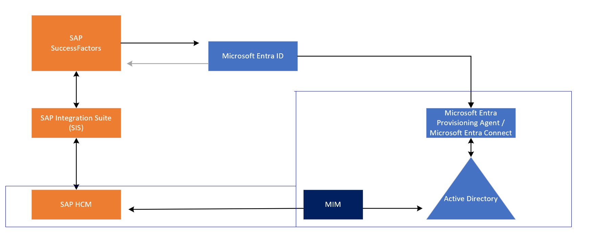

# Manage access to your SAP applications

SAP likely runs critical functions, such as HR and ERP, for your business. At the same time, your business relies on Microsoft for various Azure services, Microsoft 365, and Microsoft Entra Identity Governance for managing access to applications. This article describes how you can use Identity Governance to manage identities across your SAP applications.

## Bring identities from HR into Azure AD

### SuccessFactors

Customers who use SAP SuccessFactors can easily bring identities into [Azure Active Directory (Azure AD)](../../active-directory/saas-apps/sap-successfactors-inbound-provisioning-cloud-only-tutorial.md) or [on-premises Active Directory](../../active-directory/saas-apps/sap-successfactors-inbound-provisioning-tutorial.md) by using native connectors. The connectors support the following scenarios:

* **Hiring new employees**: When a new employee is added to SuccessFactors, a user account is automatically created in Azure AD and optionally Microsoft 365 and [other software as a service (SaaS) applications that Azure AD supports](../../active-directory/app-provisioning/user-provisioning.md). This process includes write-back of the email address to SuccessFactors.
* **Employee attribute and profile updates**: When an employee record is updated in SuccessFactors (such as name, title, or manager), the employee's user account is automatically updated in Azure AD and optionally Microsoft 365 and other SaaS applications that Azure AD supports.
* **Employee terminations**: When an employee is terminated in SuccessFactors, the employee's user account is automatically disabled in Azure AD and optionally Microsoft 365 and other SaaS applications that Azure AD supports.
* **Employee rehires**: When an employee is rehired in SuccessFactors, the employee's old account can be automatically reactivated or re-provisioned (depending on your preference) to Azure AD and optionally Microsoft 365 and other SaaS applications that Azure AD supports.

> [!VIDEO https://www.youtube-nocookie.com/embed/66v2FR2-QrY]

### SAP HCM

Customers who still use SAP Human Capital Management (HCM) can also bring identities into Azure AD. By using SAP Integration Suite, you can synchronize identities between SAP HCM and SAP SuccessFactors. From there, you can bring identities directly into Azure AD or provision them into Active Directory Domain Services by using the native provisioning integrations mentioned earlier.

## Provision identities into modern SAP applications

After your users are in Azure AD, you can provision accounts into the various SaaS and on-premises SAP applications that they need access to. You have three ways to accomplish this:

* Use the enterprise application in Azure AD to configure both single sign-on (SSO) and provisioning to SAP applications such as [SAP Analytics Cloud](../../active-directory/saas-apps/sap-analytics-cloud-provisioning-tutorial.md). With this option, you can apply a consistent set of governance processes across all your applications.
* Use the [SAP Identity Authentication Service (IAS)](../../active-directory/saas-apps/sap-cloud-platform-identity-authentication-provisioning-tutorial.md) enterprise application in Azure AD to provision identities into SAP IAS. After you bring all the identities into SAP IAS, you can use SAP IPS to provision the accounts from there into your applications when required.
* Use the [SAP IPS](https://help.sap.com/docs/IDENTITY_PROVISIONING/f48e822d6d484fa5ade7dda78b64d9f5/f2b2df8a273642a1bf801e99ecc4a043.html) integration to directly export identities from Azure AD into your [applications](https://help.sap.com/docs/IDENTITY_PROVISIONING/f48e822d6d484fa5ade7dda78b64d9f5/ab3f641552464c79b94d10b9205fd721.html). When you're using SAP IPS to pull users into your applications, all provisioning configuration is managed in SAP directly. You can still use the enterprise application in Azure AD to manage SSO and use [Azure AD as the corporate identity provider](https://help.sap.com/docs/IDENTITY_AUTHENTICATION/6d6d63354d1242d185ab4830fc04feb1/058c7b14209f4f2d8de039da4330a1c1.html).

## Provision identities into on-premises SAP systems that SAP IPS doesn't support

Customers who have yet to transition from applications such as  SAP ERP Central Component (SAP ECC) to SAP S/4HANA can still rely on the Azure AD provisioning service to provision user accounts. Within SAP ECC, you expose the necessary Business Application Programming Interfaces (BAPIs) for creating, updating, and deleting users. Within Azure AD, you have two options:

* Use the lightweight Azure AD provisioning agent and [web services connector](/azure/active-directory/app-provisioning/on-premises-web-services-connector) to provision users into apps such as SAP ECC.
* In scenarios where you need to do more complex group and role management, use [Microsoft Identity Manager](/microsoft-identity-manager/reference/microsoft-identity-manager-2016-ma-ws) to manage access to your legacy SAP applications.

## Enable SSO

After you set up provisioning for your SAP applications, you can enable SSO for those applications. Azure AD can serve as the identity provider and serve as the authentication authority for your SAP applications. [Learn how to configure Azure AD as the corporate identity provider for your SAP applications](https://help.sap.com/docs/IDENTITY_AUTHENTICATION/6d6d63354d1242d185ab4830fc04feb1/058c7b14209f4f2d8de039da4330a1c1.html).

## Trigger custom workflows

When a new employee is hired in your organization, you might need to trigger a workflow within your SAP server. By using the [Microsoft Entra Identity Governance lifecycle workflows](lifecycle-workflow-extensibility.md) in conjunction with the [SAP connector in Azure Logic Apps](/azure/logic-apps/logic-apps-using-sap-connector), you can trigger custom actions in SAP upon hiring a new employee.

## Check for separation of duties

With separation-of-duties checks now available in preview in Azure AD [entitlement management](https://techcommunity.microsoft.com/t5/azure-active-directory-identity/ensure-compliance-using-separation-of-duties-checks-in-access/ba-p/2466939), customers can ensure that users don't take on excessive access rights:

* Admins and access managers can prevent users from requesting additional access packages if they're already assigned to other access packages or are a member of other groups that are incompatible with the requested access.
* Enterprises with critical regulatory requirements for SAP apps will have a single consistent view of access controls. They can then enforce separation-of-duties checks across their financial and other business-critical applications, along with Azure AD-integrated applications.
* With [Pathlock](https://pathlock.com/), integration customers can take advantage of fine-grained separation-of-duties checks with access packages in Azure AD. Over time, this ability will help customers address Sarbanes-Oxley and other compliance requirements.

## Next steps

* [Bring identities from SAP SuccessFactors into Azure AD](../../active-directory/saas-apps/sap-successfactors-inbound-provisioning-cloud-only-tutorial.md)
* [Provision accounts in SAP IAS](../../active-directory/saas-apps/sap-cloud-platform-identity-authentication-provisioning-tutorial.md)
