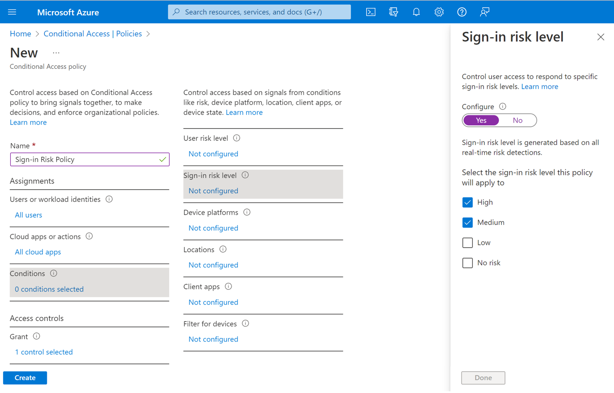

# Risk-based access policies

Access control policies can be applied to protect organizations when a sign-in or user is detected to be at risk. Such policies are called **risk-based policies**. 

Azure AD Conditional Access offers two risk conditions: **Sign-in risk** and **User risk**. Organizations can create risk-based Conditional Access policies by configuring these two risk conditions and choosing an access control method. During each sign-in, Identity Protection sends the detected risk levels to Conditional Access, and the risk-based policies will apply if the policy conditions are satisfied.

For example, as shown in the diagram below, if you have a sign-in risk policy that requires multifactor authentication when the sign-in risk level is medium or high, then the user must pass that access control if their sign-in session is detected to be at high risk.

The example above also demonstrates a main benefit of risk-based policy: **automatic risk remediation**. When a user successfully completes the required access control that verified their identity, their risk will be automatically remediated. That sign-in session and their user account will not be at risk, and no action is needed from the administrator. 

Automatic risk remediation will significantly reduce the risk investigation and remediation burden on the administrators while protecting your organizations from security compromises.
More information about risk as a condition in a Conditional Access policy can be found in the article, [Conditional Access: Conditions](../conditional-access/concept-conditional-access-conditions.md#sign-in-risk)

## Sign-in risk-based Conditional Access policy

Identity Protection analyzes signals in real-time during each sign-in, calculates a real-time sign-in risk level based on the probability that the sign-in wasn't really the user, and sends the risk level to Conditional Access. Administrators can create a Sign-in risk-based Conditional Access policy to specify what access control to apply based on this risk level to enforce organizational requirements like:

- Block access
- Allow access
- Require multifactor authentication

If risks are detected on a sign-in, users can perform the required access control such as multifactor authentication to self-remediate and close the risky sign-in event to prevent unnecessary noise for administrators.

> [!NOTE] 
> Users must have previously registered for Azure AD Multifactor Authentication before triggering the sign-in risk policy.

## User risk-based Conditional Access policy

Identity Protection can calculate what it believes is normal for a user's behavior and use that to base decisions for their risk. User risk level is a calculation of probability that an identity has been compromised. If a user has risky sign-ins or there are risks such as leaked credentials detected on their account, then the user account is at risk with a user risk level calculated by Identity Protection.  Administrators can create a User risk-based Conditional Access policy to specify what access control to apply based when the user is at risk to enforce organizational requirements: block access, allow access, or allow access but require a secure password change using [Azure AD self-service password reset](../authentication/howto-sspr-deployment.md).

A secure password change will remediate the user risk and close the risky user event to prevent unnecessary noise for administrators.

> [!NOTE] 
> Users must have previously registered for self-service password reset before triggering the user risk policy.

## Identity Protection policies
While Identity Protection also offers a user interface for creating user risk policy and sign-in risk policy, we highly recommend that you use Azure AD Conditional Access to create risk-based access policies for the following benefits:
-	Rich set of conditions to control access: Conditional Access offers a rich set of conditions such as applications and locations for configuration. The risk conditions can be used in combination with other conditions to create policies that best enforce your organizational requirements.
-	Multiple risk-based policies can be put in place to target different user groups or apply different access control for different risk levels.
-	Conditional Access policies can be created through Microsoft Graph API and can be tested first in report-only mode.
-	Manage all access policies in one place in Conditional Access.
If you already have Identity Protection risk policies set up, we encourage you to migrate them to Conditional Access.

## Azure AD MFA registration policy

Identity Protection can help organizations roll out Azure AD Multifactor Authentication (MFA) using a policy requiring registration at sign-in. Enabling this policy is a great way to ensure new users in your organization have registered for MFA on their first day. Multifactor authentication is one of the self-remediation methods for risk events within Identity Protection. Self-remediation allows your users to take action on their own to reduce helpdesk call volume.

More information about Azure AD Multifactor Authentication can be found in the article, [How it works: Azure AD Multifactor Authentication](../authentication/concept-mfa-howitworks.md).

## Next steps

- [Enable Azure AD self-service password reset](../authentication/howto-sspr-deployment.md)
- [Enable Azure AD Multifactor Authentication](../authentication/howto-mfa-getstarted.md)
- [Enable Azure AD Multifactor Authentication registration policy](howto-identity-protection-configure-mfa-policy.md)
- [Enable sign-in and user risk policies](howto-identity-protection-configure-risk-policies.md)
