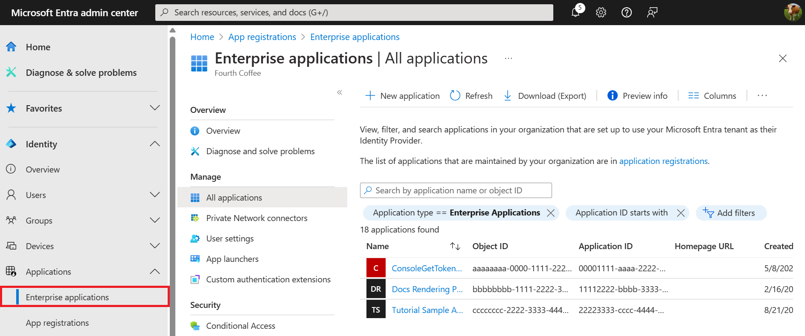
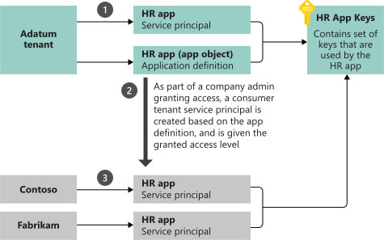

# Application and service principal objects in Azure Active Directory

This article describes application registration, application objects, and service principals in Azure Active Directory: what they are, how they're used, and how they are related to each other. A multi-tenant example scenario is also presented to illustrate the relationship between an application's application object and corresponding service principal objects.

## Application registration
In order to delegate Identity and Access Management functions to Azure AD, an application must be registered with an Azure AD [tenant](developer-glossary.md#tenant). When you register your application with Azure AD, you are creating an identity configuration for your application that allows it to integrate with Azure AD. When you register an app in the [Azure portal][AZURE-Portal], you choose whether it's single tenant (only accessible in your tenant) or multi-tenant (accessible to in other tenants) and can optionally set a redirect URI (where the access token is sent to).

When you've completed the app registration, you have a globally unique instance of the app (the application object) which lives within your home tenant or directory.  You also have a globally unique ID for your app (the app or client ID).  In the portal, you can then add secrets or certificates and scopes to make your app work, customize the branding of your app in the sign-in dialog, and more.

If you register an application in the portal, an application object as well as a service principal object are automatically created in your home tenant.  If you register/create an application using the Microsoft Graph APIs, creating the service principal object is a separate step.

## Application object
An Azure AD application is defined by its one and only application object, which resides in the Azure AD tenant where the application was registered (known as the application's "home" tenant).  An application object is used as a template or blueprint to create one or more service principal objects.  A service principal is created in every tenant where the application is used. Similar to a class in object oriented programming, the application object has some static properties which are applied to all the created service principals (or application instances). 

The application object describes three aspects of an application: how the service can issue tokens in order to access the application, resources that the application might need to access, and the actions that the application can take. 

The **App registrations** blade in the [Azure portal][AZURE-Portal] is used to list and manage the application objects in your home tenant.

The Microsoft Graph [Application entity][MS-Graph-App-Entity] defines the schema for an application object's properties.

## Service principal object
To access resources that are secured by an Azure AD tenant, the entity that requires access must be represented by a security principal. This is true for both users (user principal) and applications (service principal). The security principal defines the access policy and permissions for the user/application in the Azure AD tenant. This enables core features such as authentication of the user/application during sign-in, and authorization during resource access.

A service principal is the local representation, or application instance, of a global application object in a single tenant or directory. A service principal is a concrete instance created from the application object and inherits certain properties from that application object.  A service principal is created in each tenant where the application is used and references the globally unique app object.  The service principal object defines what the app can actually do in the specific tenant, who can access the app, and what resources the app can access. 

When an application is given permission to access resources in a tenant (upon registration or [consent](developer-glossary.md#consent)), a service principal object is created. You can also create service principal object in a tenant using [Azure PowerShell](howto-authenticate-service-principal-powershell.md), Azure CLI, [Microsoft Graph](/graph/api/serviceprincipal-post-serviceprincipals?view=graph-rest-1.0&tabs=http), the [Azure portal][AZURE-Portal], and other tools.  When using the portal, a service principal is created automatically when you register an application.

The **Enterprise applications** blade in the portal is used to list and manage the service principals in a tenant. You can see the service principal's permissions, user consented permissions, which users have done that consent, sign in information, and more.

The Microsoft Graph [ServicePrincipal entity][MS-Graph-Sp-Entity] defines the schema for a service principal object's properties.

## Relationship between application objects and service principals

The application object is the *global* representation of your application for use across all tenants, and the service principal is the *local* representation for use in a specific tenant.

The application object serves as the template from which common and default properties are *derived* for use in creating corresponding service principal objects. An application object therefore has a 1:1 relationship with the software application, and a 1:many relationship with its corresponding service principal object(s).

A service principal must be created in each tenant where the application is used, enabling it to establish an identity for sign-in and/or access to resources being secured by the tenant. A single-tenant application has only one service principal (in its home tenant), created and consented for use during application registration. A multi-tenant Web application/API also has a service principal created in each tenant where a user from that tenant has consented to its use.

> [!NOTE]
> Any changes you make to your application object, are also reflected in its service principal object in the application's home tenant only (the tenant where it was registered). For multi-tenant applications, changes to the application object are not reflected in any consumer tenants' service principal objects, until the access is removed through the [Application Access Panel](https://myapps.microsoft.com) and granted again.
>
> Also note that native applications are registered as multi-tenant by default.

## Example

The following diagram illustrates the relationship between an application's application object and corresponding service principal objects, in the context of a sample multi-tenant application called **HR app**. There are three Azure AD tenants in this example scenario:

- **Adatum** - The tenant used by the company that developed the **HR app**
- **Contoso** - The tenant used by the Contoso organization, which is a consumer of the **HR app**
- **Fabrikam** - The tenant used by the Fabrikam organization, which also consumes the **HR app**

In this example scenario:

| Step | Description |
|------|-------------|
| 1    | Is the process of creating the application and service principal objects in the application's home tenant. |
| 2    | When Contoso and Fabrikam administrators complete consent, a service principal object is created in their company's Azure AD tenant and assigned the permissions that the administrator granted. Also note that the HR app could be configured/designed to allow consent by users for individual use. |
| 3    | The consumer tenants of the HR application (Contoso and Fabrikam) each have their own service principal object. Each represents their use of an instance of the application at runtime, governed by the permissions consented by the respective administrator. |

## Next steps

- You can use the [Microsoft Graph Explorer](https://developer.microsoft.com/graph/graph-explorer) to query both the application and service principal objects.
- You can access an application's application object using the Microsoft Graph API, the [Azure portal's][AZURE-Portal] application manifest editor, or [Azure AD PowerShell cmdlets](https://docs.microsoft.com/powershell/azure/?view=azureadps-2.0), as represented by its OData [Application entity][MS-Graph-App-Entity].
- You can access an application's service principal object through the Microsoft Graph API or [Azure AD PowerShell cmdlets](https://docs.microsoft.com/powershell/azure/?view=azureadps-2.0), as represented by its OData [ServicePrincipal entity][MS-Graph-Sp-Entity].

<!--Image references-->

<!--Reference style links -->
[MS-Graph-App-Entity]: https://docs.microsoft.com/graph/api/resources/application
[MS-Graph-Sp-Entity]: https://docs.microsoft.com/graph/api/resources/serviceprincipal
[AZURE-Portal]: https://portal.azure.com
