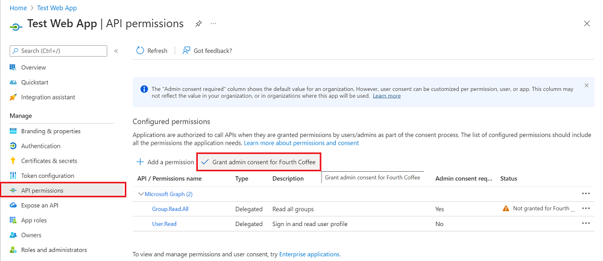

# Azure Active Directory consent framework

The Azure Active Directory (Azure AD) consent framework makes it easy to develop multi-tenant web and native client applications. These applications allow sign-in by user accounts from an Azure AD tenant that's different from the one where the application is registered. They may also need to access web APIs such as the Microsoft Graph API (to access Azure AD, Intune, and services in Microsoft 365) and other Microsoft services' APIs, in addition to your own web APIs.

The framework is based on a user or an administrator giving consent to an application that asks to be registered in their directory, which may involve accessing directory data. For example, if a web client application needs to read calendar information about the user from Microsoft 365, that user is required to consent to the client application first. After consent is given, the client application will be able to call the Microsoft Graph API on behalf of the user, and use the calendar information as needed. The [Microsoft Graph API](https://developer.microsoft.com/graph) provides access to data in Microsoft 365 (like calendars and messages from Exchange, sites and lists from SharePoint, documents from OneDrive, notebooks from OneNote, tasks from Planner, and workbooks from Excel), as well as users and groups from Azure AD and other data objects from more Microsoft cloud services.

The consent framework is built on OAuth 2.0 and its various flows, such as authorization code grant and client credentials grant, using public or confidential clients. By using OAuth 2.0, Azure AD makes it possible to build many different types of client applications--such as on a phone, tablet, server, or a web application--and gain access to the required resources.

For more info about using the consent framework with OAuth2.0 authorization grants, see [Authorize access to web applications using OAuth 2.0 and Azure AD](v2-oauth2-auth-code-flow.md) and [Authentication scenarios for Azure AD](./authentication-vs-authorization.md). For info about getting authorized access to Microsoft 365 through Microsoft Graph, see [App authentication with Microsoft Graph](/graph/).

## Consent experience - an example

The following steps show you how the consent experience works for both the application developer and the user.

1. Assume you have a web client application that needs to request specific permissions to access a resource/API. You'll learn how to do this configuration in the next section, but essentially the Azure portal is used to declare permission requests at configuration time. Like other configuration settings, they become part of the application's Azure AD registration:

    

1. Consider that your application’s permissions have been updated, the application is running, and a user is about to use it for the first time. First, the application needs to obtain an authorization code from Azure AD’s `/authorize` endpoint. The authorization code can then be used to acquire a new access and refresh token.

1. If the user is not already authenticated, Azure AD's `/authorize` endpoint prompts the user to sign in.

    

1. After the user has signed in, Azure AD will determine if the user needs to be shown a consent page. This determination is based on whether the user (or their organization’s administrator) has already granted the application consent. If consent has not already been granted, Azure AD prompts the user for consent and displays the required permissions it needs to function. The set of permissions that are displayed in the consent dialog match the ones selected in the **Delegated permissions** in the Azure portal.

    

1. After the user grants consent, an authorization code is returned to your application, which is redeemed to acquire an access token and refresh token. For more information about this flow, see [OAuth 2.0 authorization code flow](v2-oauth2-auth-code-flow.md).

1. As an administrator, you can also consent to an application's delegated permissions on behalf of all the users in your tenant. Administrative consent prevents the consent dialog from appearing for every user in the tenant, and can be done in the [Azure portal](https://portal.azure.com) by users with the administrator role. To learn which administrator roles can consent to delegated permissions, see [Administrator role permissions in Azure AD](../roles/permissions-reference.md).

    **To consent to an app's delegated permissions**

   1. Go to the **API permissions** page for your application
   1. Click on the **Grant admin consent** button.

      

   > [!IMPORTANT]
   > Granting explicit consent using the **Grant permissions** button is currently required for single-page applications (SPA) that use ADAL.js. Otherwise, the application fails when the access token is requested.

## Next steps

* See [how to convert an app to be multi-tenant](howto-convert-app-to-be-multi-tenant.md)
* For more depth, learn [how consent is supported at the OAuth 2.0 protocol layer during the authorization code grant flow.](../azuread-dev/v1-protocols-oauth-code.md#request-an-authorization-code)