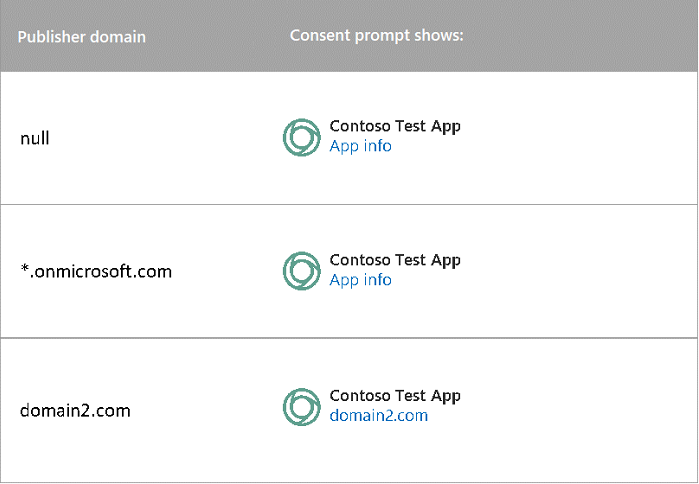
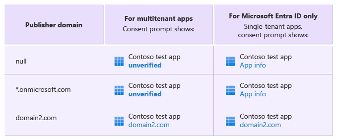

# How to: Configure an application's publisher domain

An application’s publisher domain is displayed to users on the [application’s consent prompt](application-consent-experience.md) to let users know where their information is being sent. Multi-tenant applications that are registered after May 21, 2019 that don't have a publisher domain show up as **unverified**. Multi-tenant applications are applications that support accounts outside of a single organizational directory; for example, support all Azure AD accounts, or support all Azure AD accounts and personal Microsoft accounts.

## New applications

When you register a new app, the publisher domain of your app may be set to a default value. The value depends on where the app is registered, particularly whether the app is registered in a tenant and whether the tenant has tenant verified domains.

If there are tenant-verified domains, the app’s publisher domain will default to the primary verified domain of the tenant. If there are no tenant verified domains (which is the case when the application is not registered in a tenant), the app’s publisher domain will be set to null.

The following table summarizes the default behavior of the publisher domain value.  

| Tenant-verified domains | Default value of publisher domain |
|-------------------------|----------------------------|
| null | null |
| *.onmicrosoft.com | *.onmicrosoft.com |
| - *.onmicrosoft.com<br/>- domain1.com<br/>- domain2.com (primary) | domain2.com |

If a multi-tenant application's publisher domain isn't set, or if it's set to a domain that ends in .onmicrosoft.com, the app's consent prompt will show **unverified** in place of the publisher domain.

## Grandfathered applications

If your app was registered before May 21, 2019, your application's consent prompt will not show **unverified** if you have not set a publisher domain. We recommend that you set the publisher domain value so that users can see this information on your app's consent prompt.

## Configure publisher domain using the Azure portal

To set your app's publisher domain, follow these steps.

1. Sign in to the [Azure portal](https://portal.azure.com) using either a work or school account, or a personal Microsoft account.

1. If your account is present in more than one Azure AD tenant:
   1. Select your profile from the menu on the top-right corner of the page, and then **Switch directory**.
   1. Change your session to the Azure AD tenant where you want to create your application.

1. Navigate to [Azure Active Directory > App registrations](https://go.microsoft.com/fwlink/?linkid=2083908) to find and select the app that you want to configure.

   Once you've selected the app, you'll see the app's **Overview** page.

1. From the app's **Overview** page, select the **Branding** section.

1. Find the **Publisher domain** field and select one of the following options:

   - Select **Configure a domain** if you haven't configured a domain already.
   - Select **Update domain** if a domain has already been configured.

If your app is registered in a tenant, you'll see two tabs to select from: **Select a verified domain** and **Verify a new domain**.

If your app isn't registered in a tenant, you'll only see the option to verify a new domain for your application.

### To verify a new domain for your app

1. Create a file named `microsoft-identity-association.json` and paste the following JSON code snippet.

   ```json
   {
      "associatedApplications": [
        {
           "applicationId": "{YOUR-APP-ID-HERE}"
        }
      ]
    }
   ```

1. Replace the placeholder *{YOUR-APP-ID-HERE}* with the application (client) ID that corresponds to your app.

1. Host the file at: `https://{YOUR-DOMAIN-HERE}.com/.well-known/microsoft-identity-association.json`. Replace the placeholder *{YOUR-DOMAIN-HERE}* to match the verified domain.

1. Click the **Verify and save domain** button.

### To select a verified domain

- If your tenant has verified domains, select one of the domains from the **Select a verified domain** dropdown.

>[!Note]
> The expected 'Content-Type' header that should be returned is `application/json`. You may get an error as mentioned below if you use anything else like `application/json; charset=utf-8` 
> 
>``` "Verification of publisher domain failed. Error getting JSON file from https:///.well-known/microsoft-identity-association. The server returned an unexpected content type header value. " ```
>

## Implications on the app consent prompt

Configuring the publisher domain has an impact on what users see on the app consent prompt. To fully understand the components of the consent prompt, see [Understanding the application consent experiences](application-consent-experience.md).

The following table describes the behavior for applications created before May 21, 2019.



The behavior for new applications created after May 21, 2019 will depend on the publisher domain and the type of application. The following table describes the changes you should expect to see with the different combinations of configurations.



## Implications on redirect URIs

Applications that sign in users with any work or school account, or personal Microsoft accounts ([multi-tenant](single-and-multi-tenant-apps.md)) are subject to few restrictions when specifying redirect URIs.

### Single root domain restriction

When the publisher domain value for multi-tenant apps is set to null, apps are restricted to share a single root domain for the redirect URIs. For example, the following combination of values isn't allowed because the root domain, contoso.com, doesn't match fabrikam.com.

```
"https://contoso.com",
"https://fabrikam.com",
```

### Subdomain restrictions

Subdomains are allowed, but you must explicitly register the root domain. For example, while the following URIs share a single root domain, the combination isn't allowed.

```
"https://app1.contoso.com",
"https://app2.contoso.com",
```

However, if the developer explicitly adds the root domain, the combination is allowed.

```
"https://contoso.com",
"https://app1.contoso.com",
"https://app2.contoso.com",
```

### Exceptions

The following cases aren't subject to the single root domain restriction:

- Single tenant apps, or apps that target accounts in a single directory
- Use of localhost as redirect URIs
- Redirect URIs with custom schemes (non-HTTP or HTTPS)

## Configure publisher domain programmatically

Currently, there is no REST API or PowerShell support to configure publisher domain programmatically.
