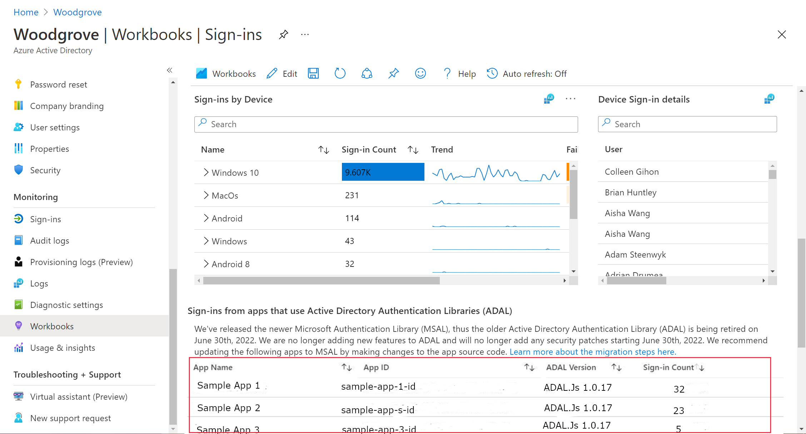

# How to: Identify apps running on ADAL and migrate them to MSAL

Azure Active Directory self-service portal provides a workbook to identify apps using ADAL for their authentication. This article provides guidance on determining apps that run on ADAL using the self-service portal. Support for ADAL is ending on June 30 2022. Apps using ADAL on existing OS versions will continue to work, but technical support or security updates will be unavailable after June 30 2022.

## Prerequisites

The following article is recommended before going through this article:

- [MSAL overview](./msal-overview.md)

## Identify apps using ADAL in your tenant

Migrating your app from ADAL to MSAL requires you to identify apps that use ADAL for authentication.  The Sign-ins workbook now has a new table. This table contains a list of applications that use ADAL and how often these applications are used. The information in this workbook is available in [sign in logs](../reports-monitoring/reference-azure-monitor-sign-ins-log-schema), but the workbook helps you collect and visualize the information in one view.  

## Accessing the workbook

If your organization is new to Azure Monitor workbooks, [integrate your Azure AD sign-in and audit logs with Azure Monitor](../reports-monitoring/howto-integrate-activity-logs-with-log-analytics) before accessing the workbook. This integration allows you to store, and query, and visualize your logs using workbooks for up to two years. Only sign-in and audit events created after Azure Monitor integration will be stored. Insights before the date of the Azure Monitor integration won't be available. You can use the workbook to assess past insights if your Azure AD sign-in and audit logs is already integrated with Azure Monitor.

To access the workbook: 

1. Sign into the Azure portal 
2. Navigate to **Azure Active Directory** > **Monitoring** > **Workbooks** 
3. In the Usage section, open the **Sign-ins** workbook 

The Sign-ins workbook has a new table at the bottom of the page that can show you which recently used apps are using ADAL as shown below. Update these apps to use MSAL.

If there are no apps running on ADAL, the workbook will display a view as shown below. 

## Next steps

After identifying your apps, we recommend you [start migrating all ADAL apps to MSAL](msal-migration.md).
